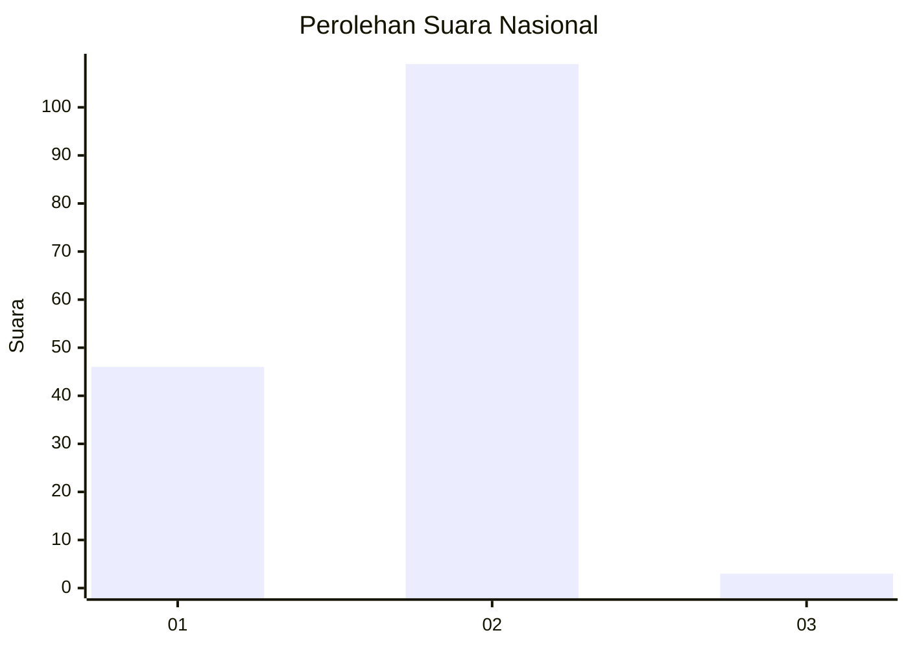
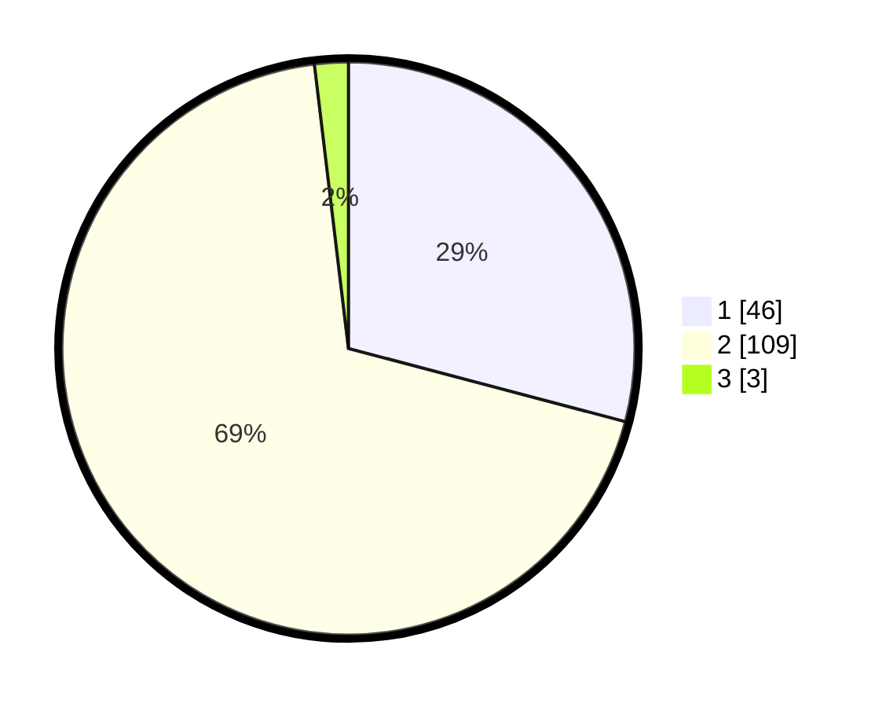

# Hasil

## Grafik

## Tabel

| No. | Nama Paslon    | Suara | Suara (raw) | Persentase |
|:--- |:-------------- | -----:| -----------:| ----------:|
| 1   | ANIES MUHAIMIN | 46    | [46][p-1]   | 29,11      |
| 2   | PRABOWO GIBRAN | 109   | [109][p-2]  | 68,99      |
| 3   | GANJAR MAHFUD  | 3     | [3][p-3]    | 1,90       |

[p-1]: https://github.com/gigit-pemilu/pemilu-2024/blob/main/pilpres/hitung-suara/sub/64-kalimantan-timur/sub/09-penajam-paser-utara/sub/01-penajam/sub/1001-tanjung-tengah/sub/002-tps/sub/paslon-1.txt
[p-2]: https://github.com/gigit-pemilu/pemilu-2024/blob/main/pilpres/hitung-suara/sub/64-kalimantan-timur/sub/09-penajam-paser-utara/sub/01-penajam/sub/1001-tanjung-tengah/sub/002-tps/sub/paslon-2.txt
[p-3]: https://github.com/gigit-pemilu/pemilu-2024/blob/main/pilpres/hitung-suara/sub/64-kalimantan-timur/sub/09-penajam-paser-utara/sub/01-penajam/sub/1001-tanjung-tengah/sub/002-tps/sub/paslon-3.txt

## Foto C Plano

https://sirekap-obj-formc.kpu.go.id/edac/pemilu/ppwp/64/09/01/10/01/6409011001002-20240218-103038--1fd41c5b-be49-4af0-887b-19388095038d.jpg

https://sirekap-obj-formc.kpu.go.id/edac/pemilu/ppwp/64/09/01/10/01/6409011001002-20240218-103106--9b625b29-6473-4060-8a89-172028c0352c.jpg

https://sirekap-obj-formc.kpu.go.id/edac/pemilu/ppwp/64/09/01/10/01/6409011001002-20240218-103229--c18d3494-efb9-425c-bd0f-0dfa209416de.jpg

## Metadata

| Key        | Value               |
| ---------- | ------------------- |
| Time Stamp | 2024-02-24 22:31:28 |

