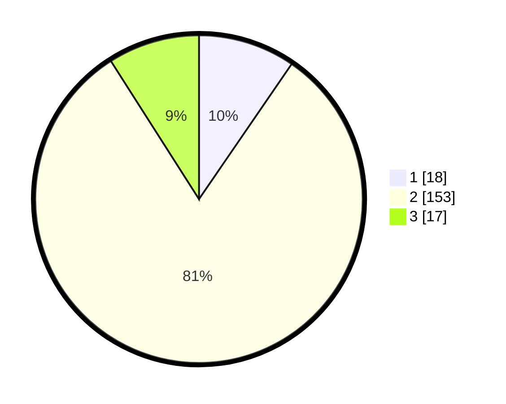

# Hasil

## Grafik

## Tabel

| No. | Nama Paslon    | Suara | Suara (raw) | Persentase |
|:--- |:-------------- | -----:| -----------:| ----------:|
| 1   | ANIES MUHAIMIN | 18    | [18][p-1]   | 9,57       |
| 2   | PRABOWO GIBRAN | 153   | [153][p-2]  | 81,38      |
| 3   | GANJAR MAHFUD  | 17    | [17][p-3]   | 9,04       |

[p-1]: https://github.com/gigit-pemilu/pemilu-2024-64-kalimantan-timur/blob/main/pilpres/hitung-suara/sub/64-kalimantan-timur/sub/09-penajam-paser-utara/sub/01-penajam/sub/1001-tanjung-tengah/sub/003-tps/sub/paslon-1.txt
[p-2]: https://github.com/gigit-pemilu/pemilu-2024-64-kalimantan-timur/blob/main/pilpres/hitung-suara/sub/64-kalimantan-timur/sub/09-penajam-paser-utara/sub/01-penajam/sub/1001-tanjung-tengah/sub/003-tps/sub/paslon-2.txt
[p-3]: https://github.com/gigit-pemilu/pemilu-2024-64-kalimantan-timur/blob/main/pilpres/hitung-suara/sub/64-kalimantan-timur/sub/09-penajam-paser-utara/sub/01-penajam/sub/1001-tanjung-tengah/sub/003-tps/sub/paslon-3.txt

## Foto C Plano

https://sirekap-obj-formc.kpu.go.id/c46c/pemilu/ppwp/64/09/01/10/01/6409011001003-20240218-111223--db954298-b401-45c5-b926-6112721e6164.jpg

https://sirekap-obj-formc.kpu.go.id/c46c/pemilu/ppwp/64/09/01/10/01/6409011001003-20240218-111352--91dac574-df22-4779-ac9e-dfbfbcb05359.jpg

https://sirekap-obj-formc.kpu.go.id/c46c/pemilu/ppwp/64/09/01/10/01/6409011001003-20240218-111440--693c5c15-eb34-4847-993c-0417eb81169f.jpg

## Metadata

| Key        | Value               |
| ---------- | ------------------- |
| Time Stamp | 2024-02-24 22:31:28 |

