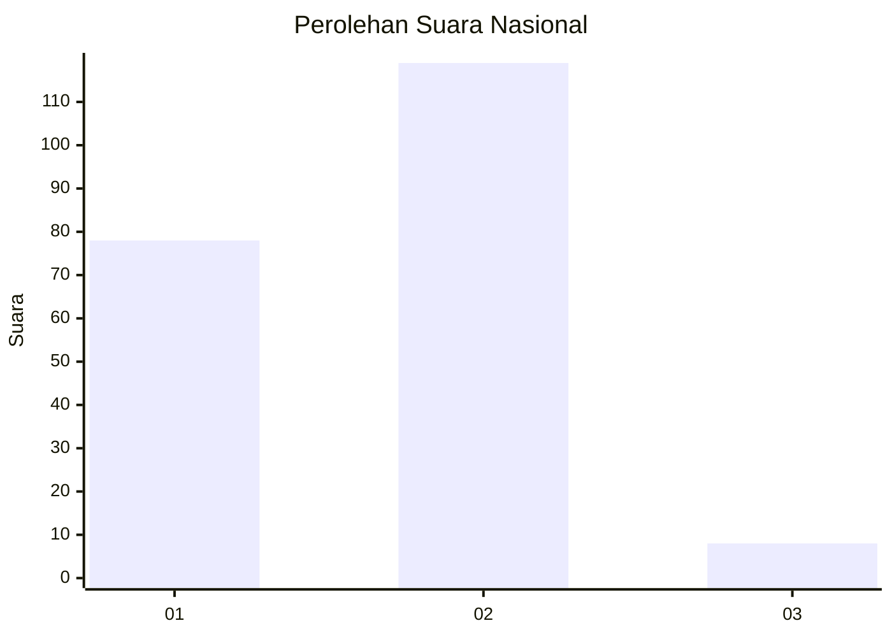
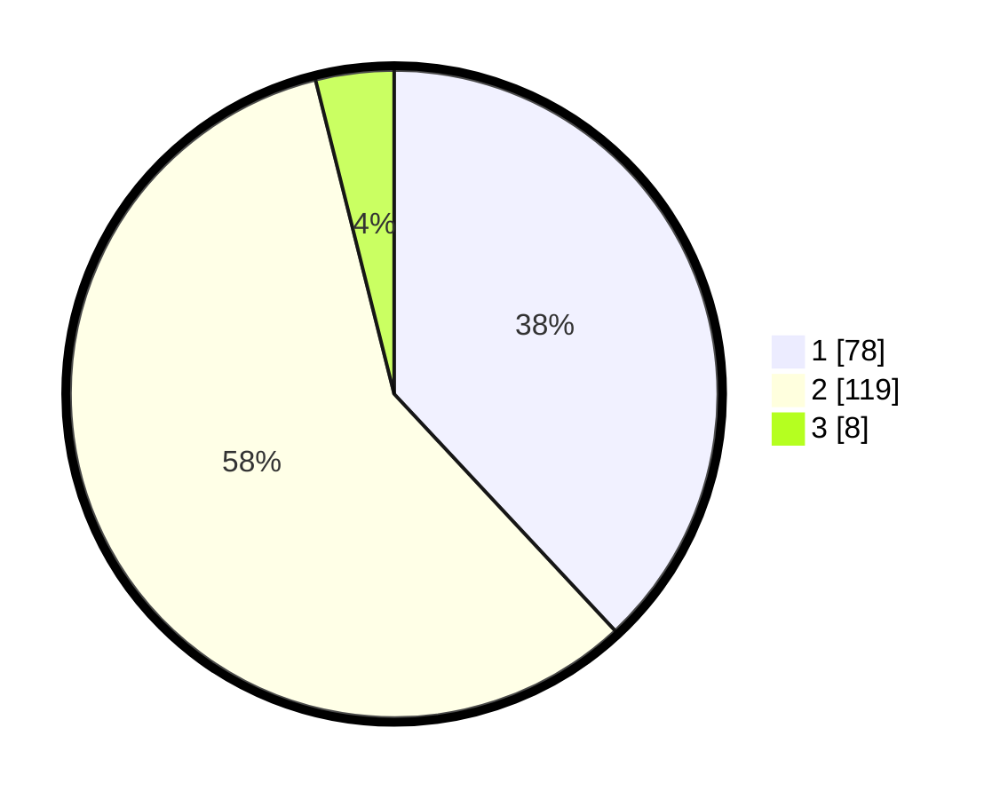

# Hasil

## Grafik

## Tabel

| No. | Nama Paslon    | Suara | Suara (raw) | Persentase |
|:--- |:-------------- | -----:| -----------:| ----------:|
| 1   | ANIES MUHAIMIN | 78    | [78][p-1]   | 38,05      |
| 2   | PRABOWO GIBRAN | 119   | [119][p-2]  | 58,05      |
| 3   | GANJAR MAHFUD  | 8     | [8][p-3]    | 3,90       |

[p-1]: https://github.com/gigit-pemilu/pemilu-2024/blob/main/pilpres/hitung-suara/sub/64-kalimantan-timur/sub/09-penajam-paser-utara/sub/01-penajam/sub/1001-tanjung-tengah/sub/005-tps/sub/paslon-1.txt
[p-2]: https://github.com/gigit-pemilu/pemilu-2024/blob/main/pilpres/hitung-suara/sub/64-kalimantan-timur/sub/09-penajam-paser-utara/sub/01-penajam/sub/1001-tanjung-tengah/sub/005-tps/sub/paslon-2.txt
[p-3]: https://github.com/gigit-pemilu/pemilu-2024/blob/main/pilpres/hitung-suara/sub/64-kalimantan-timur/sub/09-penajam-paser-utara/sub/01-penajam/sub/1001-tanjung-tengah/sub/005-tps/sub/paslon-3.txt

## Foto C Plano

https://sirekap-obj-formc.kpu.go.id/95d6/pemilu/ppwp/64/09/01/10/01/6409011001005-20240218-134808--655499d2-eccf-4178-80e9-35ee2c1099ee.jpg

https://sirekap-obj-formc.kpu.go.id/95d6/pemilu/ppwp/64/09/01/10/01/6409011001005-20240218-134840--c57cd5f9-51ef-4ff1-a2ad-4e428355bfb4.jpg

https://sirekap-obj-formc.kpu.go.id/95d6/pemilu/ppwp/64/09/01/10/01/6409011001005-20240218-134914--d10f80b5-a223-4a93-8046-68a7bcc523cd.jpg

## Metadata

| Key        | Value               |
| ---------- | ------------------- |
| Time Stamp | 2024-02-24 22:31:28 |

