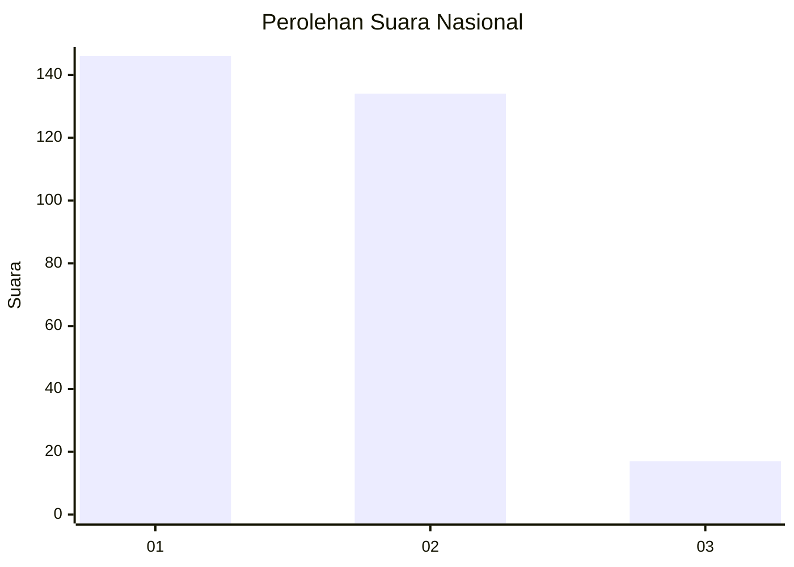
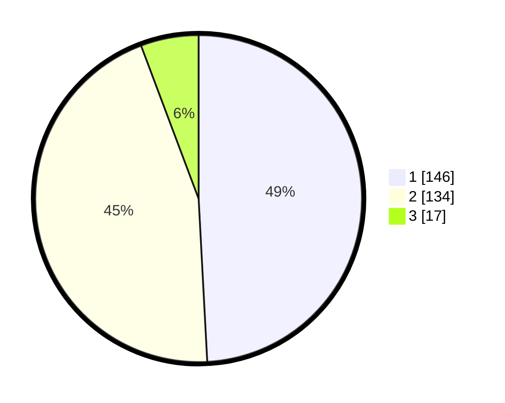

# Hasil

## Grafik

## Tabel

| No. | Nama Paslon    | Suara | Suara (raw) | Persentase |
|:--- |:-------------- | -----:| -----------:| ----------:|
| 1   | ANIES MUHAIMIN | 146   | [146][p-1]  | 49,16      |
| 2   | PRABOWO GIBRAN | 134   | [134][p-2]  | 45,12      |
| 3   | GANJAR MAHFUD  | 17    | [17][p-3]   | 5,72       |

[p-1]: https://github.com/gigit-pemilu/pemilu-2024/blob/main/pilpres/hitung-suara/sub/64-kalimantan-timur/sub/09-penajam-paser-utara/sub/01-penajam/sub/1011-penajam/sub/015-tps/sub/paslon-1.txt
[p-2]: https://github.com/gigit-pemilu/pemilu-2024/blob/main/pilpres/hitung-suara/sub/64-kalimantan-timur/sub/09-penajam-paser-utara/sub/01-penajam/sub/1011-penajam/sub/015-tps/sub/paslon-2.txt
[p-3]: https://github.com/gigit-pemilu/pemilu-2024/blob/main/pilpres/hitung-suara/sub/64-kalimantan-timur/sub/09-penajam-paser-utara/sub/01-penajam/sub/1011-penajam/sub/015-tps/sub/paslon-3.txt

## Foto C Plano

https://sirekap-obj-formc.kpu.go.id/bf7f/pemilu/ppwp/64/09/01/10/11/6409011011015-20240221-145034--d7619f6e-61f4-4746-ae7f-255ee88933dd.jpg

https://sirekap-obj-formc.kpu.go.id/bf7f/pemilu/ppwp/64/09/01/10/11/6409011011015-20240221-145106--74c273fc-b26d-4e6a-9578-3a6821eb364a.jpg

https://sirekap-obj-formc.kpu.go.id/bf7f/pemilu/ppwp/64/09/01/10/11/6409011011015-20240221-145138--ae6e0850-429c-4b55-9762-6b8bf36eb571.jpg

## Metadata

| Key        | Value               |
| ---------- | ------------------- |
| Time Stamp | 2024-02-24 22:31:28 |

