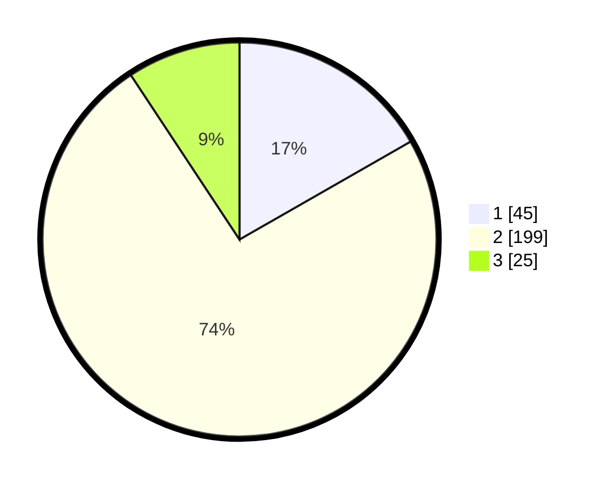

# Hasil

## Grafik

## Tabel

| No. | Nama Paslon    | Suara | Suara (raw) | Persentase |
|:--- |:-------------- | -----:| -----------:| ----------:|
| 1   | ANIES MUHAIMIN | 45    | [45][p-1]   | 16,73      |
| 2   | PRABOWO GIBRAN | 199   | [199][p-2]  | 73,98      |
| 3   | GANJAR MAHFUD  | 25    | [25][p-3]   | 9,29       |

[p-1]: https://github.com/gigit-pemilu/pemilu-2024/blob/main/pilpres/hitung-suara/sub/64-kalimantan-timur/sub/09-penajam-paser-utara/sub/01-penajam/sub/1014-sotek/sub/015-tps/sub/paslon-1.txt
[p-2]: https://github.com/gigit-pemilu/pemilu-2024/blob/main/pilpres/hitung-suara/sub/64-kalimantan-timur/sub/09-penajam-paser-utara/sub/01-penajam/sub/1014-sotek/sub/015-tps/sub/paslon-2.txt
[p-3]: https://github.com/gigit-pemilu/pemilu-2024/blob/main/pilpres/hitung-suara/sub/64-kalimantan-timur/sub/09-penajam-paser-utara/sub/01-penajam/sub/1014-sotek/sub/015-tps/sub/paslon-3.txt

## Foto C Plano

https://sirekap-obj-formc.kpu.go.id/3005/pemilu/ppwp/64/09/01/10/14/6409011014015-20240220-125626--26a4ed17-60b9-4497-8eb0-0ffb12874295.jpg

https://sirekap-obj-formc.kpu.go.id/3005/pemilu/ppwp/64/09/01/10/14/6409011014015-20240220-125714--3761c7a9-01ed-4dca-9002-fc8af2732c52.jpg

https://sirekap-obj-formc.kpu.go.id/3005/pemilu/ppwp/64/09/01/10/14/6409011014015-20240220-125748--09c3a480-8029-4e27-87fc-fa9e45d3d6df.jpg

## Metadata

| Key        | Value               |
| ---------- | ------------------- |
| Time Stamp | 2024-02-24 22:31:28 |

