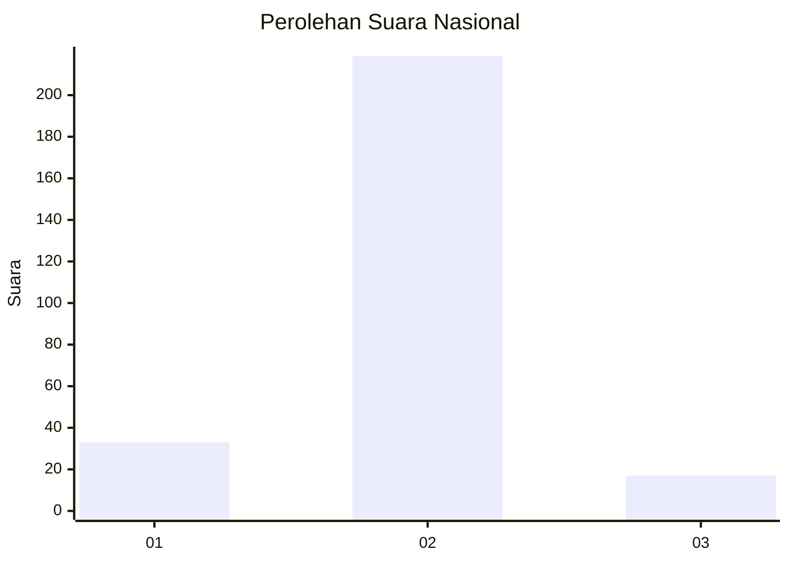
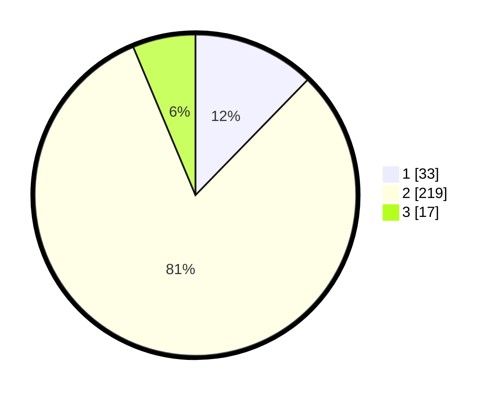

# Hasil

## Grafik

## Tabel

| No. | Nama Paslon    | Suara | Suara (raw) | Persentase |
|:--- |:-------------- | -----:| -----------:| ----------:|
| 1   | ANIES MUHAIMIN | 33    | [33][p-1]   | 12,27      |
| 2   | PRABOWO GIBRAN | 219   | [219][p-2]  | 81,41      |
| 3   | GANJAR MAHFUD  | 17    | [17][p-3]   | 6,32       |

[p-1]: https://github.com/gigit-pemilu/pemilu-2024/blob/main/pilpres/hitung-suara/sub/64-kalimantan-timur/sub/09-penajam-paser-utara/sub/02-waru/sub/1003-waru/sub/003-tps/sub/paslon-1.txt
[p-2]: https://github.com/gigit-pemilu/pemilu-2024/blob/main/pilpres/hitung-suara/sub/64-kalimantan-timur/sub/09-penajam-paser-utara/sub/02-waru/sub/1003-waru/sub/003-tps/sub/paslon-2.txt
[p-3]: https://github.com/gigit-pemilu/pemilu-2024/blob/main/pilpres/hitung-suara/sub/64-kalimantan-timur/sub/09-penajam-paser-utara/sub/02-waru/sub/1003-waru/sub/003-tps/sub/paslon-3.txt

## Foto C Plano

https://sirekap-obj-formc.kpu.go.id/bee1/pemilu/ppwp/64/09/02/10/03/6409021003003-20240221-062844--bfbedb71-89a9-47c8-9ecc-27bb9d34bfb0.jpg

https://sirekap-obj-formc.kpu.go.id/bee1/pemilu/ppwp/64/09/02/10/03/6409021003003-20240219-220132--c47a341d-ca37-451e-abb8-781e8bcaeb6a.jpg

https://sirekap-obj-formc.kpu.go.id/bee1/pemilu/ppwp/64/09/02/10/03/6409021003003-20240219-220149--7eac57c4-8acc-4244-bd23-c2a0fde36ef6.jpg

## Metadata

| Key        | Value               |
| ---------- | ------------------- |
| Time Stamp | 2024-02-21 07:00:00 |

