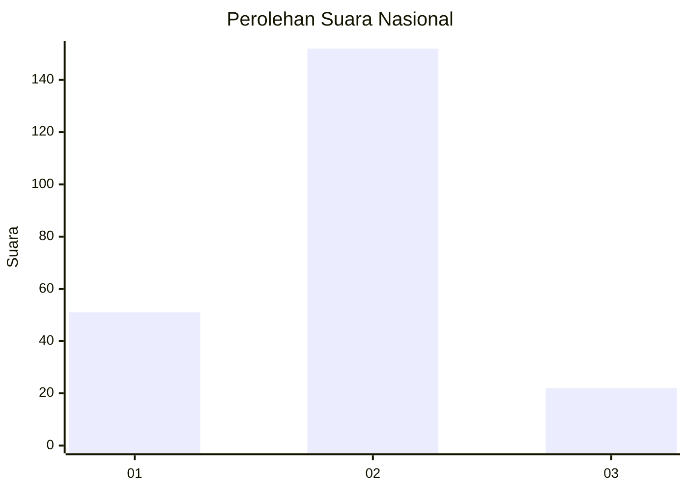

# Hasil

## Grafik

## Tabel

| No. | Nama Paslon    | Suara | Suara (raw) | Persentase |
|:--- |:-------------- | -----:| -----------:| ----------:|
| 1   | ANIES MUHAIMIN | 51    | [51][p-1]   | 22,67      |
| 2   | PRABOWO GIBRAN | 152   | [152][p-2]  | 67,56      |
| 3   | GANJAR MAHFUD  | 22    | [22][p-3]   | 9,78       |

[p-1]: https://github.com/gigit-pemilu/pemilu-2024/blob/main/pilpres/hitung-suara/sub/64-kalimantan-timur/sub/09-penajam-paser-utara/sub/03-babulu/sub/2001-babulu-darat/sub/003-tps/sub/paslon-1.txt
[p-2]: https://github.com/gigit-pemilu/pemilu-2024/blob/main/pilpres/hitung-suara/sub/64-kalimantan-timur/sub/09-penajam-paser-utara/sub/03-babulu/sub/2001-babulu-darat/sub/003-tps/sub/paslon-2.txt
[p-3]: https://github.com/gigit-pemilu/pemilu-2024/blob/main/pilpres/hitung-suara/sub/64-kalimantan-timur/sub/09-penajam-paser-utara/sub/03-babulu/sub/2001-babulu-darat/sub/003-tps/sub/paslon-3.txt

## Foto C Plano

https://sirekap-obj-formc.kpu.go.id/39d6/pemilu/ppwp/64/09/03/20/01/6409032001003-20240219-102219--69ebc559-c354-44cb-8ab8-ffab712decd1.jpg

https://sirekap-obj-formc.kpu.go.id/39d6/pemilu/ppwp/64/09/03/20/01/6409032001003-20240219-102741--b2dd0b8a-ddc2-40c7-ad76-1891e3070232.jpg

https://sirekap-obj-formc.kpu.go.id/39d6/pemilu/ppwp/64/09/03/20/01/6409032001003-20240219-102852--75c891f2-309b-489b-962a-a46edf927b95.jpg

## Metadata

| Key        | Value               |
| ---------- | ------------------- |
| Time Stamp | 2024-02-24 22:31:28 |

