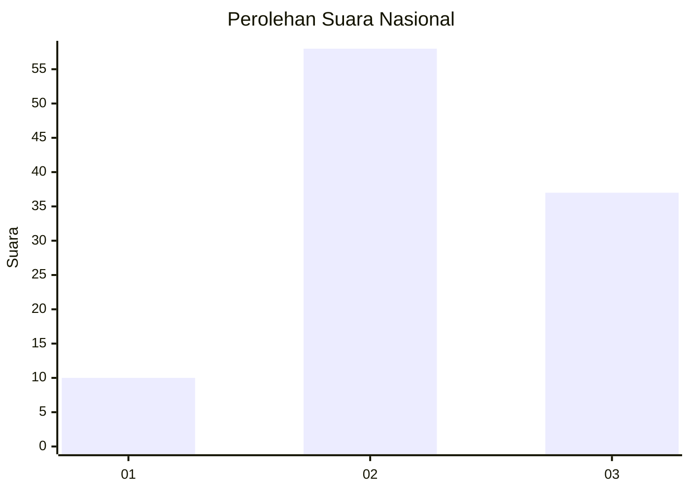
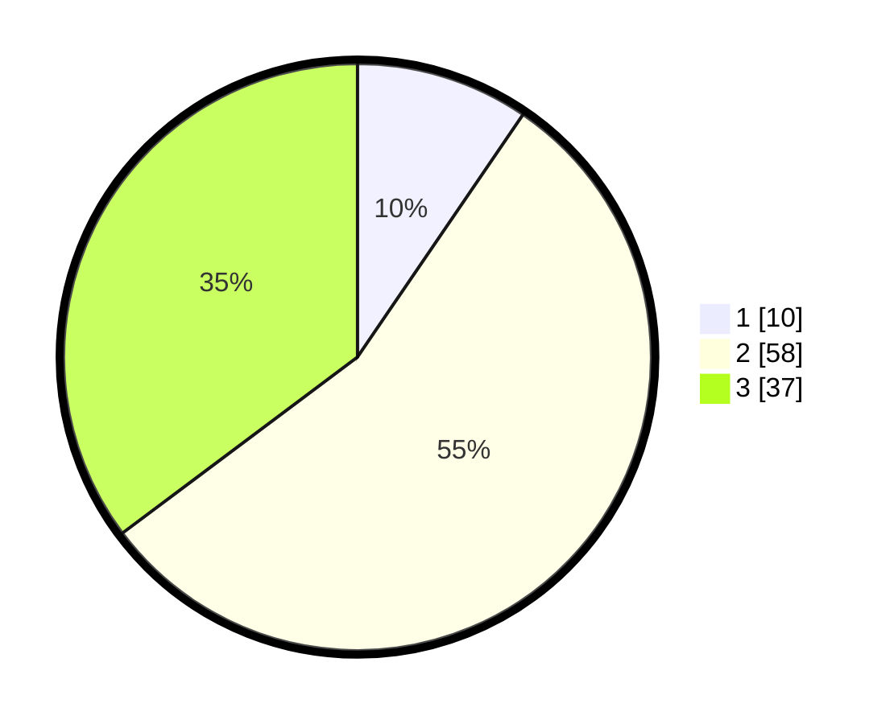

# Hasil

## Grafik

## Tabel

| No. | Nama Paslon    | Suara | Suara (raw) | Persentase |
|:--- |:-------------- | -----:| -----------:| ----------:|
| 1   | ANIES MUHAIMIN | 10    | [10][p-1]   | 9,52       |
| 2   | PRABOWO GIBRAN | 58    | [58][p-2]   | 55,24      |
| 3   | GANJAR MAHFUD  | 37    | [37][p-3]   | 35,24      |

[p-1]: https://github.com/gigit-pemilu/pemilu-2024/blob/main/pilpres/hitung-suara/sub/64-kalimantan-timur/sub/09-penajam-paser-utara/sub/03-babulu/sub/2001-babulu-darat/sub/027-tps/sub/paslon-1.txt
[p-2]: https://github.com/gigit-pemilu/pemilu-2024/blob/main/pilpres/hitung-suara/sub/64-kalimantan-timur/sub/09-penajam-paser-utara/sub/03-babulu/sub/2001-babulu-darat/sub/027-tps/sub/paslon-2.txt
[p-3]: https://github.com/gigit-pemilu/pemilu-2024/blob/main/pilpres/hitung-suara/sub/64-kalimantan-timur/sub/09-penajam-paser-utara/sub/03-babulu/sub/2001-babulu-darat/sub/027-tps/sub/paslon-3.txt

## Foto C Plano

https://sirekap-obj-formc.kpu.go.id/5387/pemilu/ppwp/64/09/03/20/01/6409032001027-20240219-193903--ca515d47-2fd6-41d3-811d-f8387c04812c.jpg

https://sirekap-obj-formc.kpu.go.id/5387/pemilu/ppwp/64/09/03/20/01/6409032001027-20240219-200512--730c48e1-9900-45f4-a60a-f15167088f41.jpg

https://sirekap-obj-formc.kpu.go.id/5387/pemilu/ppwp/64/09/03/20/01/6409032001027-20240219-200803--bedd8876-7532-47bd-b671-61cd5a663543.jpg

## Metadata

| Key        | Value               |
| ---------- | ------------------- |
| Time Stamp | 2024-02-19 21:00:00 |

