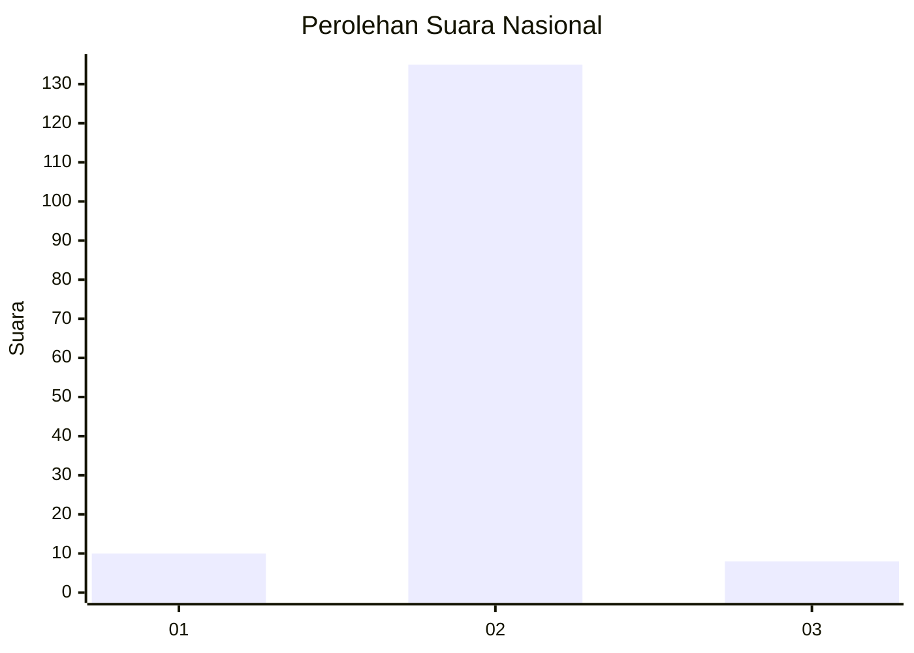
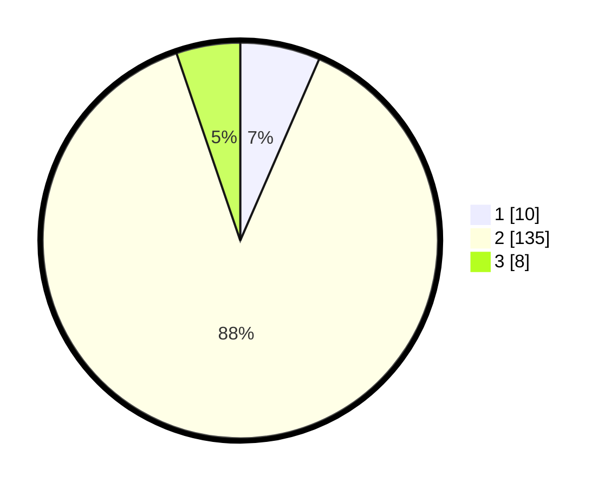

# Hasil

## Grafik

## Tabel

| No. | Nama Paslon    | Suara | Suara (raw) | Persentase |
|:--- |:-------------- | -----:| -----------:| ----------:|
| 1   | ANIES MUHAIMIN | 10    | [10][p-1]   | 6,54       |
| 2   | PRABOWO GIBRAN | 135   | [135][p-2]  | 88,24      |
| 3   | GANJAR MAHFUD  | 8     | [8][p-3]    | 5,23       |

[p-1]: https://github.com/gigit-pemilu/pemilu-2024/blob/main/pilpres/hitung-suara/sub/64-kalimantan-timur/sub/09-penajam-paser-utara/sub/04-sepaku/sub/1005-sepaku/sub/001-tps/sub/paslon-1.txt
[p-2]: https://github.com/gigit-pemilu/pemilu-2024/blob/main/pilpres/hitung-suara/sub/64-kalimantan-timur/sub/09-penajam-paser-utara/sub/04-sepaku/sub/1005-sepaku/sub/001-tps/sub/paslon-2.txt
[p-3]: https://github.com/gigit-pemilu/pemilu-2024/blob/main/pilpres/hitung-suara/sub/64-kalimantan-timur/sub/09-penajam-paser-utara/sub/04-sepaku/sub/1005-sepaku/sub/001-tps/sub/paslon-3.txt

## Foto C Plano

https://sirekap-obj-formc.kpu.go.id/434f/pemilu/ppwp/64/09/04/10/05/6409041005001-20240225-055852--5e0b395b-6c57-44e5-9e81-eaba92fec12b.jpg

https://sirekap-obj-formc.kpu.go.id/434f/pemilu/ppwp/64/09/04/10/05/6409041005001-20240214-141741--12a86a01-2b64-41f4-8183-85432e324fdf.jpg

https://sirekap-obj-formc.kpu.go.id/434f/pemilu/ppwp/64/09/04/10/05/6409041005001-20240214-141933--d2792240-1b3e-4715-b04f-83197b322e35.jpg

## Metadata

| Key        | Value               |
| ---------- | ------------------- |
| Time Stamp | 2024-02-25 06:00:00 |

