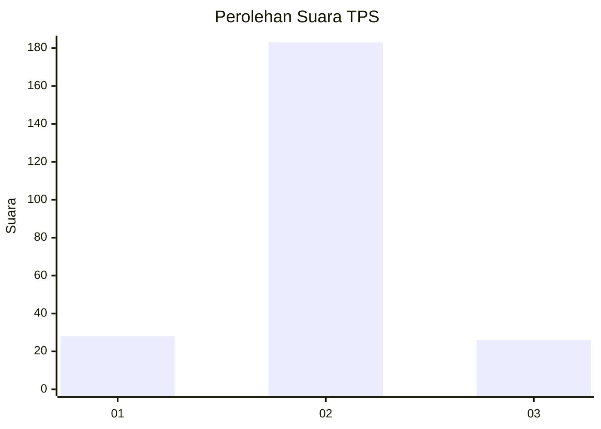
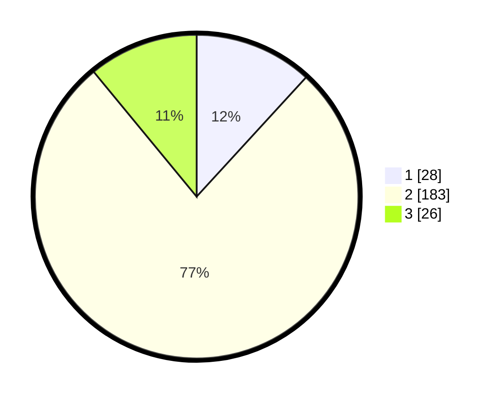

# Hasil

## Grafik

## Tabel

| No. | Nama Paslon    | Suara | Suara (raw) | Persentase |
|:--- |:-------------- | -----:| -----------:| ----------:|
| 1   | ANIES MUHAIMIN | 28    | [28][p-1]   | 11,81      |
| 2   | PRABOWO GIBRAN | 183   | [183][p-2]  | 77,22      |
| 3   | GANJAR MAHFUD  | 26    | [26][p-3]   | 10,97      |

[p-1]: https://github.com/gigit-pemilu/pemilu-2024-64-kalimantan-timur/blob/main/pilpres/hitung-suara/sub/64-kalimantan-timur/sub/09-penajam-paser-utara/sub/04-sepaku/sub/1005-sepaku/sub/003-tps/sub/paslon-1.txt
[p-2]: https://github.com/gigit-pemilu/pemilu-2024-64-kalimantan-timur/blob/main/pilpres/hitung-suara/sub/64-kalimantan-timur/sub/09-penajam-paser-utara/sub/04-sepaku/sub/1005-sepaku/sub/003-tps/sub/paslon-2.txt
[p-3]: https://github.com/gigit-pemilu/pemilu-2024-64-kalimantan-timur/blob/main/pilpres/hitung-suara/sub/64-kalimantan-timur/sub/09-penajam-paser-utara/sub/04-sepaku/sub/1005-sepaku/sub/003-tps/sub/paslon-3.txt

## Foto C Plano

https://sirekap-obj-formc.kpu.go.id/6dee/pemilu/ppwp/64/09/04/10/05/6409041005003-20240219-181511--dc4498a5-d03a-4f09-b265-3e8e14cc2ab7.jpg

https://sirekap-obj-formc.kpu.go.id/6dee/pemilu/ppwp/64/09/04/10/05/6409041005003-20240219-181611--3790fe6a-42f7-48bb-a86a-b309ffcbb496.jpg

https://sirekap-obj-formc.kpu.go.id/6dee/pemilu/ppwp/64/09/04/10/05/6409041005003-20240219-181650--459f3671-b085-440c-9da2-2e4ad2b928e8.jpg

## Metadata

| Key        | Value               |
| ---------- | ------------------- |
| Time Stamp | 2024-02-25 21:00:00 |

