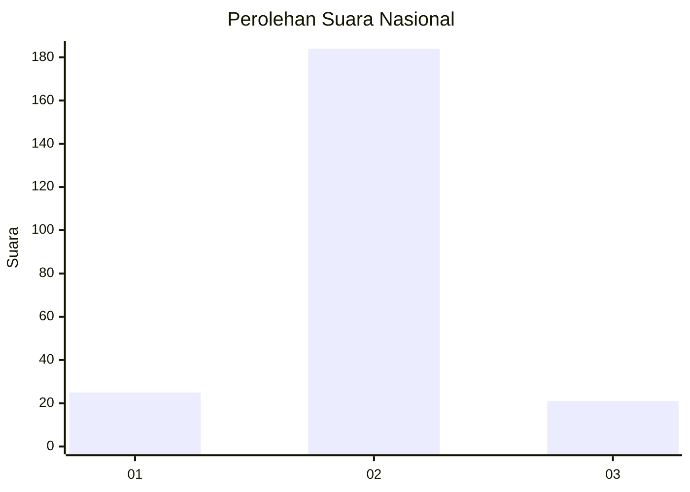
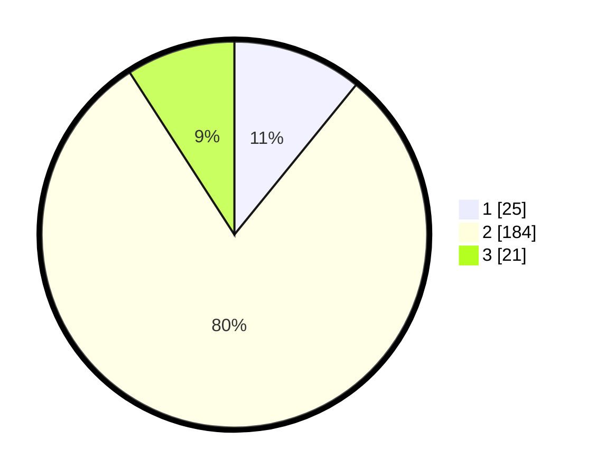

# Hasil

## Grafik

## Tabel

| No. | Nama Paslon    | Suara | Suara (raw) | Persentase |
|:--- |:-------------- | -----:| -----------:| ----------:|
| 1   | ANIES MUHAIMIN | 25    | [25][p-1]   | 10,87      |
| 2   | PRABOWO GIBRAN | 184   | [184][p-2]  | 80,00      |
| 3   | GANJAR MAHFUD  | 21    | [21][p-3]   | 9,13       |

[p-1]: https://github.com/gigit-pemilu/pemilu-2024/blob/main/pilpres/hitung-suara/sub/64-kalimantan-timur/sub/09-penajam-paser-utara/sub/04-sepaku/sub/1005-sepaku/sub/004-tps/sub/paslon-1.txt
[p-2]: https://github.com/gigit-pemilu/pemilu-2024/blob/main/pilpres/hitung-suara/sub/64-kalimantan-timur/sub/09-penajam-paser-utara/sub/04-sepaku/sub/1005-sepaku/sub/004-tps/sub/paslon-2.txt
[p-3]: https://github.com/gigit-pemilu/pemilu-2024/blob/main/pilpres/hitung-suara/sub/64-kalimantan-timur/sub/09-penajam-paser-utara/sub/04-sepaku/sub/1005-sepaku/sub/004-tps/sub/paslon-3.txt

## Foto C Plano

https://sirekap-obj-formc.kpu.go.id/16f9/pemilu/ppwp/64/09/04/10/05/6409041005004-20240224-093957--d2a9fb24-01b8-4ecc-8fb9-aa7c8c7d0b42.jpg

https://sirekap-obj-formc.kpu.go.id/16f9/pemilu/ppwp/64/09/04/10/05/6409041005004-20240224-093902--9a995438-1035-49c0-807f-654aecd9ac03.jpg

https://sirekap-obj-formc.kpu.go.id/16f9/pemilu/ppwp/64/09/04/10/05/6409041005004-20240224-094024--0bfea20c-58f1-4065-80ef-7cd38e4264d1.jpg

## Metadata

| Key        | Value               |
| ---------- | ------------------- |
| Time Stamp | 2024-02-25 20:00:00 |

