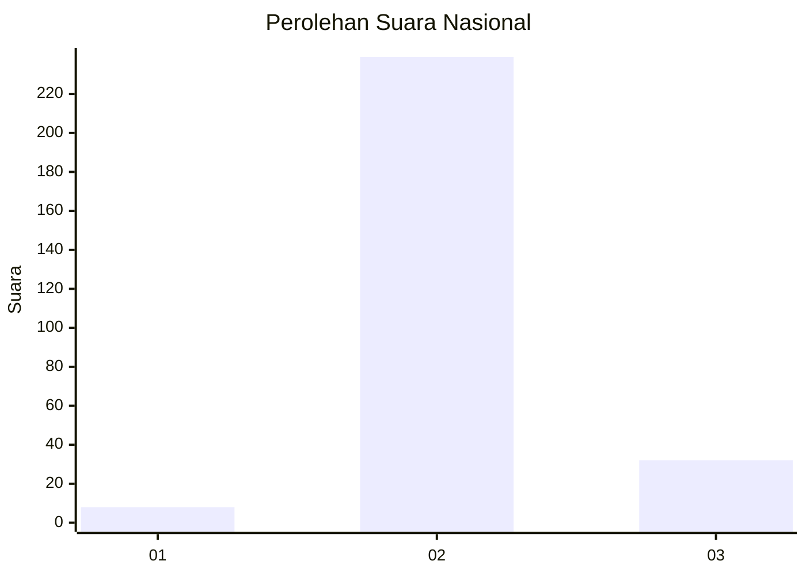
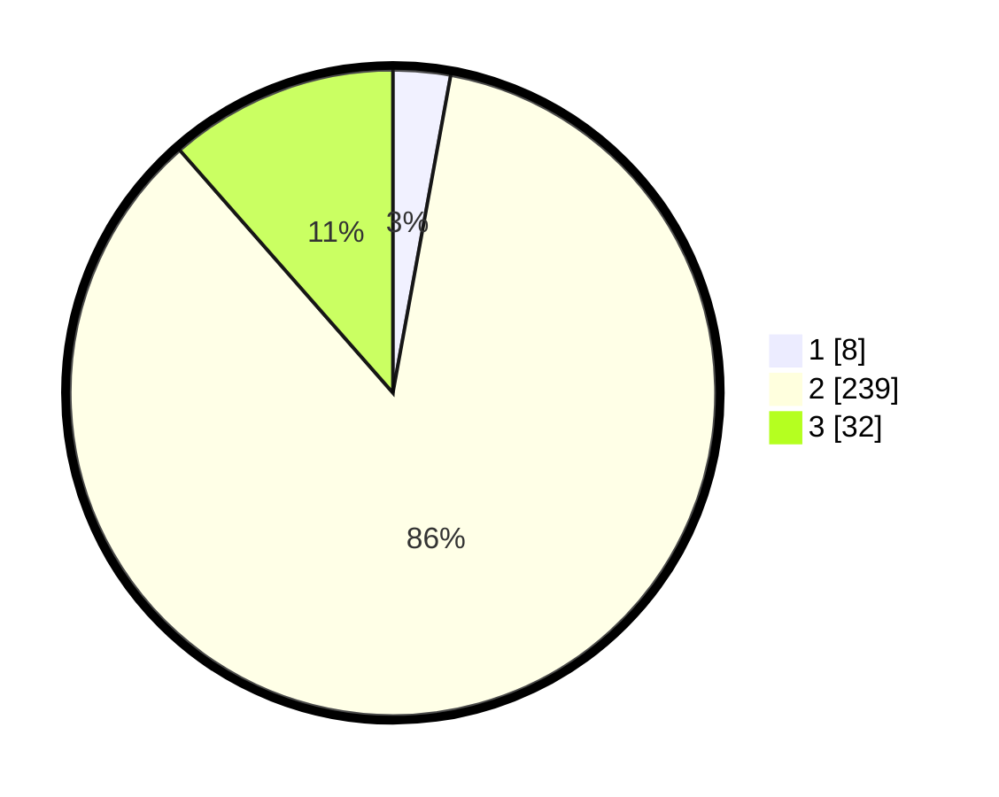

# Hasil

## Grafik

## Tabel

| No. | Nama Paslon    | Suara | Suara (raw) | Persentase |
|:--- |:-------------- | -----:| -----------:| ----------:|
| 1   | ANIES MUHAIMIN | 8     | [8][p-1]    | 2,87       |
| 2   | PRABOWO GIBRAN | 239   | [239][p-2]  | 85,66      |
| 3   | GANJAR MAHFUD  | 32    | [32][p-3]   | 11,47      |

[p-1]: https://github.com/gigit-pemilu/pemilu-2024/blob/main/pilpres/hitung-suara/sub/64-kalimantan-timur/sub/09-penajam-paser-utara/sub/04-sepaku/sub/2003-suka-raja/sub/009-tps/sub/paslon-1.txt
[p-2]: https://github.com/gigit-pemilu/pemilu-2024/blob/main/pilpres/hitung-suara/sub/64-kalimantan-timur/sub/09-penajam-paser-utara/sub/04-sepaku/sub/2003-suka-raja/sub/009-tps/sub/paslon-2.txt
[p-3]: https://github.com/gigit-pemilu/pemilu-2024/blob/main/pilpres/hitung-suara/sub/64-kalimantan-timur/sub/09-penajam-paser-utara/sub/04-sepaku/sub/2003-suka-raja/sub/009-tps/sub/paslon-3.txt

## Foto C Plano

https://sirekap-obj-formc.kpu.go.id/f0f7/pemilu/ppwp/64/09/04/20/03/6409042003009-20240225-222738--66d698ce-1bf3-48fa-a6f7-79d02f4caf05.jpg

https://sirekap-obj-formc.kpu.go.id/f0f7/pemilu/ppwp/64/09/04/20/03/6409042003009-20240222-150720--bfa5c393-21eb-4c13-bc97-12a9dd1d99b4.jpg

https://sirekap-obj-formc.kpu.go.id/f0f7/pemilu/ppwp/64/09/04/20/03/6409042003009-20240225-223050--71959c51-cebc-4d39-aa3b-1e85f888964c.jpg

## Metadata

| Key        | Value               |
| ---------- | ------------------- |
| Time Stamp | 2024-02-25 23:00:00 |

