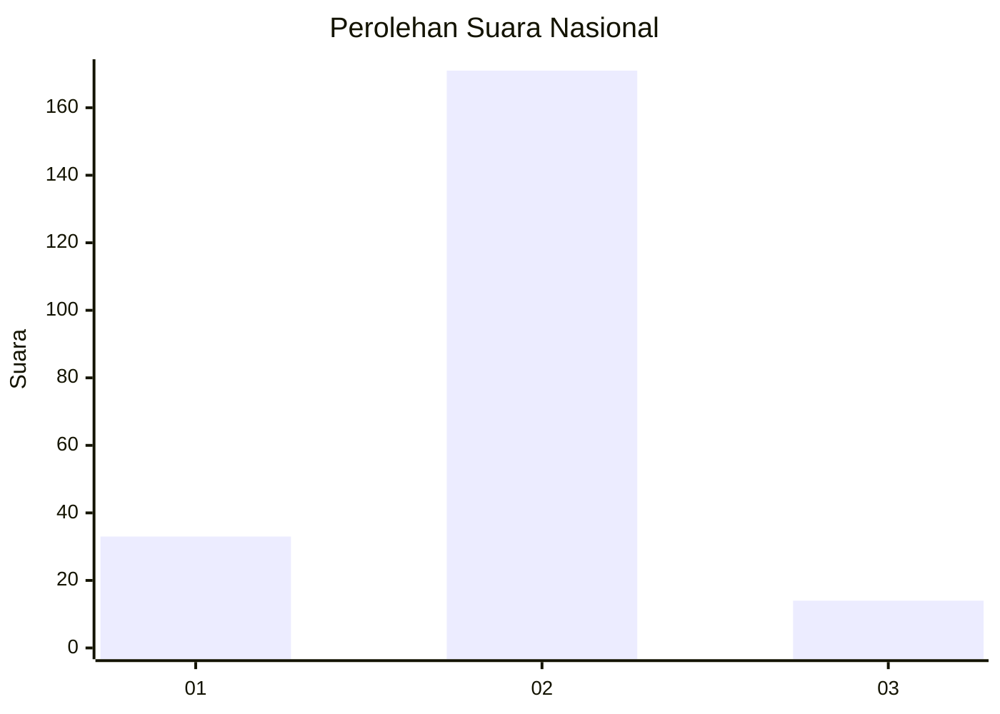
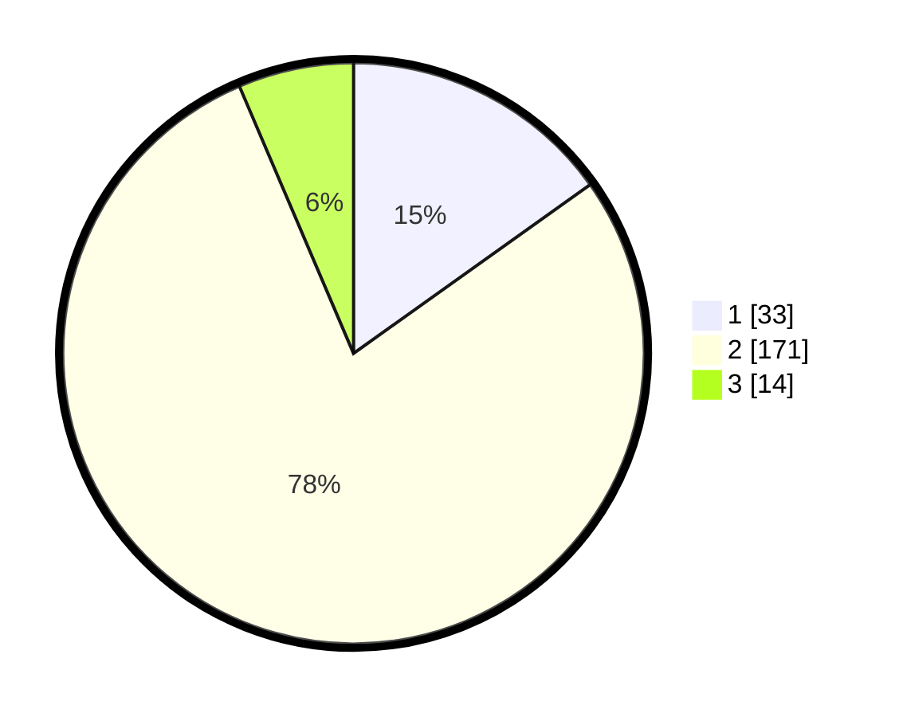

# Hasil

## Grafik

## Tabel

| No. | Nama Paslon    | Suara | Suara (raw) | Persentase |
|:--- |:-------------- | -----:| -----------:| ----------:|
| 1   | ANIES MUHAIMIN | 33    | [33][p-1]   | 15,14      |
| 2   | PRABOWO GIBRAN | 171   | [171][p-2]  | 78,44      |
| 3   | GANJAR MAHFUD  | 14    | [14][p-3]   | 6,42       |

[p-1]: https://github.com/gigit-pemilu/pemilu-2024/blob/main/pilpres/hitung-suara/sub/64-kalimantan-timur/sub/71-kota-balikpapan/sub/02-balikpapan-barat/sub/1001-baru-ilir/sub/003-tps/sub/paslon-1.txt
[p-2]: https://github.com/gigit-pemilu/pemilu-2024/blob/main/pilpres/hitung-suara/sub/64-kalimantan-timur/sub/71-kota-balikpapan/sub/02-balikpapan-barat/sub/1001-baru-ilir/sub/003-tps/sub/paslon-2.txt
[p-3]: https://github.com/gigit-pemilu/pemilu-2024/blob/main/pilpres/hitung-suara/sub/64-kalimantan-timur/sub/71-kota-balikpapan/sub/02-balikpapan-barat/sub/1001-baru-ilir/sub/003-tps/sub/paslon-3.txt

## Foto C Plano

https://sirekap-obj-formc.kpu.go.id/d103/pemilu/ppwp/64/71/02/10/01/6471021001003-20240229-122408--0a1e7fa2-0695-47a9-a8a1-43c5d2d78b6c.jpg

https://sirekap-obj-formc.kpu.go.id/d103/pemilu/ppwp/64/71/02/10/01/6471021001003-20240214-234227--ad39b9e5-2f6a-45a2-bec6-fdc5a1d616cc.jpg

https://sirekap-obj-formc.kpu.go.id/d103/pemilu/ppwp/64/71/02/10/01/6471021001003-20240214-234400--6b425369-43da-4785-95a5-7a566f1915d0.jpg

## Metadata

| Key        | Value               |
| ---------- | ------------------- |
| Time Stamp | 2024-02-29 13:00:00 |

