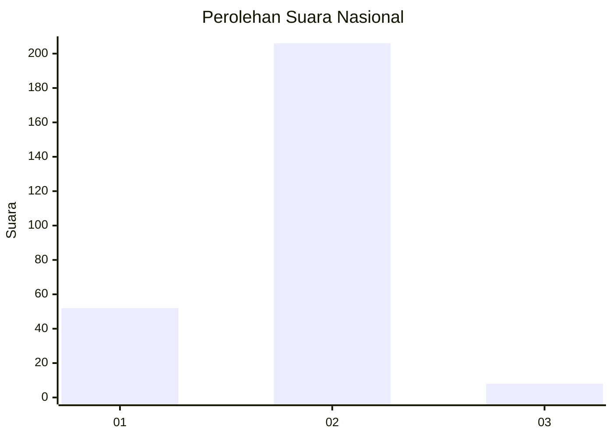
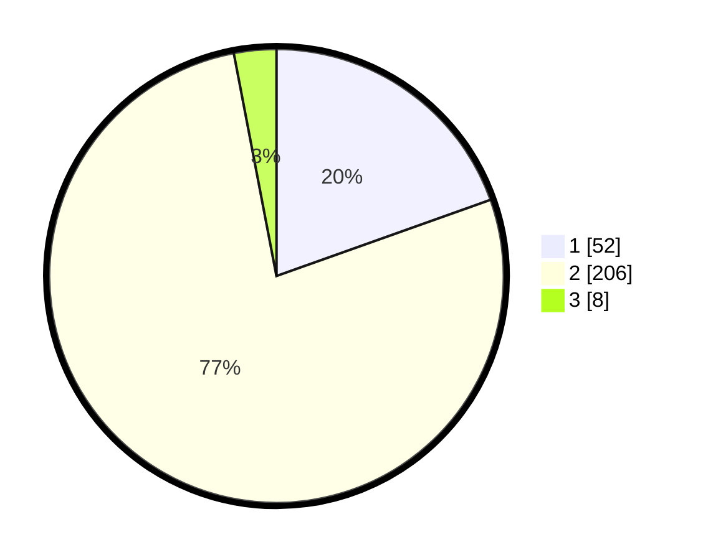

# Hasil

## Grafik

## Tabel

| No. | Nama Paslon    | Suara | Suara (raw) | Persentase |
|:--- |:-------------- | -----:| -----------:| ----------:|
| 1   | ANIES MUHAIMIN | 52    | [52][p-1]   | 19,55      |
| 2   | PRABOWO GIBRAN | 206   | [206][p-2]  | 77,44      |
| 3   | GANJAR MAHFUD  | 8     | [8][p-3]    | 3,01       |

[p-1]: https://github.com/gigit-pemilu/pemilu-2024/blob/main/pilpres/hitung-suara/sub/64-kalimantan-timur/sub/71-kota-balikpapan/sub/02-balikpapan-barat/sub/1004-kariangau/sub/006-tps/sub/paslon-1.txt
[p-2]: https://github.com/gigit-pemilu/pemilu-2024/blob/main/pilpres/hitung-suara/sub/64-kalimantan-timur/sub/71-kota-balikpapan/sub/02-balikpapan-barat/sub/1004-kariangau/sub/006-tps/sub/paslon-2.txt
[p-3]: https://github.com/gigit-pemilu/pemilu-2024/blob/main/pilpres/hitung-suara/sub/64-kalimantan-timur/sub/71-kota-balikpapan/sub/02-balikpapan-barat/sub/1004-kariangau/sub/006-tps/sub/paslon-3.txt

## Foto C Plano

https://sirekap-obj-formc.kpu.go.id/6e0f/pemilu/ppwp/64/71/02/10/04/6471021004006-20240214-215258--e7f8ed48-9f98-4aa7-bed3-5929915ef370.jpg

https://sirekap-obj-formc.kpu.go.id/6e0f/pemilu/ppwp/64/71/02/10/04/6471021004006-20240214-155141--b980c9cb-bfe3-4db4-9403-c87f43e1cd9e.jpg

https://sirekap-obj-formc.kpu.go.id/6e0f/pemilu/ppwp/64/71/02/10/04/6471021004006-20240214-162231--1cc0c7d2-0f8f-4b04-a2ae-22cdbafc3292.jpg

## Metadata

| Key        | Value               |
| ---------- | ------------------- |
| Time Stamp | 2024-02-15 05:00:24 |

