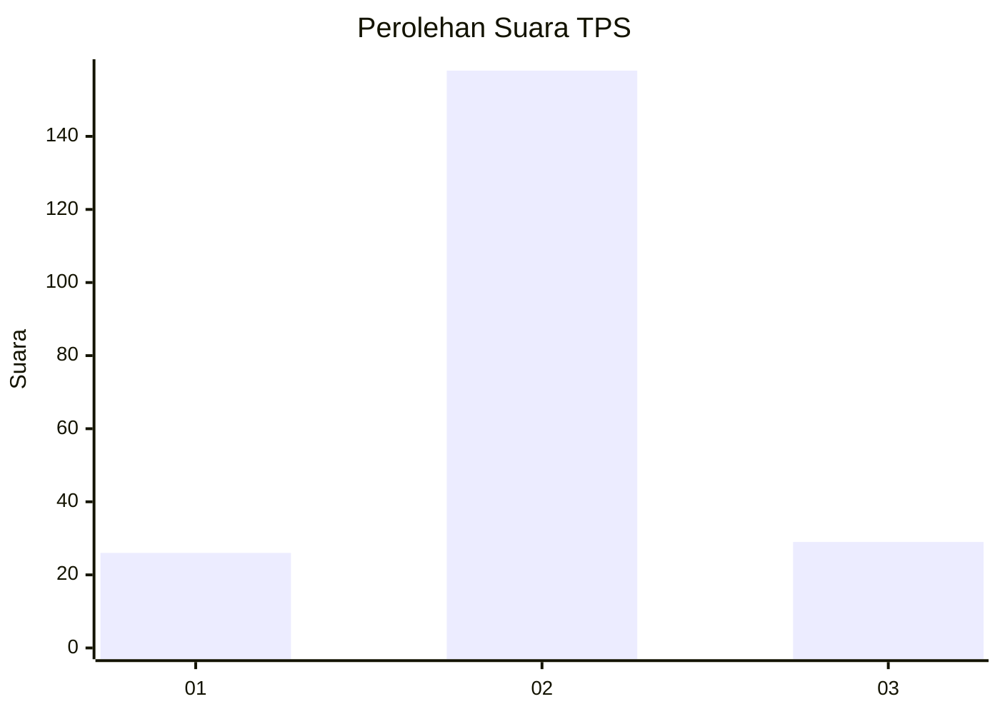
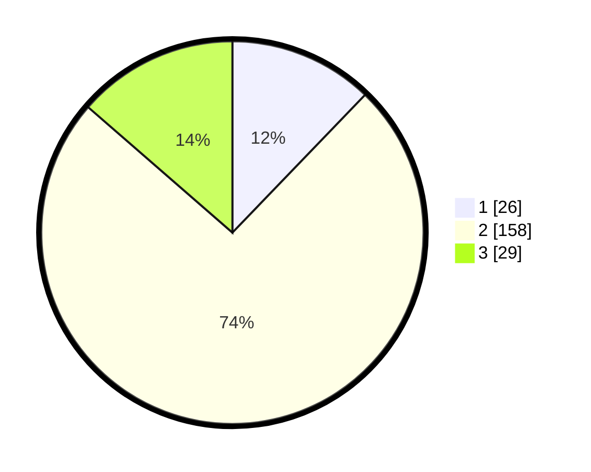

# Hasil

## Grafik

## Tabel

| No. | Nama Paslon    | Suara | Suara (raw) | Persentase |
|:--- |:-------------- | -----:| -----------:| ----------:|
| 1   | ANIES MUHAIMIN | 26    | [26][p-1]   | 12,21      |
| 2   | PRABOWO GIBRAN | 158   | [158][p-2]  | 74,18      |
| 3   | GANJAR MAHFUD  | 29    | [29][p-3]   | 13,62      |

[p-1]: https://github.com/gigit-pemilu/pemilu-2024-64-kalimantan-timur/blob/main/pilpres/hitung-suara/sub/64-kalimantan-timur/sub/71-kota-balikpapan/sub/03-balikpapan-utara/sub/1001-batu-ampar/sub/004-tps/sub/paslon-1.txt
[p-2]: https://github.com/gigit-pemilu/pemilu-2024-64-kalimantan-timur/blob/main/pilpres/hitung-suara/sub/64-kalimantan-timur/sub/71-kota-balikpapan/sub/03-balikpapan-utara/sub/1001-batu-ampar/sub/004-tps/sub/paslon-2.txt
[p-3]: https://github.com/gigit-pemilu/pemilu-2024-64-kalimantan-timur/blob/main/pilpres/hitung-suara/sub/64-kalimantan-timur/sub/71-kota-balikpapan/sub/03-balikpapan-utara/sub/1001-batu-ampar/sub/004-tps/sub/paslon-3.txt

## Foto C Plano

https://sirekap-obj-formc.kpu.go.id/7f60/pemilu/ppwp/64/71/03/10/01/6471031001004-20240214-155434--ece150b1-6da0-4123-b8cd-4740e04e7518.jpg

https://sirekap-obj-formc.kpu.go.id/7f60/pemilu/ppwp/64/71/03/10/01/6471031001004-20240214-155059--c45461ae-e855-472f-b749-90b2fe3e608c.jpg

https://sirekap-obj-formc.kpu.go.id/7f60/pemilu/ppwp/64/71/03/10/01/6471031001004-20240214-155117--86161851-dc82-49ae-8990-547c3ce0063b.jpg

## Metadata

| Key        | Value               |
| ---------- | ------------------- |
| Time Stamp | 2024-02-15 22:30:27 |

