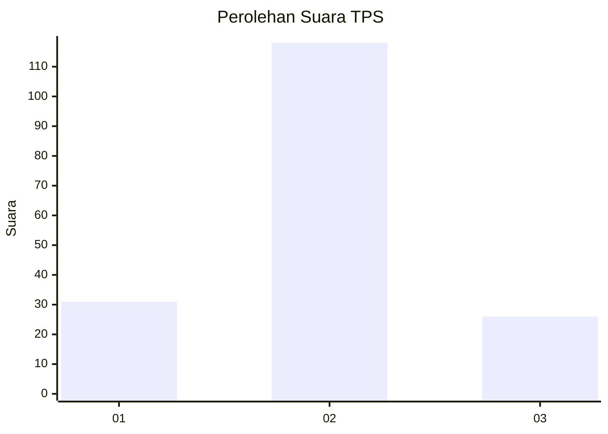
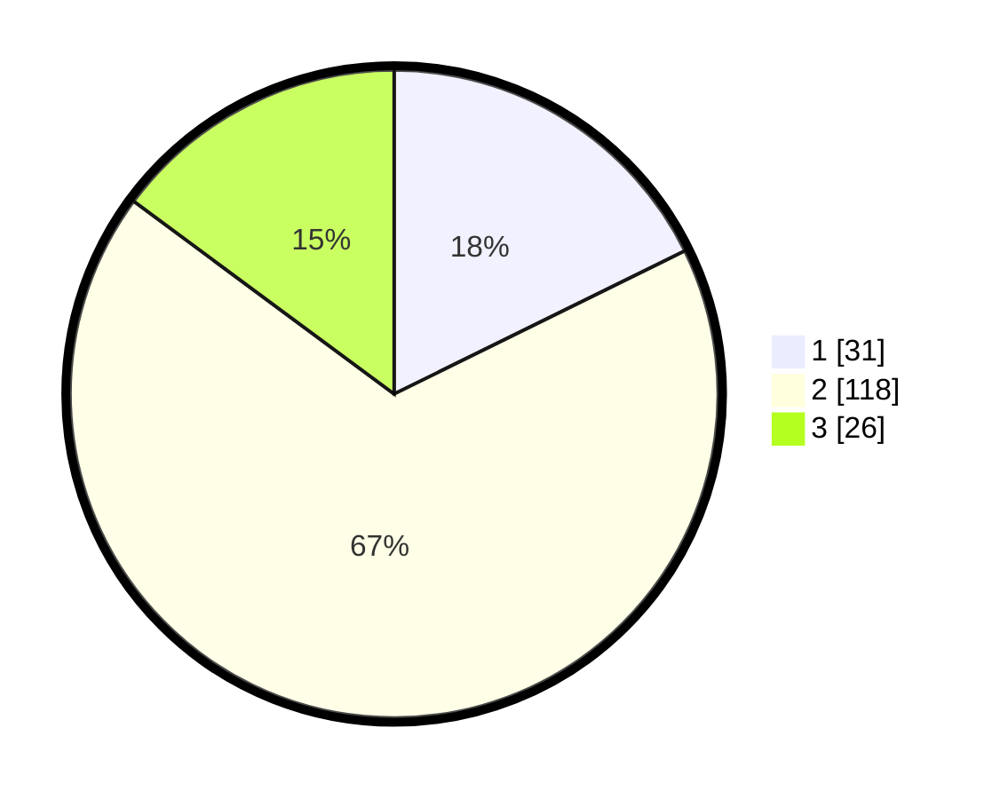

# Hasil

## Grafik

## Tabel

| No. | Nama Paslon    | Suara | Suara (raw) | Persentase |
|:--- |:-------------- | -----:| -----------:| ----------:|
| 1   | ANIES MUHAIMIN | 31    | [31][p-1]   | 17,71      |
| 2   | PRABOWO GIBRAN | 118   | [118][p-2]  | 67,43      |
| 3   | GANJAR MAHFUD  | 26    | [26][p-3]   | 14,86      |

[p-1]: https://github.com/gigit-pemilu/pemilu-2024-64-kalimantan-timur/blob/main/pilpres/hitung-suara/sub/64-kalimantan-timur/sub/71-kota-balikpapan/sub/05-balikpapan-selatan/sub/1002-sepinggan/sub/002-tps/sub/paslon-1.txt
[p-2]: https://github.com/gigit-pemilu/pemilu-2024-64-kalimantan-timur/blob/main/pilpres/hitung-suara/sub/64-kalimantan-timur/sub/71-kota-balikpapan/sub/05-balikpapan-selatan/sub/1002-sepinggan/sub/002-tps/sub/paslon-2.txt
[p-3]: https://github.com/gigit-pemilu/pemilu-2024-64-kalimantan-timur/blob/main/pilpres/hitung-suara/sub/64-kalimantan-timur/sub/71-kota-balikpapan/sub/05-balikpapan-selatan/sub/1002-sepinggan/sub/002-tps/sub/paslon-3.txt

## Foto C Plano

https://sirekap-obj-formc.kpu.go.id/ef62/pemilu/ppwp/64/71/05/10/02/6471051002002-20240214-235019--e1a6ffc5-e076-4f60-98f6-a4f92fbecbfc.jpg

https://sirekap-obj-formc.kpu.go.id/ef62/pemilu/ppwp/64/71/05/10/02/6471051002002-20240214-235132--8e3c767c-a624-493d-beaf-d6ce57c17075.jpg

https://sirekap-obj-formc.kpu.go.id/ef62/pemilu/ppwp/64/71/05/10/02/6471051002002-20240214-235323--cc1597b2-bcc0-4310-bf6d-2e453e9b1910.jpg

## Metadata

| Key        | Value               |
| ---------- | ------------------- |
| Time Stamp | 2024-02-15 12:00:28 |

