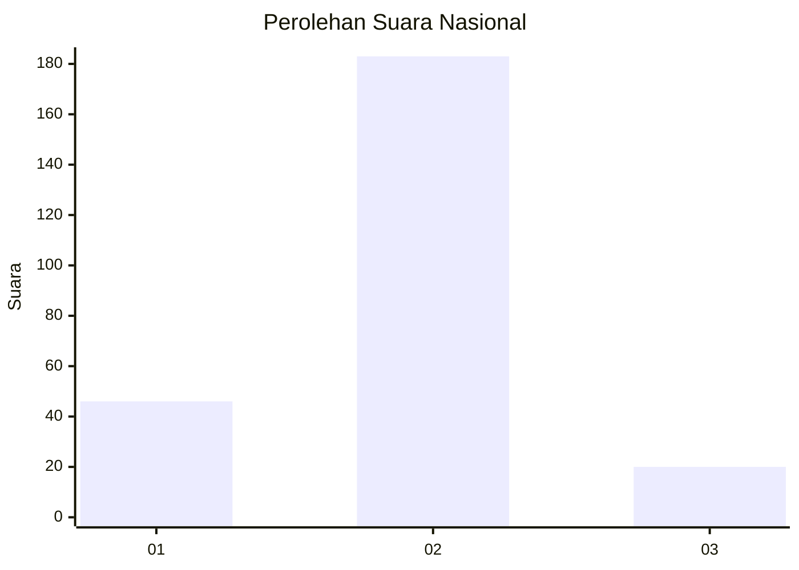
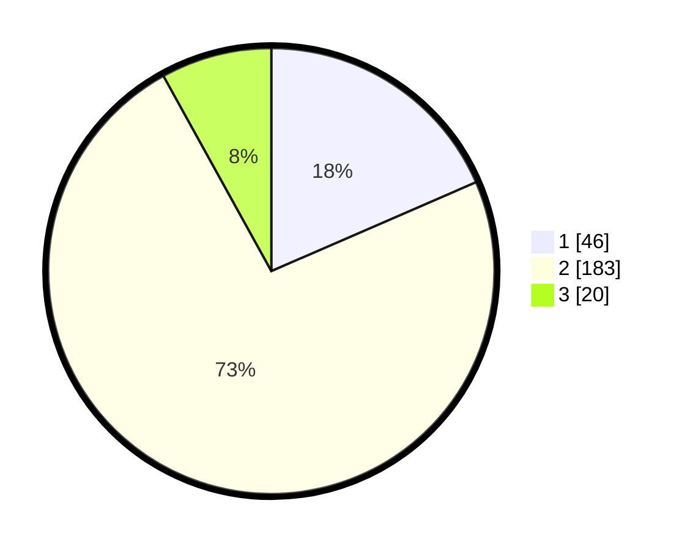

# Hasil

## Grafik

## Tabel

| No. | Nama Paslon    | Suara | Suara (raw) | Persentase |
|:--- |:-------------- | -----:| -----------:| ----------:|
| 1   | ANIES MUHAIMIN | 46    | [46][p-1]   | 18,47      |
| 2   | PRABOWO GIBRAN | 183   | [183][p-2]  | 73,49      |
| 3   | GANJAR MAHFUD  | 20    | [20][p-3]   | 8,03       |

[p-1]: https://github.com/gigit-pemilu/pemilu-2024/blob/main/pilpres/hitung-suara/sub/64-kalimantan-timur/sub/71-kota-balikpapan/sub/06-balikpapan-kota/sub/1001-prapatan/sub/003-tps/sub/paslon-1.txt
[p-2]: https://github.com/gigit-pemilu/pemilu-2024/blob/main/pilpres/hitung-suara/sub/64-kalimantan-timur/sub/71-kota-balikpapan/sub/06-balikpapan-kota/sub/1001-prapatan/sub/003-tps/sub/paslon-2.txt
[p-3]: https://github.com/gigit-pemilu/pemilu-2024/blob/main/pilpres/hitung-suara/sub/64-kalimantan-timur/sub/71-kota-balikpapan/sub/06-balikpapan-kota/sub/1001-prapatan/sub/003-tps/sub/paslon-3.txt

## Foto C Plano

https://sirekap-obj-formc.kpu.go.id/3de3/pemilu/ppwp/64/71/06/10/01/6471061001003-20240214-220701--6aac6cda-4082-4ba2-a8bf-0415b61634d4.jpg

https://sirekap-obj-formc.kpu.go.id/3de3/pemilu/ppwp/64/71/06/10/01/6471061001003-20240214-220939--b4c78b1b-05c5-4c4a-bce7-4287c1b02465.jpg

https://sirekap-obj-formc.kpu.go.id/3de3/pemilu/ppwp/64/71/06/10/01/6471061001003-20240214-220551--41a7c1dc-3160-41f4-bfc3-94dd7525aab9.jpg

## Metadata

| Key        | Value               |
| ---------- | ------------------- |
| Time Stamp | 2024-02-24 22:31:28 |

