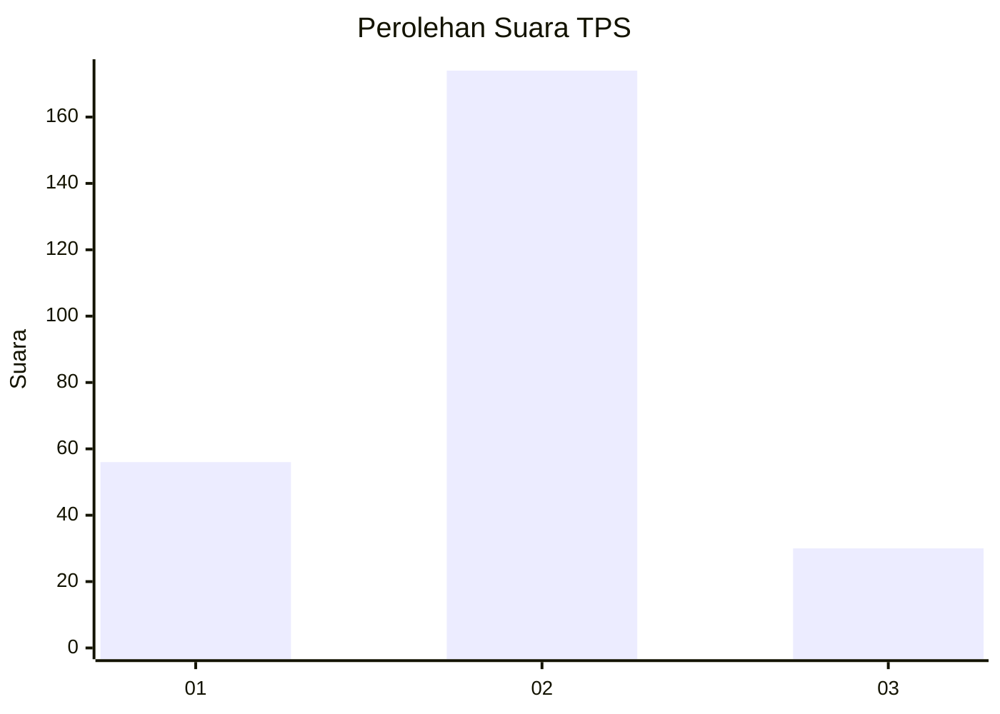
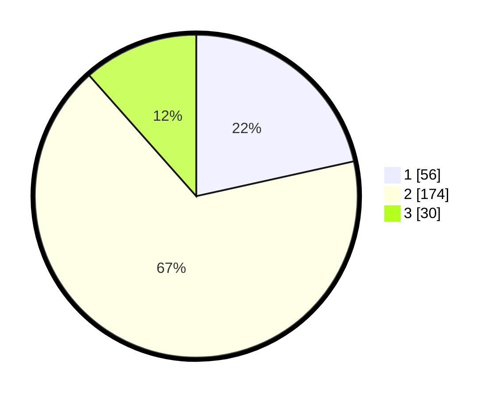

# Hasil

## Grafik

## Tabel

| No. | Nama Paslon    | Suara | Suara (raw) | Persentase |
|:--- |:-------------- | -----:| -----------:| ----------:|
| 1   | ANIES MUHAIMIN | 56    | [56][p-1]   | 21,54      |
| 2   | PRABOWO GIBRAN | 174   | [174][p-2]  | 66,92      |
| 3   | GANJAR MAHFUD  | 30    | [30][p-3]   | 11,54      |

[p-1]: https://github.com/gigit-pemilu/pemilu-2024-64-kalimantan-timur/blob/main/pilpres/hitung-suara/sub/64-kalimantan-timur/sub/71-kota-balikpapan/sub/06-balikpapan-kota/sub/1001-prapatan/sub/004-tps/sub/paslon-1.txt
[p-2]: https://github.com/gigit-pemilu/pemilu-2024-64-kalimantan-timur/blob/main/pilpres/hitung-suara/sub/64-kalimantan-timur/sub/71-kota-balikpapan/sub/06-balikpapan-kota/sub/1001-prapatan/sub/004-tps/sub/paslon-2.txt
[p-3]: https://github.com/gigit-pemilu/pemilu-2024-64-kalimantan-timur/blob/main/pilpres/hitung-suara/sub/64-kalimantan-timur/sub/71-kota-balikpapan/sub/06-balikpapan-kota/sub/1001-prapatan/sub/004-tps/sub/paslon-3.txt

## Foto C Plano

https://sirekap-obj-formc.kpu.go.id/0531/pemilu/ppwp/64/71/06/10/01/6471061001004-20240214-185248--31aedbe9-047a-42c4-88ff-61a8951d9c02.jpg

https://sirekap-obj-formc.kpu.go.id/0531/pemilu/ppwp/64/71/06/10/01/6471061001004-20240214-185252--0d482e41-c6ca-47a6-b3b8-c1e54fd6c9ee.jpg

https://sirekap-obj-formc.kpu.go.id/0531/pemilu/ppwp/64/71/06/10/01/6471061001004-20240214-185302--d44ead12-f1f5-4263-9a73-da831c3a8cd2.jpg

## Metadata

| Key        | Value               |
| ---------- | ------------------- |
| Time Stamp | 2024-02-25 16:00:00 |

