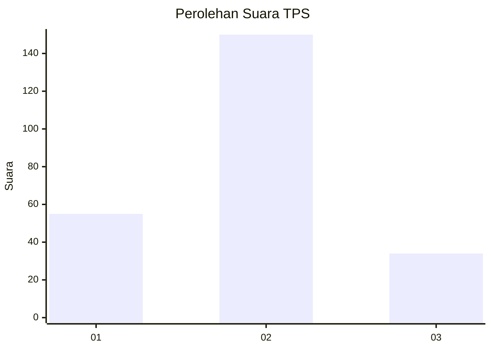
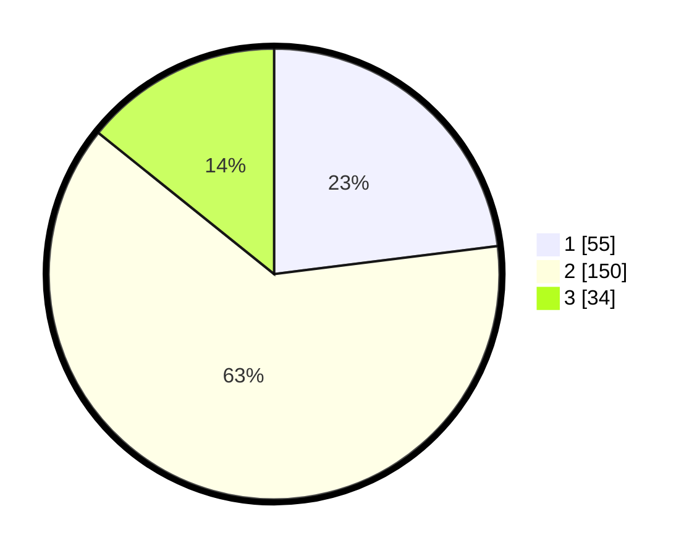

# Hasil

## Grafik

## Tabel

| No. | Nama Paslon    | Suara | Suara (raw) | Persentase |
|:--- |:-------------- | -----:| -----------:| ----------:|
| 1   | ANIES MUHAIMIN | 55    | [55][p-1]   | 23,01      |
| 2   | PRABOWO GIBRAN | 150   | [150][p-2]  | 62,76      |
| 3   | GANJAR MAHFUD  | 34    | [34][p-3]   | 14,23      |

[p-1]: https://github.com/gigit-pemilu/pemilu-2024-64-kalimantan-timur/blob/main/pilpres/hitung-suara/sub/64-kalimantan-timur/sub/71-kota-balikpapan/sub/06-balikpapan-kota/sub/1001-prapatan/sub/006-tps/sub/paslon-1.txt
[p-2]: https://github.com/gigit-pemilu/pemilu-2024-64-kalimantan-timur/blob/main/pilpres/hitung-suara/sub/64-kalimantan-timur/sub/71-kota-balikpapan/sub/06-balikpapan-kota/sub/1001-prapatan/sub/006-tps/sub/paslon-2.txt
[p-3]: https://github.com/gigit-pemilu/pemilu-2024-64-kalimantan-timur/blob/main/pilpres/hitung-suara/sub/64-kalimantan-timur/sub/71-kota-balikpapan/sub/06-balikpapan-kota/sub/1001-prapatan/sub/006-tps/sub/paslon-3.txt

## Foto C Plano

https://sirekap-obj-formc.kpu.go.id/4f6f/pemilu/ppwp/64/71/06/10/01/6471061001006-20240215-053920--8583b129-7dfc-4bfa-b602-704c4c482f6d.jpg

https://sirekap-obj-formc.kpu.go.id/4f6f/pemilu/ppwp/64/71/06/10/01/6471061001006-20240214-194615--fd281b77-2bfd-4778-b745-e838226b01b7.jpg

https://sirekap-obj-formc.kpu.go.id/4f6f/pemilu/ppwp/64/71/06/10/01/6471061001006-20240214-194713--d595a3c0-593d-42a9-adf5-c3be3ce1610b.jpg

## Metadata

| Key        | Value               |
| ---------- | ------------------- |
| Time Stamp | 2024-02-24 22:31:28 |

