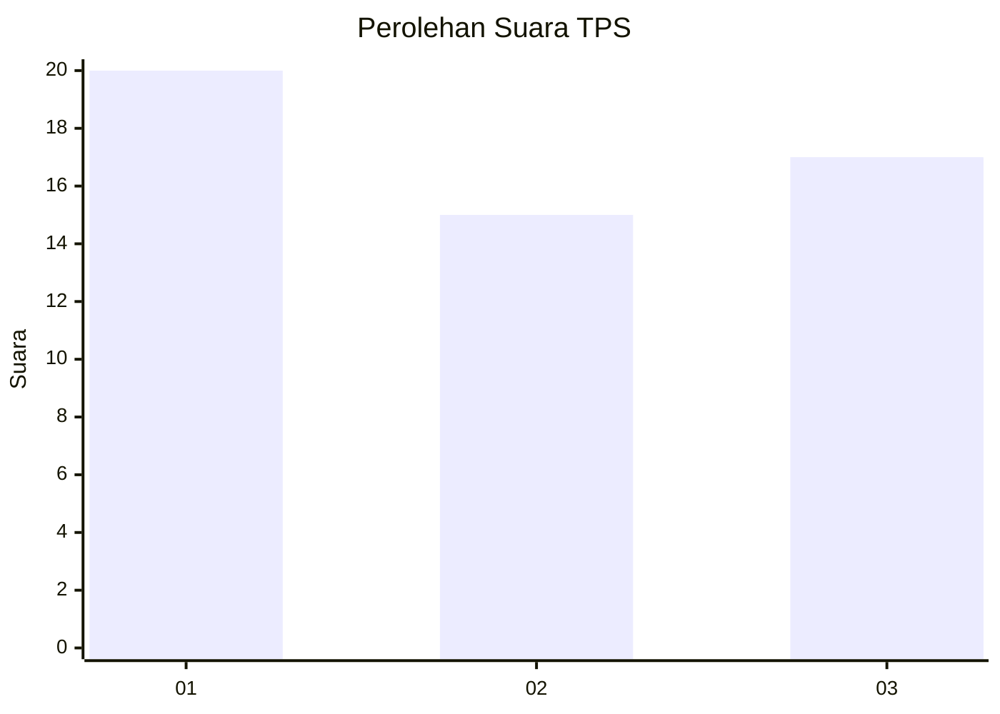
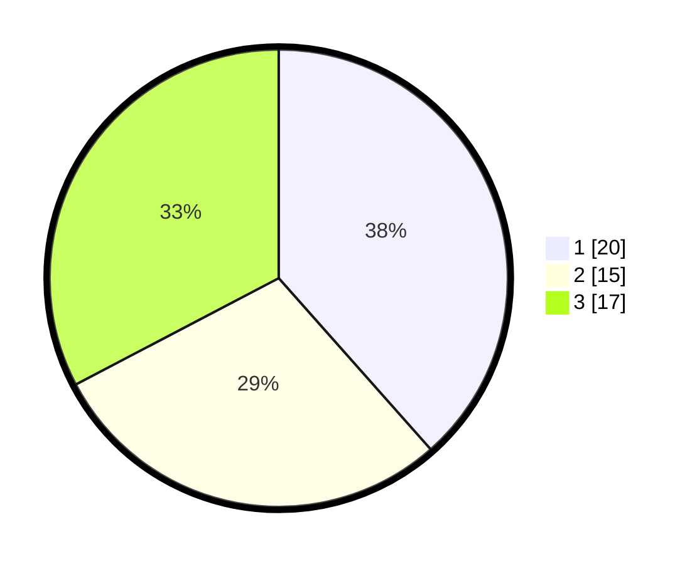

# Hasil

## Grafik

## Tabel

| No. | Nama Paslon    | Suara | Suara (raw) | Persentase |
|:--- |:-------------- | -----:| -----------:| ----------:|
| 1   | ANIES MUHAIMIN | 20    | [20][p-1]   | 38,46      |
| 2   | PRABOWO GIBRAN | 15    | [15][p-2]   | 28,85      |
| 3   | GANJAR MAHFUD  | 17    | [17][p-3]   | 32,69      |

[p-1]: https://github.com/gigit-pemilu/pemilu-2024-64-kalimantan-timur/blob/main/pilpres/hitung-suara/sub/64-kalimantan-timur/sub/71-kota-balikpapan/sub/06-balikpapan-kota/sub/1003-klandasan-ulu/sub/035-tps/sub/paslon-1.txt
[p-2]: https://github.com/gigit-pemilu/pemilu-2024-64-kalimantan-timur/blob/main/pilpres/hitung-suara/sub/64-kalimantan-timur/sub/71-kota-balikpapan/sub/06-balikpapan-kota/sub/1003-klandasan-ulu/sub/035-tps/sub/paslon-2.txt
[p-3]: https://github.com/gigit-pemilu/pemilu-2024-64-kalimantan-timur/blob/main/pilpres/hitung-suara/sub/64-kalimantan-timur/sub/71-kota-balikpapan/sub/06-balikpapan-kota/sub/1003-klandasan-ulu/sub/035-tps/sub/paslon-3.txt

## Foto C Plano

https://sirekap-obj-formc.kpu.go.id/4ad8/pemilu/ppwp/64/71/06/10/03/6471061003035-20240215-044826--c123d812-c3fc-4cc5-aadc-88679b2aad18.jpg

https://sirekap-obj-formc.kpu.go.id/4ad8/pemilu/ppwp/64/71/06/10/03/6471061003035-20240215-045117--a536884a-50b1-45d5-9430-8a1e9c1fe31f.jpg

https://sirekap-obj-formc.kpu.go.id/4ad8/pemilu/ppwp/64/71/06/10/03/6471061003035-20240215-045209--eb9cb638-4dad-44e7-889a-1ce0dd6546a8.jpg

## Metadata

| Key        | Value               |
| ---------- | ------------------- |
| Time Stamp | 2024-02-24 22:31:28 |

