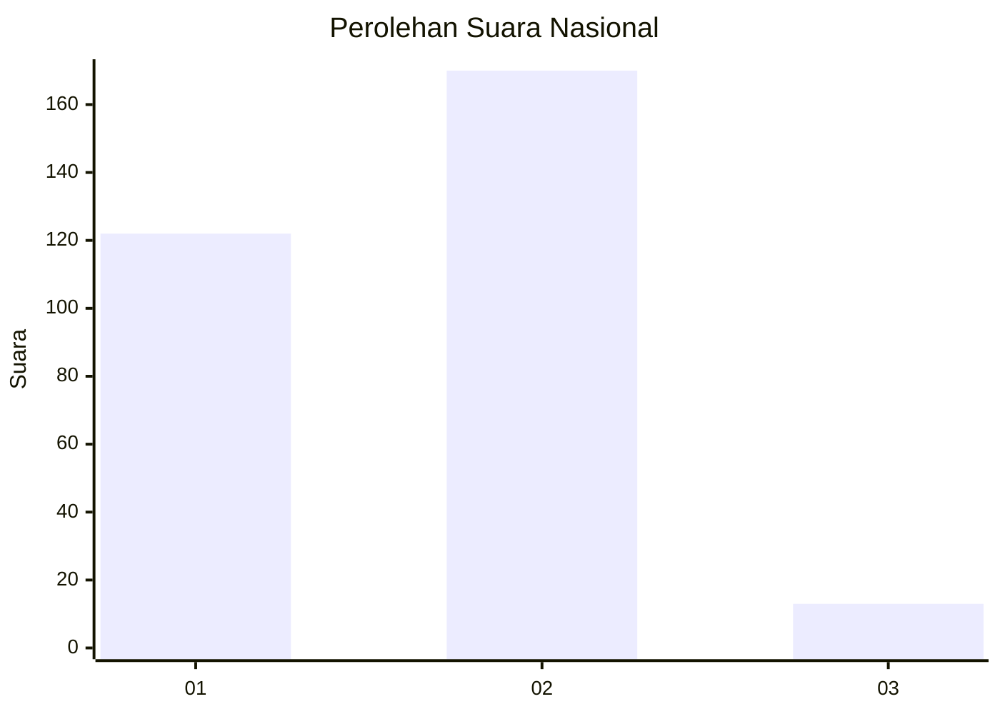
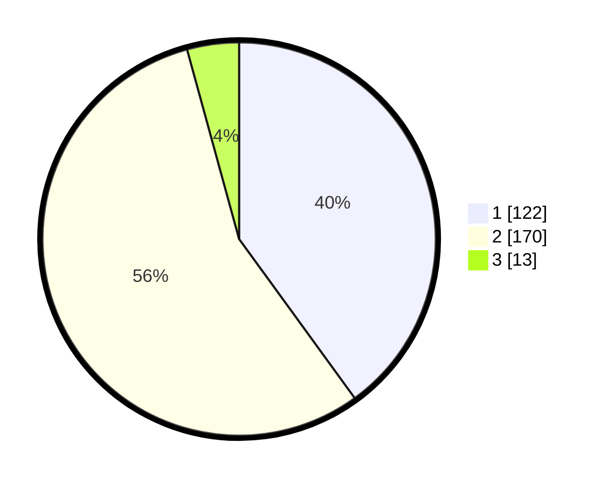

# Hasil

## Grafik

## Tabel

| No. | Nama Paslon    | Suara | Suara (raw) | Persentase |
|:--- |:-------------- | -----:| -----------:| ----------:|
| 1   | ANIES MUHAIMIN | 122   | [122][p-1]  | 40,00      |
| 2   | PRABOWO GIBRAN | 170   | [170][p-2]  | 55,74      |
| 3   | GANJAR MAHFUD  | 13    | [13][p-3]   | 4,26       |

[p-1]: https://github.com/gigit-pemilu/pemilu-2024/blob/main/pilpres/hitung-suara/sub/64-kalimantan-timur/sub/71-kota-balikpapan/sub/06-balikpapan-kota/sub/1004-klandasan-ilir/sub/040-tps/sub/paslon-1.txt
[p-2]: https://github.com/gigit-pemilu/pemilu-2024/blob/main/pilpres/hitung-suara/sub/64-kalimantan-timur/sub/71-kota-balikpapan/sub/06-balikpapan-kota/sub/1004-klandasan-ilir/sub/040-tps/sub/paslon-2.txt
[p-3]: https://github.com/gigit-pemilu/pemilu-2024/blob/main/pilpres/hitung-suara/sub/64-kalimantan-timur/sub/71-kota-balikpapan/sub/06-balikpapan-kota/sub/1004-klandasan-ilir/sub/040-tps/sub/paslon-3.txt

## Foto C Plano

https://sirekap-obj-formc.kpu.go.id/9f09/pemilu/ppwp/64/71/06/10/04/6471061004040-20240215-021737--5069e9c9-7460-4bd9-9c02-e8c1ed4c989e.jpg

https://sirekap-obj-formc.kpu.go.id/9f09/pemilu/ppwp/64/71/06/10/04/6471061004040-20240215-021914--655da411-65f0-408a-9805-d38e46654f6e.jpg

https://sirekap-obj-formc.kpu.go.id/9f09/pemilu/ppwp/64/71/06/10/04/6471061004040-20240215-021959--8a03e189-9139-452b-b4de-8a15c7478b36.jpg

## Metadata

| Key        | Value               |
| ---------- | ------------------- |
| Time Stamp | 2024-02-26 13:00:00 |

