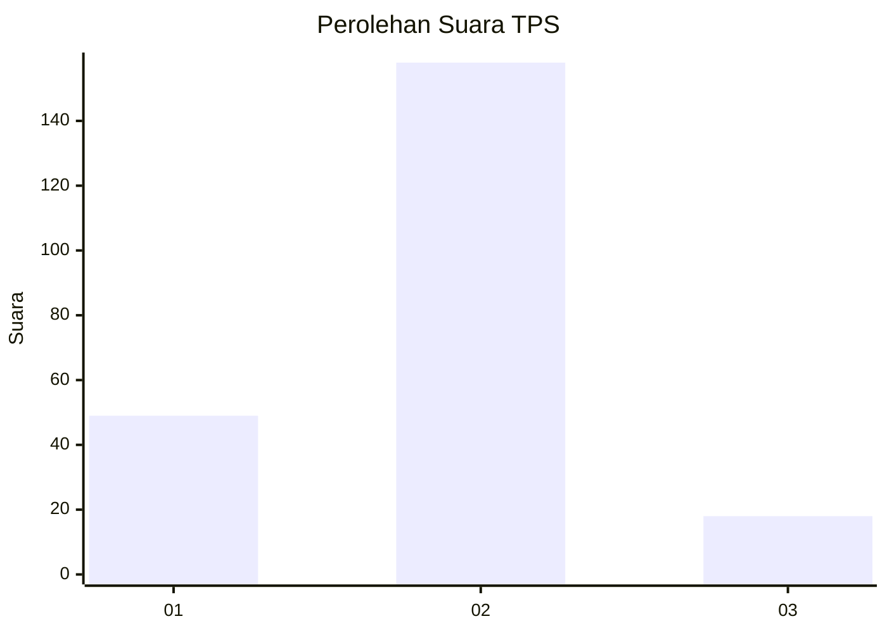
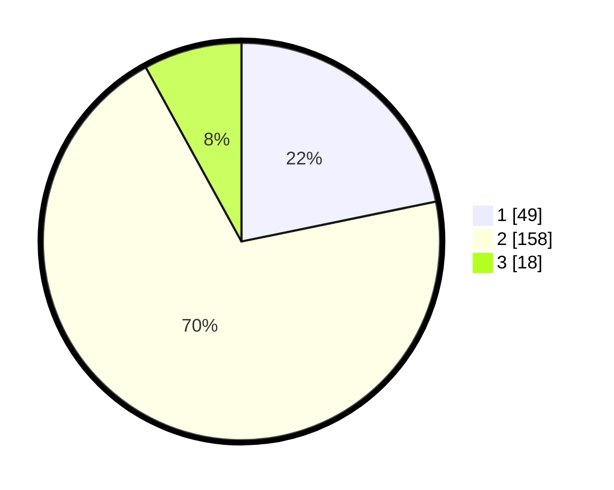

# Hasil

## Grafik

## Tabel

| No. | Nama Paslon    | Suara | Suara (raw) | Persentase |
|:--- |:-------------- | -----:| -----------:| ----------:|
| 1   | ANIES MUHAIMIN | 49    | [49][p-1]   | 21,78      |
| 2   | PRABOWO GIBRAN | 158   | [158][p-2]  | 70,22      |
| 3   | GANJAR MAHFUD  | 18    | [18][p-3]   | 8,00       |

[p-1]: https://github.com/gigit-pemilu/pemilu-2024-64-kalimantan-timur/blob/main/pilpres/hitung-suara/sub/64-kalimantan-timur/sub/72-kota-samarinda/sub/01-palaran/sub/1001-rawa-makmur/sub/004-tps/sub/paslon-1.txt
[p-2]: https://github.com/gigit-pemilu/pemilu-2024-64-kalimantan-timur/blob/main/pilpres/hitung-suara/sub/64-kalimantan-timur/sub/72-kota-samarinda/sub/01-palaran/sub/1001-rawa-makmur/sub/004-tps/sub/paslon-2.txt
[p-3]: https://github.com/gigit-pemilu/pemilu-2024-64-kalimantan-timur/blob/main/pilpres/hitung-suara/sub/64-kalimantan-timur/sub/72-kota-samarinda/sub/01-palaran/sub/1001-rawa-makmur/sub/004-tps/sub/paslon-3.txt

## Foto C Plano

https://sirekap-obj-formc.kpu.go.id/f2fb/pemilu/ppwp/64/72/01/10/01/6472011001004-20240215-011256--f2d75e19-9a00-4dc7-a227-fd3cde2cd194.jpg

https://sirekap-obj-formc.kpu.go.id/f2fb/pemilu/ppwp/64/72/01/10/01/6472011001004-20240215-011436--d5c62d20-d1b9-4d54-80e7-89c280ed59fd.jpg

https://sirekap-obj-formc.kpu.go.id/f2fb/pemilu/ppwp/64/72/01/10/01/6472011001004-20240215-011549--aa889897-c6c2-4879-8a90-437dbf9f3463.jpg

## Metadata

| Key        | Value               |
| ---------- | ------------------- |
| Time Stamp | 2024-02-25 19:00:00 |

