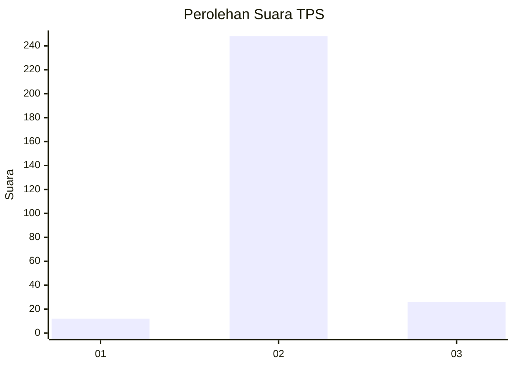
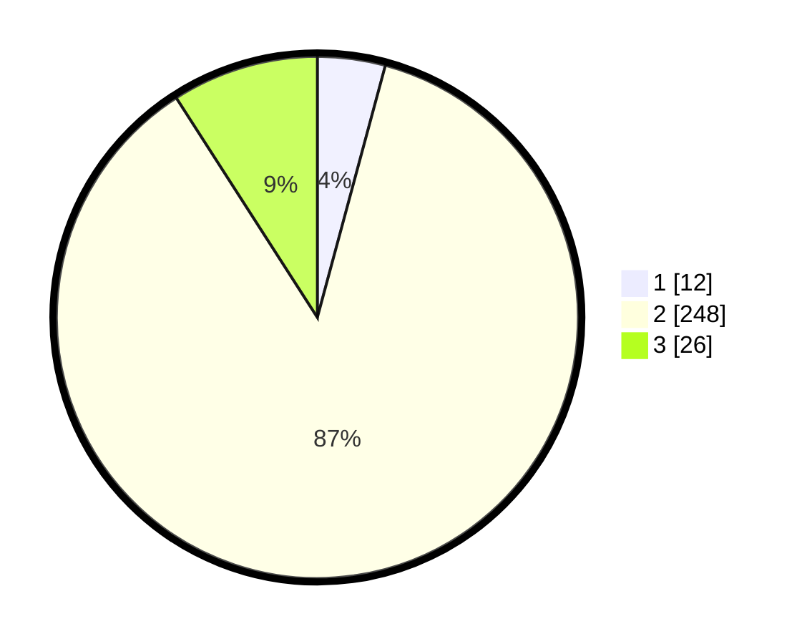

# Hasil

## Grafik

## Tabel

| No. | Nama Paslon    | Suara | Suara (raw) | Persentase |
|:--- |:-------------- | -----:| -----------:| ----------:|
| 1   | ANIES MUHAIMIN | 12    | [12][p-1]   | 4,20       |
| 2   | PRABOWO GIBRAN | 248   | [248][p-2]  | 86,71      |
| 3   | GANJAR MAHFUD  | 26    | [26][p-3]   | 9,09       |

[p-1]: https://github.com/gigit-pemilu/pemilu-2024-64-kalimantan-timur/blob/main/pilpres/hitung-suara/sub/64-kalimantan-timur/sub/72-kota-samarinda/sub/01-palaran/sub/1003-bukuan/sub/019-tps/sub/paslon-1.txt
[p-2]: https://github.com/gigit-pemilu/pemilu-2024-64-kalimantan-timur/blob/main/pilpres/hitung-suara/sub/64-kalimantan-timur/sub/72-kota-samarinda/sub/01-palaran/sub/1003-bukuan/sub/019-tps/sub/paslon-2.txt
[p-3]: https://github.com/gigit-pemilu/pemilu-2024-64-kalimantan-timur/blob/main/pilpres/hitung-suara/sub/64-kalimantan-timur/sub/72-kota-samarinda/sub/01-palaran/sub/1003-bukuan/sub/019-tps/sub/paslon-3.txt

## Foto C Plano

https://sirekap-obj-formc.kpu.go.id/1feb/pemilu/ppwp/64/72/01/10/03/6472011003019-20240215-033135--6755ddc4-cb9b-4e0f-adc6-1796d9e31ff8.jpg

https://sirekap-obj-formc.kpu.go.id/1feb/pemilu/ppwp/64/72/01/10/03/6472011003019-20240215-033242--ddf11f72-ff5b-4972-b39e-26b60d93e4fe.jpg

https://sirekap-obj-formc.kpu.go.id/1feb/pemilu/ppwp/64/72/01/10/03/6472011003019-20240215-033345--a40bc379-935e-40d3-81b3-718cd73cfa32.jpg

## Metadata

| Key        | Value               |
| ---------- | ------------------- |
| Time Stamp | 2024-02-25 11:00:00 |

