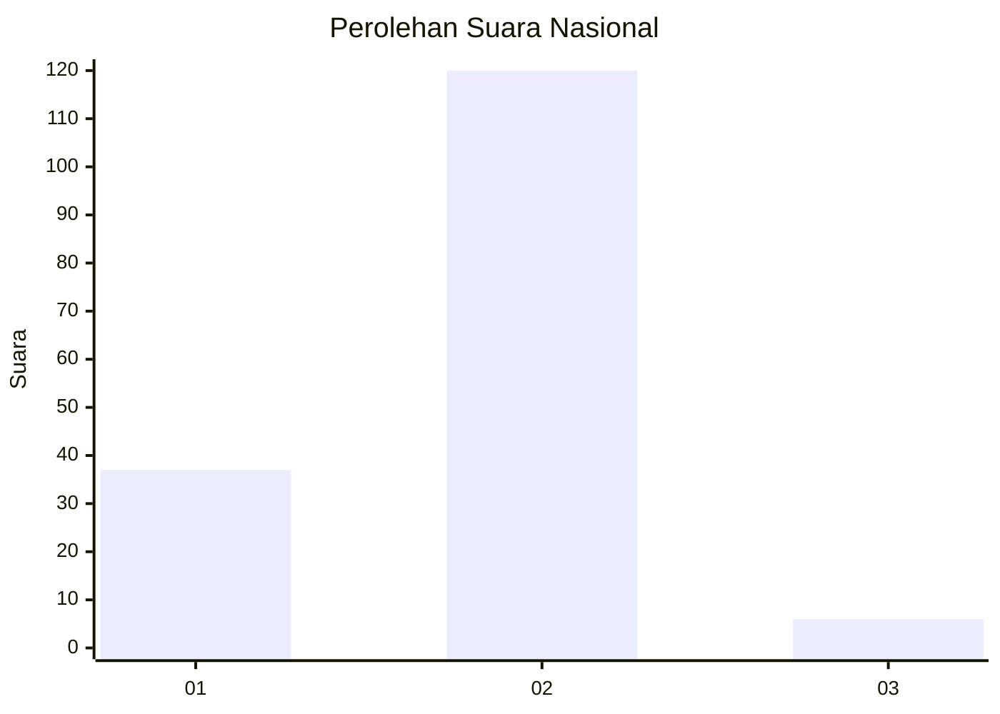

# Hasil

## Grafik

## Tabel

| No. | Nama Paslon    | Suara | Suara (raw) | Persentase |
|:--- |:-------------- | -----:| -----------:| ----------:|
| 1   | ANIES MUHAIMIN | 37    | [37][p-1]   | 22,70      |
| 2   | PRABOWO GIBRAN | 120   | [120][p-2]  | 73,62      |
| 3   | GANJAR MAHFUD  | 6     | [6][p-3]    | 3,68       |

[p-1]: https://github.com/gigit-pemilu/pemilu-2024/blob/main/pilpres/hitung-suara/sub/64-kalimantan-timur/sub/72-kota-samarinda/sub/02-samarinda-seberang/sub/1001-sungai-keledang/sub/001-tps/sub/paslon-1.txt
[p-2]: https://github.com/gigit-pemilu/pemilu-2024/blob/main/pilpres/hitung-suara/sub/64-kalimantan-timur/sub/72-kota-samarinda/sub/02-samarinda-seberang/sub/1001-sungai-keledang/sub/001-tps/sub/paslon-2.txt
[p-3]: https://github.com/gigit-pemilu/pemilu-2024/blob/main/pilpres/hitung-suara/sub/64-kalimantan-timur/sub/72-kota-samarinda/sub/02-samarinda-seberang/sub/1001-sungai-keledang/sub/001-tps/sub/paslon-3.txt

## Foto C Plano

https://sirekap-obj-formc.kpu.go.id/c214/pemilu/ppwp/64/72/02/10/01/6472021001001-20240216-160748--38e3ef69-11ca-4b1d-89a1-b0ac94836e0b.jpg

https://sirekap-obj-formc.kpu.go.id/c214/pemilu/ppwp/64/72/02/10/01/6472021001001-20240216-160900--5c9fd513-d9ef-475d-aad6-74178b36a5e1.jpg

https://sirekap-obj-formc.kpu.go.id/c214/pemilu/ppwp/64/72/02/10/01/6472021001001-20240216-161135--5a14ffa5-139b-45c6-b09e-21eba070cb1e.jpg

## Metadata

| Key        | Value               |
| ---------- | ------------------- |
| Time Stamp | 2024-02-25 18:00:00 |

