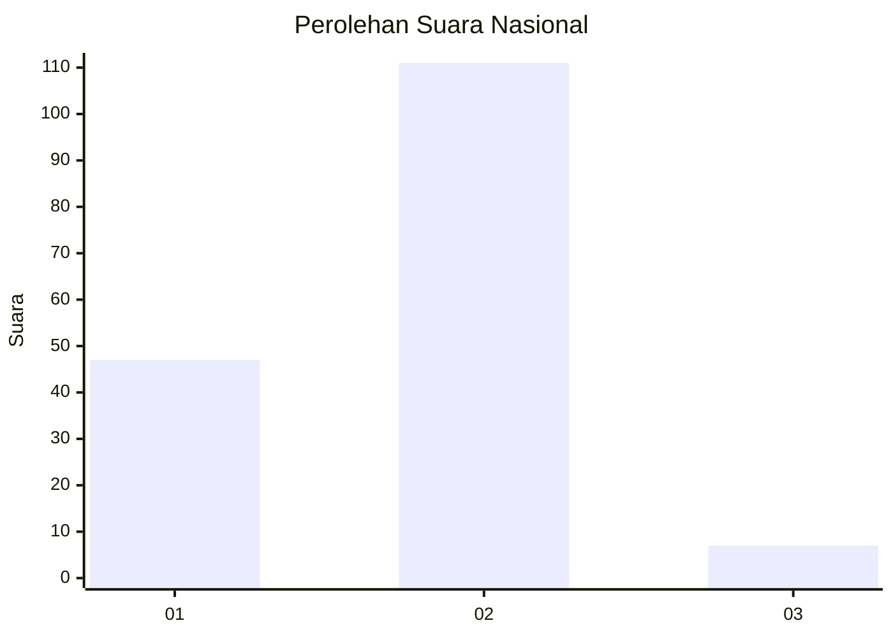
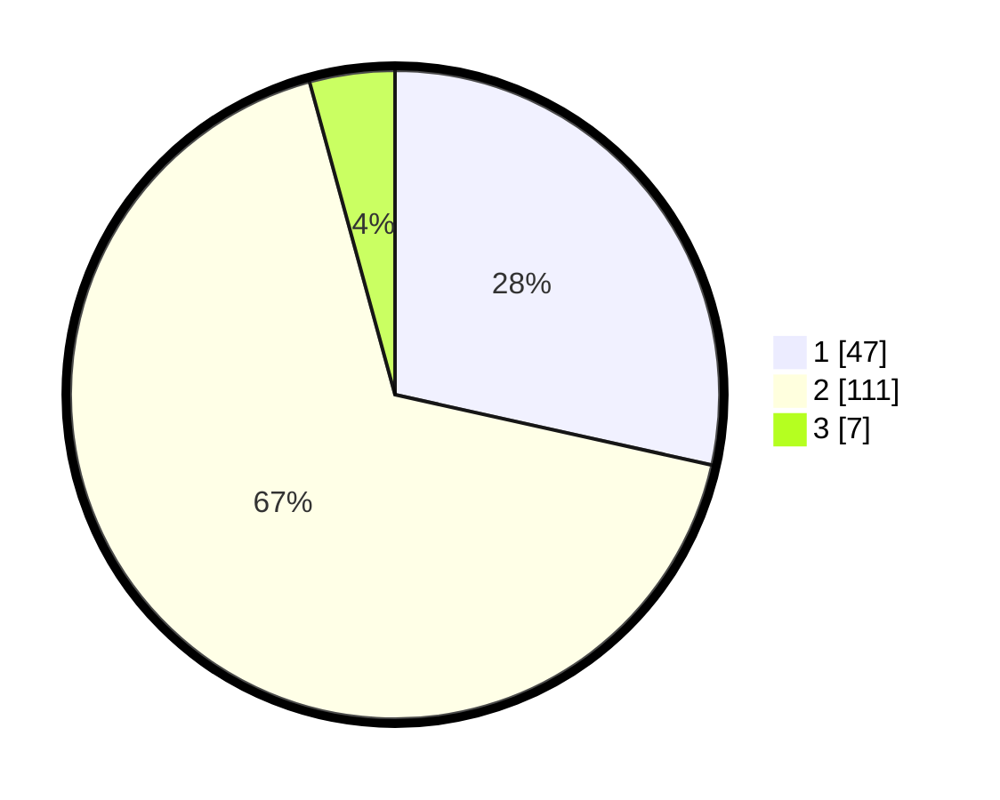

# Hasil

## Grafik

## Tabel

| No. | Nama Paslon    | Suara | Suara (raw) | Persentase |
|:--- |:-------------- | -----:| -----------:| ----------:|
| 1   | ANIES MUHAIMIN | 47    | [47][p-1]   | 28,48      |
| 2   | PRABOWO GIBRAN | 111   | [111][p-2]  | 67,27      |
| 3   | GANJAR MAHFUD  | 7     | [7][p-3]    | 4,24       |

[p-1]: https://github.com/gigit-pemilu/pemilu-2024/blob/main/pilpres/hitung-suara/sub/64-kalimantan-timur/sub/72-kota-samarinda/sub/02-samarinda-seberang/sub/1001-sungai-keledang/sub/002-tps/sub/paslon-1.txt
[p-2]: https://github.com/gigit-pemilu/pemilu-2024/blob/main/pilpres/hitung-suara/sub/64-kalimantan-timur/sub/72-kota-samarinda/sub/02-samarinda-seberang/sub/1001-sungai-keledang/sub/002-tps/sub/paslon-2.txt
[p-3]: https://github.com/gigit-pemilu/pemilu-2024/blob/main/pilpres/hitung-suara/sub/64-kalimantan-timur/sub/72-kota-samarinda/sub/02-samarinda-seberang/sub/1001-sungai-keledang/sub/002-tps/sub/paslon-3.txt

## Foto C Plano

https://sirekap-obj-formc.kpu.go.id/7bbe/pemilu/ppwp/64/72/02/10/01/6472021001002-20240215-022610--e0e9e2dd-65b5-4486-8db1-5e25c63dd8a4.jpg

https://sirekap-obj-formc.kpu.go.id/7bbe/pemilu/ppwp/64/72/02/10/01/6472021001002-20240215-022625--f25dbfb2-24bc-40b6-81d4-a12467b45e8e.jpg

https://sirekap-obj-formc.kpu.go.id/7bbe/pemilu/ppwp/64/72/02/10/01/6472021001002-20240215-022638--0aba379f-f4eb-4124-a43c-ae3d0a7c7b7f.jpg

## Metadata

| Key        | Value               |
| ---------- | ------------------- |
| Time Stamp | 2024-02-15 19:00:26 |

