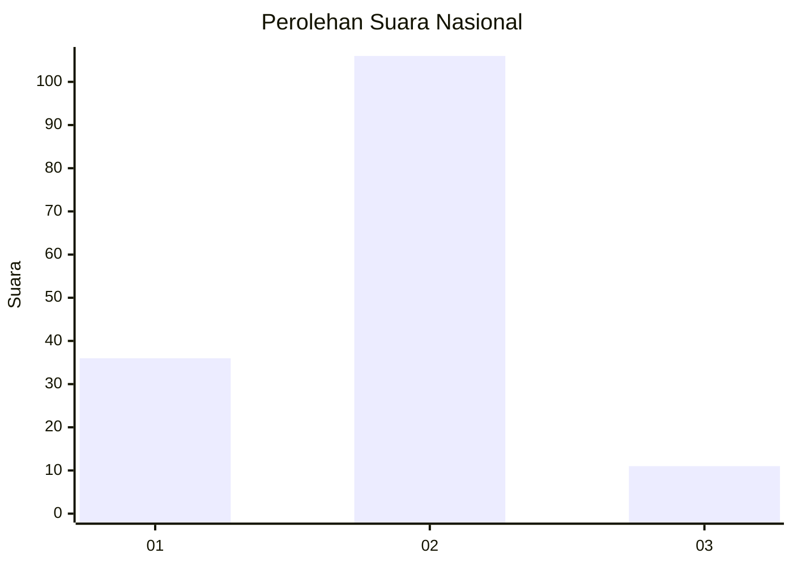
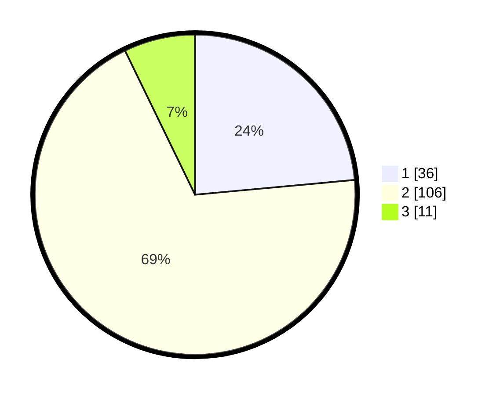

# Hasil

## Grafik

## Tabel

| No. | Nama Paslon    | Suara | Suara (raw) | Persentase |
|:--- |:-------------- | -----:| -----------:| ----------:|
| 1   | ANIES MUHAIMIN | 36    | [36][p-1]   | 23,53      |
| 2   | PRABOWO GIBRAN | 106   | [106][p-2]  | 69,28      |
| 3   | GANJAR MAHFUD  | 11    | [11][p-3]   | 7,19       |

[p-1]: https://github.com/gigit-pemilu/pemilu-2024/blob/main/pilpres/hitung-suara/sub/64-kalimantan-timur/sub/72-kota-samarinda/sub/02-samarinda-seberang/sub/1001-sungai-keledang/sub/004-tps/sub/paslon-1.txt
[p-2]: https://github.com/gigit-pemilu/pemilu-2024/blob/main/pilpres/hitung-suara/sub/64-kalimantan-timur/sub/72-kota-samarinda/sub/02-samarinda-seberang/sub/1001-sungai-keledang/sub/004-tps/sub/paslon-2.txt
[p-3]: https://github.com/gigit-pemilu/pemilu-2024/blob/main/pilpres/hitung-suara/sub/64-kalimantan-timur/sub/72-kota-samarinda/sub/02-samarinda-seberang/sub/1001-sungai-keledang/sub/004-tps/sub/paslon-3.txt

## Foto C Plano

https://sirekap-obj-formc.kpu.go.id/d74b/pemilu/ppwp/64/72/02/10/01/6472021001004-20240215-013658--0df29504-c097-428a-95b0-1c6ed69e35c1.jpg

https://sirekap-obj-formc.kpu.go.id/d74b/pemilu/ppwp/64/72/02/10/01/6472021001004-20240214-202246--cce0a3da-1776-43f6-8de6-0179291d68bf.jpg

https://sirekap-obj-formc.kpu.go.id/d74b/pemilu/ppwp/64/72/02/10/01/6472021001004-20240214-202250--f2771ce3-3b5a-4d80-89a9-fe33e58ff9ba.jpg

## Metadata

| Key        | Value               |
| ---------- | ------------------- |
| Time Stamp | 2024-02-25 08:00:00 |

