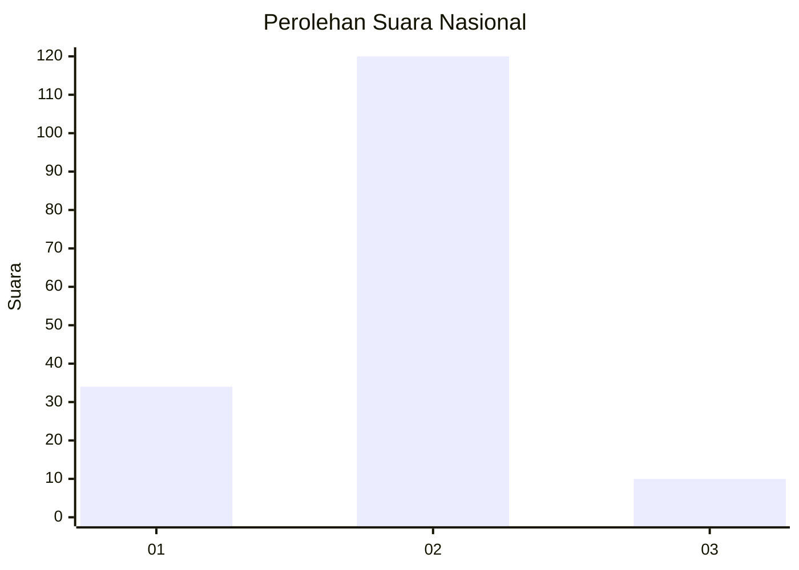

# Hasil

## Grafik

## Tabel

| No. | Nama Paslon    | Suara | Suara (raw) | Persentase |
|:--- |:-------------- | -----:| -----------:| ----------:|
| 1   | ANIES MUHAIMIN | 34    | [34][p-1]   | 20,73      |
| 2   | PRABOWO GIBRAN | 120   | [120][p-2]  | 73,17      |
| 3   | GANJAR MAHFUD  | 10    | [10][p-3]   | 6,10       |

[p-1]: https://github.com/gigit-pemilu/pemilu-2024/blob/main/pilpres/hitung-suara/sub/64-kalimantan-timur/sub/72-kota-samarinda/sub/03-samarinda-ulu/sub/1001-teluk-lerong-ilir/sub/002-tps/sub/paslon-1.txt
[p-2]: https://github.com/gigit-pemilu/pemilu-2024/blob/main/pilpres/hitung-suara/sub/64-kalimantan-timur/sub/72-kota-samarinda/sub/03-samarinda-ulu/sub/1001-teluk-lerong-ilir/sub/002-tps/sub/paslon-2.txt
[p-3]: https://github.com/gigit-pemilu/pemilu-2024/blob/main/pilpres/hitung-suara/sub/64-kalimantan-timur/sub/72-kota-samarinda/sub/03-samarinda-ulu/sub/1001-teluk-lerong-ilir/sub/002-tps/sub/paslon-3.txt

## Foto C Plano

https://sirekap-obj-formc.kpu.go.id/28bf/pemilu/ppwp/64/72/03/10/01/6472031001002-20240214-141511--8c601ed4-892c-4517-9318-1de495a5a282.jpg

https://sirekap-obj-formc.kpu.go.id/28bf/pemilu/ppwp/64/72/03/10/01/6472031001002-20240214-133057--ea796f9b-fcc7-4f8b-9040-3fb283e3c286.jpg

https://sirekap-obj-formc.kpu.go.id/28bf/pemilu/ppwp/64/72/03/10/01/6472031001002-20240214-141552--cd7aa04a-e794-4d7c-93b8-6a38d0fff967.jpg

## Metadata

| Key        | Value               |
| ---------- | ------------------- |
| Time Stamp | 2024-02-15 15:00:29 |

