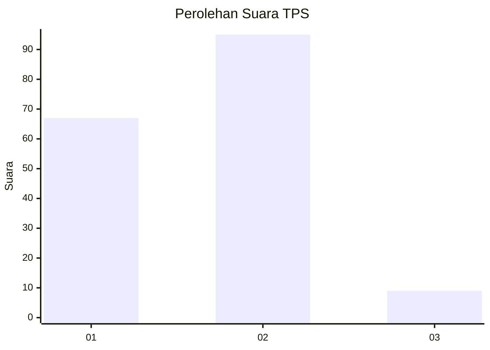
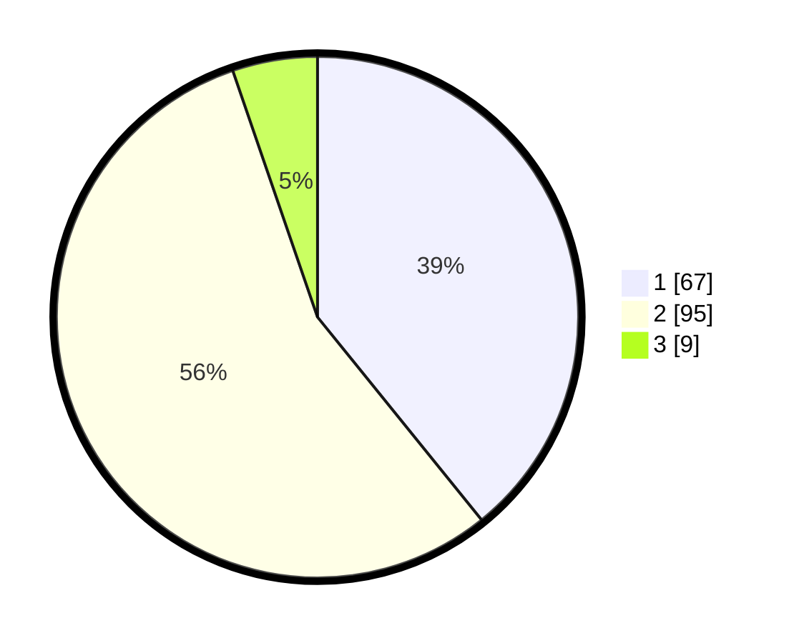

# Hasil

## Grafik

## Tabel

| No. | Nama Paslon    | Suara | Suara (raw) | Persentase |
|:--- |:-------------- | -----:| -----------:| ----------:|
| 1   | ANIES MUHAIMIN | 67    | [67][p-1]   | 39,18      |
| 2   | PRABOWO GIBRAN | 95    | [95][p-2]   | 55,56      |
| 3   | GANJAR MAHFUD  | 9     | [9][p-3]    | 5,26       |

[p-1]: https://github.com/gigit-pemilu/pemilu-2024-64-kalimantan-timur/blob/main/pilpres/hitung-suara/sub/64-kalimantan-timur/sub/72-kota-samarinda/sub/03-samarinda-ulu/sub/1001-teluk-lerong-ilir/sub/011-tps/sub/paslon-1.txt
[p-2]: https://github.com/gigit-pemilu/pemilu-2024-64-kalimantan-timur/blob/main/pilpres/hitung-suara/sub/64-kalimantan-timur/sub/72-kota-samarinda/sub/03-samarinda-ulu/sub/1001-teluk-lerong-ilir/sub/011-tps/sub/paslon-2.txt
[p-3]: https://github.com/gigit-pemilu/pemilu-2024-64-kalimantan-timur/blob/main/pilpres/hitung-suara/sub/64-kalimantan-timur/sub/72-kota-samarinda/sub/03-samarinda-ulu/sub/1001-teluk-lerong-ilir/sub/011-tps/sub/paslon-3.txt

## Foto C Plano

https://sirekap-obj-formc.kpu.go.id/1ad3/pemilu/ppwp/64/72/03/10/01/6472031001011-20240214-190312--1d453653-fc50-439e-acab-440e8ad3540c.jpg

https://sirekap-obj-formc.kpu.go.id/1ad3/pemilu/ppwp/64/72/03/10/01/6472031001011-20240214-190354--f2bb94a9-20a6-46f3-9106-4d4c1736dfe1.jpg

https://sirekap-obj-formc.kpu.go.id/1ad3/pemilu/ppwp/64/72/03/10/01/6472031001011-20240214-190545--f28cde03-1b6e-4565-86ff-3c03d6d9f33c.jpg

## Metadata

| Key        | Value               |
| ---------- | ------------------- |
| Time Stamp | 2024-02-15 15:00:29 |

