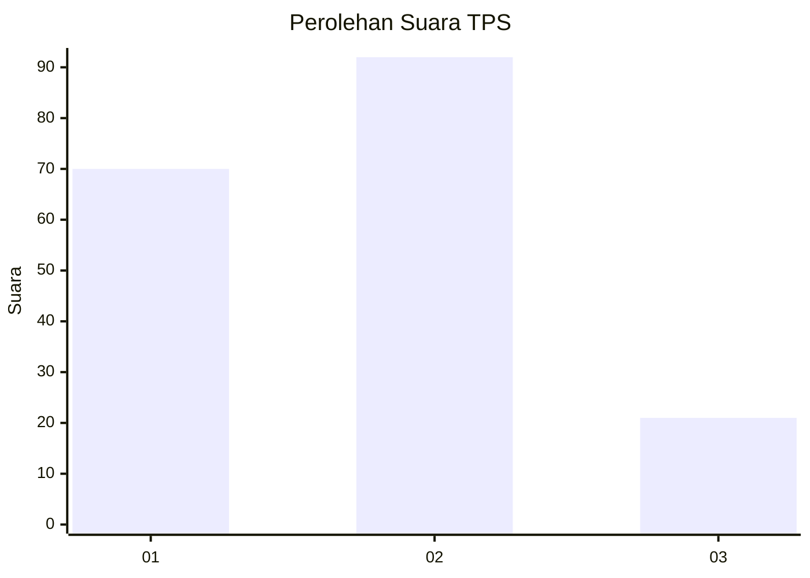
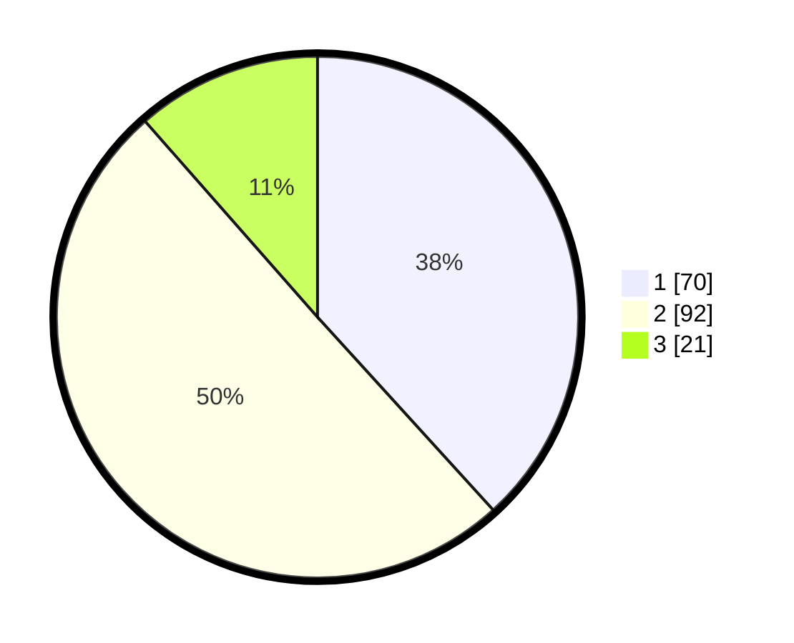

# Hasil

## Grafik

## Tabel

| No. | Nama Paslon    | Suara | Suara (raw) | Persentase |
|:--- |:-------------- | -----:| -----------:| ----------:|
| 1   | ANIES MUHAIMIN | 70    | [70][p-1]   | 38,25      |
| 2   | PRABOWO GIBRAN | 92    | [92][p-2]   | 50,27      |
| 3   | GANJAR MAHFUD  | 21    | [21][p-3]   | 11,48      |

[p-1]: https://github.com/gigit-pemilu/pemilu-2024-64-kalimantan-timur/blob/main/pilpres/hitung-suara/sub/64-kalimantan-timur/sub/72-kota-samarinda/sub/05-samarinda-utara/sub/1002-sempaja-selatan/sub/001-tps/sub/paslon-1.txt
[p-2]: https://github.com/gigit-pemilu/pemilu-2024-64-kalimantan-timur/blob/main/pilpres/hitung-suara/sub/64-kalimantan-timur/sub/72-kota-samarinda/sub/05-samarinda-utara/sub/1002-sempaja-selatan/sub/001-tps/sub/paslon-2.txt
[p-3]: https://github.com/gigit-pemilu/pemilu-2024-64-kalimantan-timur/blob/main/pilpres/hitung-suara/sub/64-kalimantan-timur/sub/72-kota-samarinda/sub/05-samarinda-utara/sub/1002-sempaja-selatan/sub/001-tps/sub/paslon-3.txt

## Foto C Plano

https://sirekap-obj-formc.kpu.go.id/39fb/pemilu/ppwp/64/72/05/10/02/6472051002001-20240214-141312--63e5afab-c798-4f65-9391-32e2da70990c.jpg

https://sirekap-obj-formc.kpu.go.id/39fb/pemilu/ppwp/64/72/05/10/02/6472051002001-20240214-141343--9832117c-03aa-46d0-84e1-537c2ad19141.jpg

https://sirekap-obj-formc.kpu.go.id/39fb/pemilu/ppwp/64/72/05/10/02/6472051002001-20240214-141424--9ba33ada-6483-48fc-9f6b-803e721619d4.jpg

## Metadata

| Key        | Value               |
| ---------- | ------------------- |
| Time Stamp | 2024-02-15 15:00:29 |

