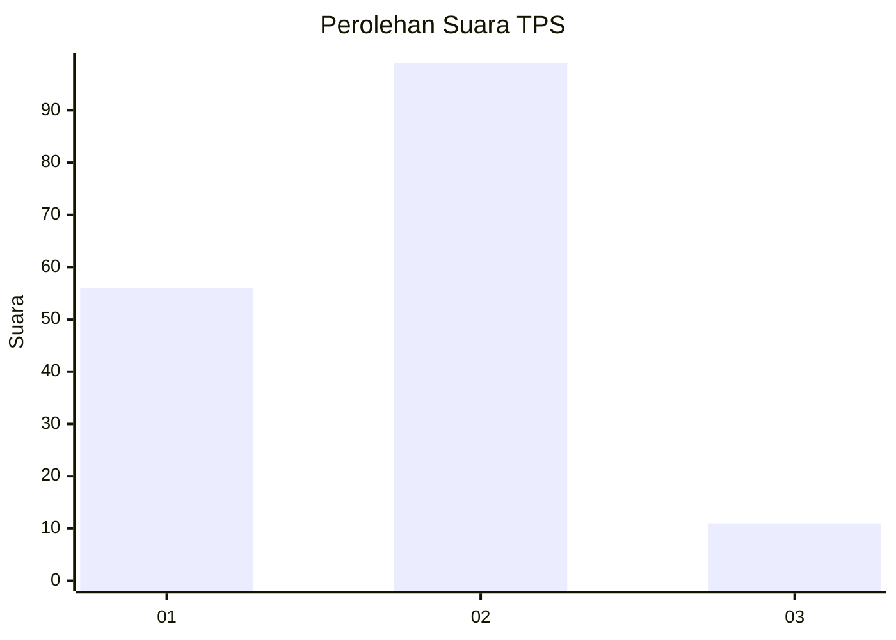
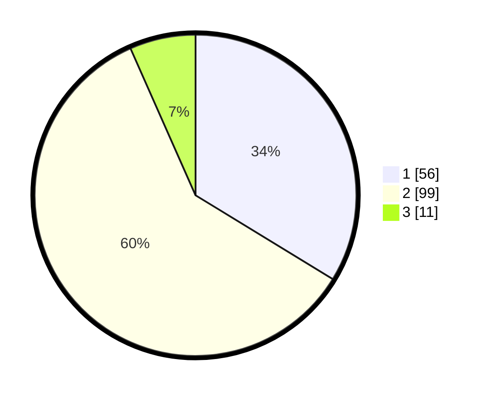

# Hasil

## Grafik

## Tabel

| No. | Nama Paslon    | Suara | Suara (raw) | Persentase |
|:--- |:-------------- | -----:| -----------:| ----------:|
| 1   | ANIES MUHAIMIN | 56    | [56][p-1]   | 33,73      |
| 2   | PRABOWO GIBRAN | 99    | [99][p-2]   | 59,64      |
| 3   | GANJAR MAHFUD  | 11    | [11][p-3]   | 6,63       |

[p-1]: https://github.com/gigit-pemilu/pemilu-2024-64-kalimantan-timur/blob/main/pilpres/hitung-suara/sub/64-kalimantan-timur/sub/72-kota-samarinda/sub/05-samarinda-utara/sub/1002-sempaja-selatan/sub/034-tps/sub/paslon-1.txt
[p-2]: https://github.com/gigit-pemilu/pemilu-2024-64-kalimantan-timur/blob/main/pilpres/hitung-suara/sub/64-kalimantan-timur/sub/72-kota-samarinda/sub/05-samarinda-utara/sub/1002-sempaja-selatan/sub/034-tps/sub/paslon-2.txt
[p-3]: https://github.com/gigit-pemilu/pemilu-2024-64-kalimantan-timur/blob/main/pilpres/hitung-suara/sub/64-kalimantan-timur/sub/72-kota-samarinda/sub/05-samarinda-utara/sub/1002-sempaja-selatan/sub/034-tps/sub/paslon-3.txt

## Foto C Plano

https://sirekap-obj-formc.kpu.go.id/3d11/pemilu/ppwp/64/72/05/10/02/6472051002034-20240214-214624--fb62064b-b086-46a7-888c-eee2af02c10b.jpg

https://sirekap-obj-formc.kpu.go.id/3d11/pemilu/ppwp/64/72/05/10/02/6472051002034-20240214-214806--a17a85e0-c070-438c-832f-db80cfe5cc0e.jpg

https://sirekap-obj-formc.kpu.go.id/3d11/pemilu/ppwp/64/72/05/10/02/6472051002034-20240214-214925--74f6556e-7bef-4d76-b5a9-f2fde8daba77.jpg

## Metadata

| Key        | Value               |
| ---------- | ------------------- |
| Time Stamp | 2024-02-24 22:31:28 |

