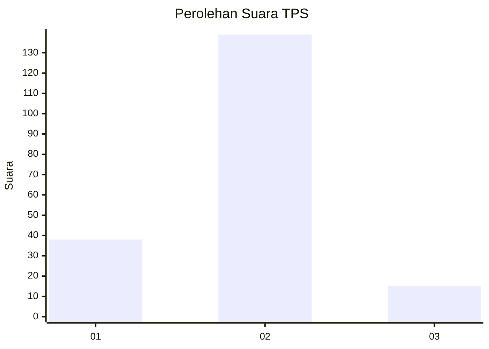
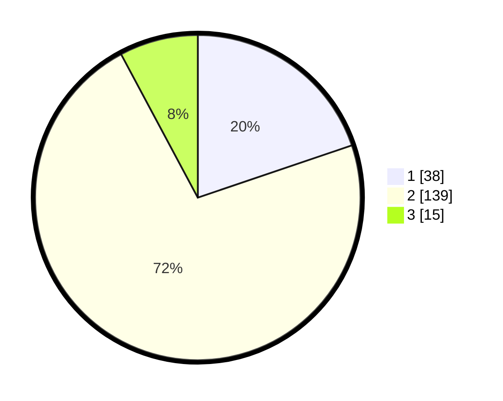

# Hasil

## Grafik

## Tabel

| No. | Nama Paslon    | Suara | Suara (raw) | Persentase |
|:--- |:-------------- | -----:| -----------:| ----------:|
| 1   | ANIES MUHAIMIN | 38    | [38][p-1]   | 19,79      |
| 2   | PRABOWO GIBRAN | 139   | [139][p-2]  | 72,40      |
| 3   | GANJAR MAHFUD  | 15    | [15][p-3]   | 7,81       |

[p-1]: https://github.com/gigit-pemilu/pemilu-2024-64-kalimantan-timur/blob/main/pilpres/hitung-suara/sub/64-kalimantan-timur/sub/72-kota-samarinda/sub/06-sungai-kunjang/sub/1001-loa-bakung/sub/003-tps/sub/paslon-1.txt
[p-2]: https://github.com/gigit-pemilu/pemilu-2024-64-kalimantan-timur/blob/main/pilpres/hitung-suara/sub/64-kalimantan-timur/sub/72-kota-samarinda/sub/06-sungai-kunjang/sub/1001-loa-bakung/sub/003-tps/sub/paslon-2.txt
[p-3]: https://github.com/gigit-pemilu/pemilu-2024-64-kalimantan-timur/blob/main/pilpres/hitung-suara/sub/64-kalimantan-timur/sub/72-kota-samarinda/sub/06-sungai-kunjang/sub/1001-loa-bakung/sub/003-tps/sub/paslon-3.txt

## Foto C Plano

https://sirekap-obj-formc.kpu.go.id/8a9a/pemilu/ppwp/64/72/06/10/01/6472061001003-20240214-192830--e2f437d6-49e5-44fd-87cc-8b1f2262a47f.jpg

https://sirekap-obj-formc.kpu.go.id/8a9a/pemilu/ppwp/64/72/06/10/01/6472061001003-20240214-193418--90e325a7-1194-405b-b64f-82c0f722c2e0.jpg

https://sirekap-obj-formc.kpu.go.id/8a9a/pemilu/ppwp/64/72/06/10/01/6472061001003-20240214-193612--eea00e8d-c671-4af1-95a1-f88a1d981e39.jpg

## Metadata

| Key        | Value               |
| ---------- | ------------------- |
| Time Stamp | 2024-02-25 16:00:00 |

