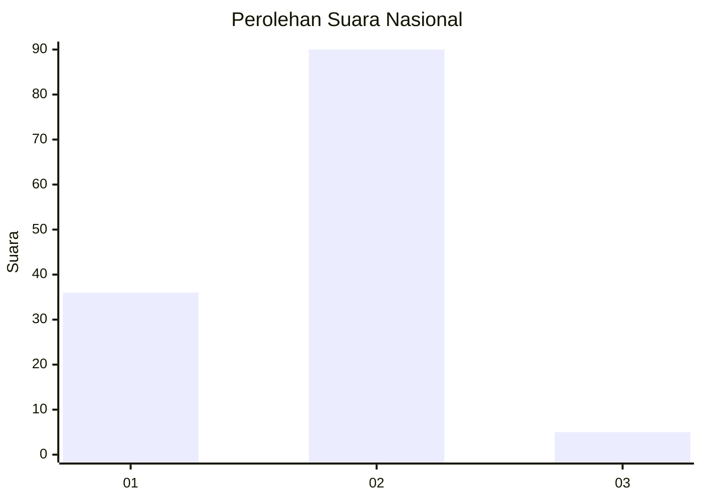
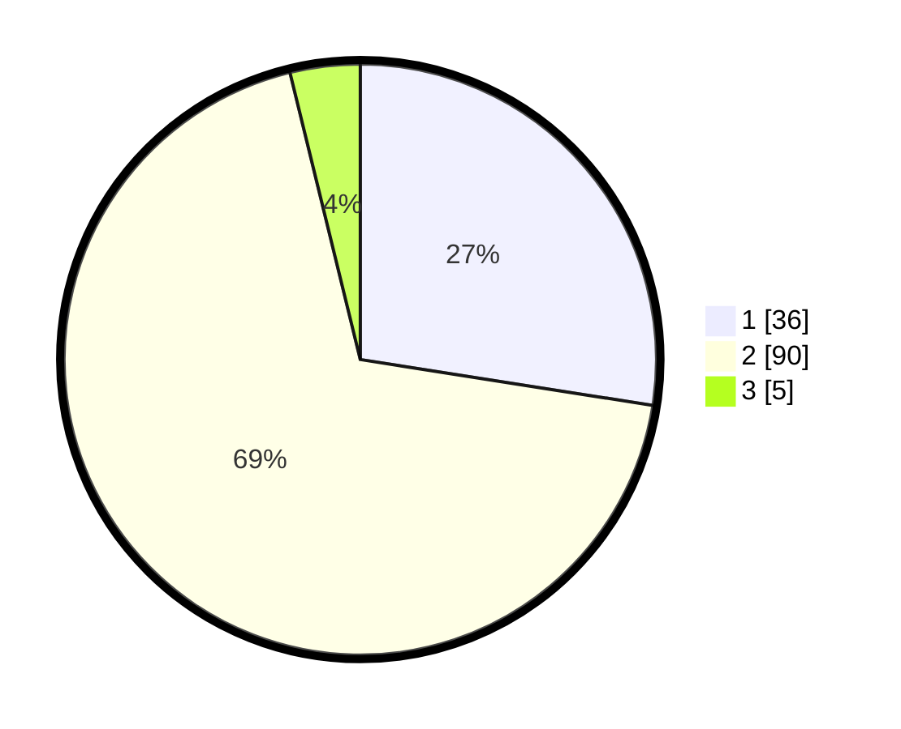

# Hasil

## Grafik

## Tabel

| No. | Nama Paslon    | Suara | Suara (raw) | Persentase |
|:--- |:-------------- | -----:| -----------:| ----------:|
| 1   | ANIES MUHAIMIN | 36    | [36][p-1]   | 27,48      |
| 2   | PRABOWO GIBRAN | 90    | [90][p-2]   | 68,70      |
| 3   | GANJAR MAHFUD  | 5     | [5][p-3]    | 3,82       |

[p-1]: https://github.com/gigit-pemilu/pemilu-2024/blob/main/pilpres/hitung-suara/sub/64-kalimantan-timur/sub/72-kota-samarinda/sub/06-sungai-kunjang/sub/1001-loa-bakung/sub/005-tps/sub/paslon-1.txt
[p-2]: https://github.com/gigit-pemilu/pemilu-2024/blob/main/pilpres/hitung-suara/sub/64-kalimantan-timur/sub/72-kota-samarinda/sub/06-sungai-kunjang/sub/1001-loa-bakung/sub/005-tps/sub/paslon-2.txt
[p-3]: https://github.com/gigit-pemilu/pemilu-2024/blob/main/pilpres/hitung-suara/sub/64-kalimantan-timur/sub/72-kota-samarinda/sub/06-sungai-kunjang/sub/1001-loa-bakung/sub/005-tps/sub/paslon-3.txt

## Foto C Plano

https://sirekap-obj-formc.kpu.go.id/d523/pemilu/ppwp/64/72/06/10/01/6472061001005-20240214-222813--6ea4ec56-f824-4389-bb0a-0efd79f5cda7.jpg

https://sirekap-obj-formc.kpu.go.id/d523/pemilu/ppwp/64/72/06/10/01/6472061001005-20240214-222907--a501275b-ffc0-49d7-9e1d-b452c1c678bc.jpg

https://sirekap-obj-formc.kpu.go.id/d523/pemilu/ppwp/64/72/06/10/01/6472061001005-20240214-222947--62ffb016-c069-49b6-89c2-033a44933d59.jpg

## Metadata

| Key        | Value               |
| ---------- | ------------------- |
| Time Stamp | 2024-02-25 13:00:00 |

