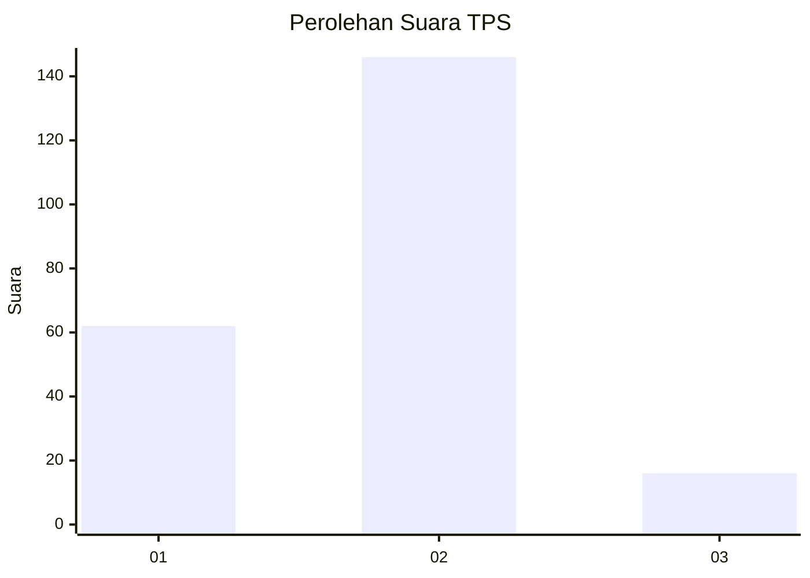
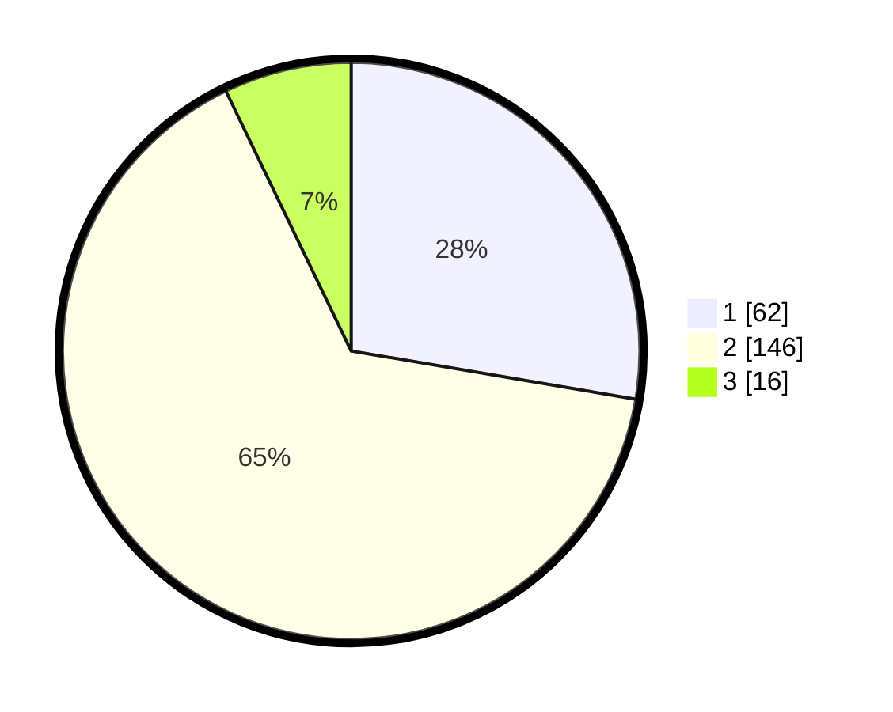

# Hasil

## Grafik

## Tabel

| No. | Nama Paslon    | Suara | Suara (raw) | Persentase |
|:--- |:-------------- | -----:| -----------:| ----------:|
| 1   | ANIES MUHAIMIN | 62    | [62][p-1]   | 27,68      |
| 2   | PRABOWO GIBRAN | 146   | [146][p-2]  | 65,18      |
| 3   | GANJAR MAHFUD  | 16    | [16][p-3]   | 7,14       |

[p-1]: https://github.com/gigit-pemilu/pemilu-2024-64-kalimantan-timur/blob/main/pilpres/hitung-suara/sub/64-kalimantan-timur/sub/72-kota-samarinda/sub/06-sungai-kunjang/sub/1001-loa-bakung/sub/008-tps/sub/paslon-1.txt
[p-2]: https://github.com/gigit-pemilu/pemilu-2024-64-kalimantan-timur/blob/main/pilpres/hitung-suara/sub/64-kalimantan-timur/sub/72-kota-samarinda/sub/06-sungai-kunjang/sub/1001-loa-bakung/sub/008-tps/sub/paslon-2.txt
[p-3]: https://github.com/gigit-pemilu/pemilu-2024-64-kalimantan-timur/blob/main/pilpres/hitung-suara/sub/64-kalimantan-timur/sub/72-kota-samarinda/sub/06-sungai-kunjang/sub/1001-loa-bakung/sub/008-tps/sub/paslon-3.txt

## Foto C Plano

https://sirekap-obj-formc.kpu.go.id/5549/pemilu/ppwp/64/72/06/10/01/6472061001008-20240214-202436--79c48e84-f817-4ede-b268-e49277f5afe5.jpg

https://sirekap-obj-formc.kpu.go.id/5549/pemilu/ppwp/64/72/06/10/01/6472061001008-20240214-202445--221a2f39-12f8-4926-b4fd-1fc18483ddae.jpg

https://sirekap-obj-formc.kpu.go.id/5549/pemilu/ppwp/64/72/06/10/01/6472061001008-20240214-202450--a6e23a1d-2f40-4e02-b11d-1f39263cff38.jpg

## Metadata

| Key        | Value               |
| ---------- | ------------------- |
| Time Stamp | 2024-02-19 06:16:00 |

