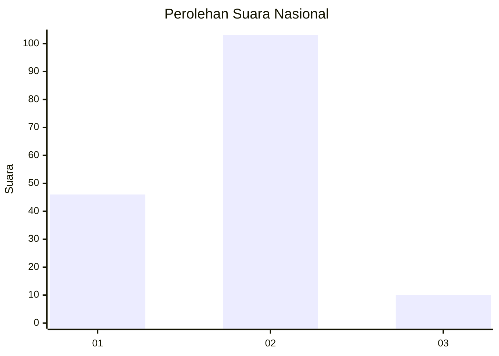
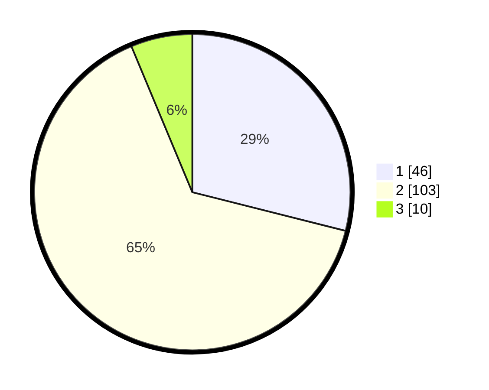

# Hasil

## Grafik

## Tabel

| No. | Nama Paslon    | Suara | Suara (raw) | Persentase |
|:--- |:-------------- | -----:| -----------:| ----------:|
| 1   | ANIES MUHAIMIN | 46    | [46][p-1]   | 28,93      |
| 2   | PRABOWO GIBRAN | 103   | [103][p-2]  | 64,78      |
| 3   | GANJAR MAHFUD  | 10    | [10][p-3]   | 6,29       |

[p-1]: https://github.com/gigit-pemilu/pemilu-2024/blob/main/pilpres/hitung-suara/sub/64-kalimantan-timur/sub/72-kota-samarinda/sub/06-sungai-kunjang/sub/1001-loa-bakung/sub/010-tps/sub/paslon-1.txt
[p-2]: https://github.com/gigit-pemilu/pemilu-2024/blob/main/pilpres/hitung-suara/sub/64-kalimantan-timur/sub/72-kota-samarinda/sub/06-sungai-kunjang/sub/1001-loa-bakung/sub/010-tps/sub/paslon-2.txt
[p-3]: https://github.com/gigit-pemilu/pemilu-2024/blob/main/pilpres/hitung-suara/sub/64-kalimantan-timur/sub/72-kota-samarinda/sub/06-sungai-kunjang/sub/1001-loa-bakung/sub/010-tps/sub/paslon-3.txt

## Foto C Plano

https://sirekap-obj-formc.kpu.go.id/519e/pemilu/ppwp/64/72/06/10/01/6472061001010-20240215-015347--e2f89665-1342-4625-9051-2f27a0962fa2.jpg

https://sirekap-obj-formc.kpu.go.id/519e/pemilu/ppwp/64/72/06/10/01/6472061001010-20240215-015442--c3088758-a5d8-4435-8e25-6d1db4e2fde6.jpg

https://sirekap-obj-formc.kpu.go.id/519e/pemilu/ppwp/64/72/06/10/01/6472061001010-20240214-225308--be71d131-d229-42ba-93c3-2306441bb543.jpg

## Metadata

| Key        | Value               |
| ---------- | ------------------- |
| Time Stamp | 2024-02-19 06:16:00 |

