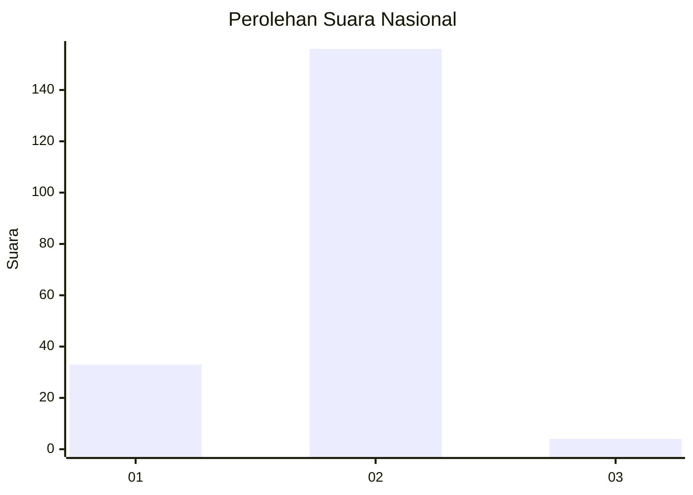
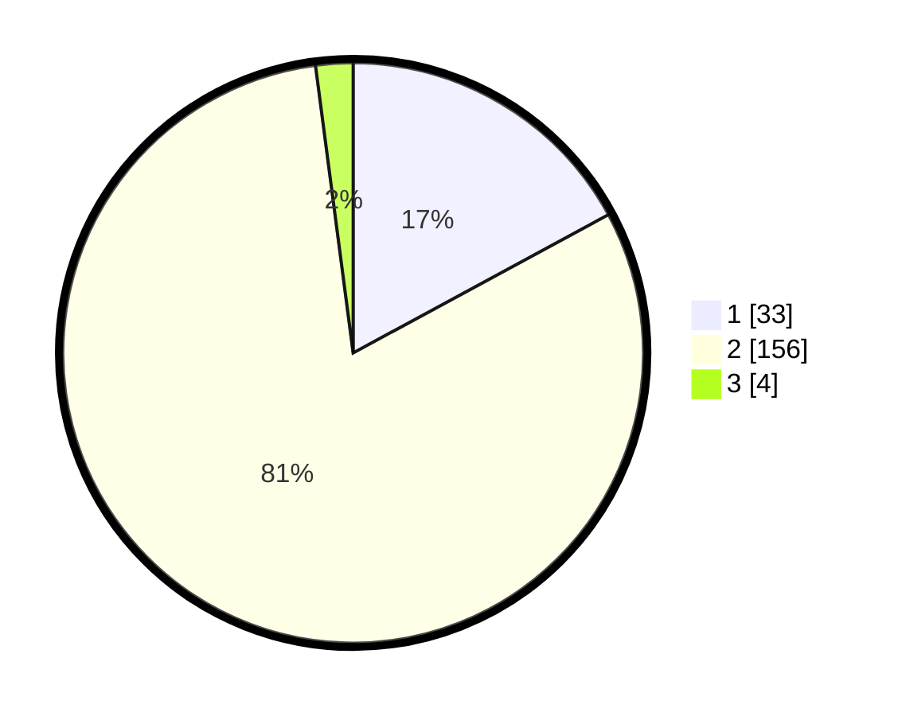

# Hasil

## Grafik

## Tabel

| No. | Nama Paslon    | Suara | Suara (raw) | Persentase |
|:--- |:-------------- | -----:| -----------:| ----------:|
| 1   | ANIES MUHAIMIN | 33    | [33][p-1]   | 17,10      |
| 2   | PRABOWO GIBRAN | 156   | [156][p-2]  | 80,83      |
| 3   | GANJAR MAHFUD  | 4     | [4][p-3]    | 2,07       |

[p-1]: https://github.com/gigit-pemilu/pemilu-2024/blob/main/pilpres/hitung-suara/sub/64-kalimantan-timur/sub/72-kota-samarinda/sub/07-sambutan/sub/1001-sungai-kapih/sub/002-tps/sub/paslon-1.txt
[p-2]: https://github.com/gigit-pemilu/pemilu-2024/blob/main/pilpres/hitung-suara/sub/64-kalimantan-timur/sub/72-kota-samarinda/sub/07-sambutan/sub/1001-sungai-kapih/sub/002-tps/sub/paslon-2.txt
[p-3]: https://github.com/gigit-pemilu/pemilu-2024/blob/main/pilpres/hitung-suara/sub/64-kalimantan-timur/sub/72-kota-samarinda/sub/07-sambutan/sub/1001-sungai-kapih/sub/002-tps/sub/paslon-3.txt

## Foto C Plano

https://sirekap-obj-formc.kpu.go.id/e3b1/pemilu/ppwp/64/72/07/10/01/6472071001002-20240214-230657--f02300d1-a204-426c-949f-9e9fc75b96cb.jpg

https://sirekap-obj-formc.kpu.go.id/e3b1/pemilu/ppwp/64/72/07/10/01/6472071001002-20240214-230838--44788349-4e98-45c4-b313-e8f9d13f48c6.jpg

https://sirekap-obj-formc.kpu.go.id/e3b1/pemilu/ppwp/64/72/07/10/01/6472071001002-20240214-230937--5298309b-d58f-42c7-9654-dfa620eb5152.jpg

## Metadata

| Key        | Value               |
| ---------- | ------------------- |
| Time Stamp | 2024-02-25 01:00:00 |

