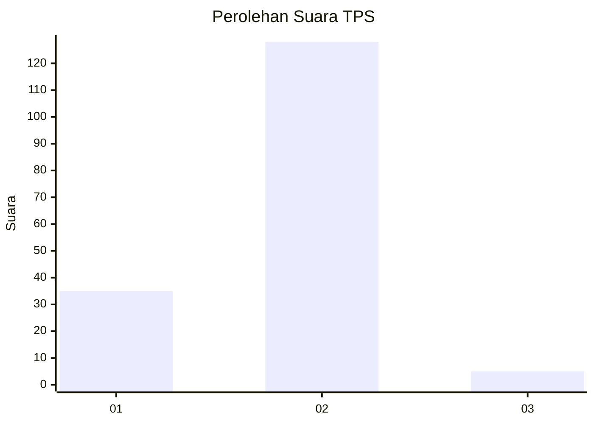
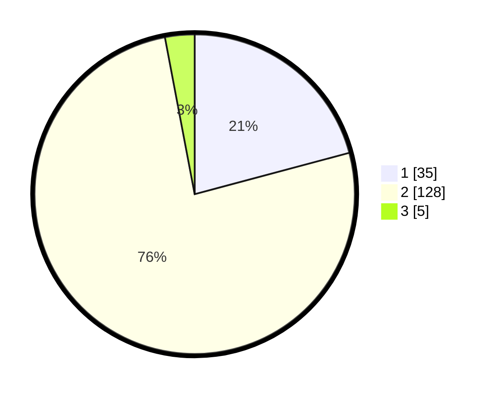

# Hasil

## Grafik

## Tabel

| No. | Nama Paslon    | Suara | Suara (raw) | Persentase |
|:--- |:-------------- | -----:| -----------:| ----------:|
| 1   | ANIES MUHAIMIN | 35    | [35][p-1]   | 20,83      |
| 2   | PRABOWO GIBRAN | 128   | [128][p-2]  | 76,19      |
| 3   | GANJAR MAHFUD  | 5     | [5][p-3]    | 2,98       |

[p-1]: https://github.com/gigit-pemilu/pemilu-2024-64-kalimantan-timur/blob/main/pilpres/hitung-suara/sub/64-kalimantan-timur/sub/72-kota-samarinda/sub/07-sambutan/sub/1001-sungai-kapih/sub/006-tps/sub/paslon-1.txt
[p-2]: https://github.com/gigit-pemilu/pemilu-2024-64-kalimantan-timur/blob/main/pilpres/hitung-suara/sub/64-kalimantan-timur/sub/72-kota-samarinda/sub/07-sambutan/sub/1001-sungai-kapih/sub/006-tps/sub/paslon-2.txt
[p-3]: https://github.com/gigit-pemilu/pemilu-2024-64-kalimantan-timur/blob/main/pilpres/hitung-suara/sub/64-kalimantan-timur/sub/72-kota-samarinda/sub/07-sambutan/sub/1001-sungai-kapih/sub/006-tps/sub/paslon-3.txt

## Foto C Plano

https://sirekap-obj-formc.kpu.go.id/3604/pemilu/ppwp/64/72/07/10/01/6472071001006-20240215-015412--8aff9ed5-99d3-4dff-9300-72c66eab8360.jpg

https://sirekap-obj-formc.kpu.go.id/3604/pemilu/ppwp/64/72/07/10/01/6472071001006-20240215-015545--c13519a7-3166-417f-b7f1-0bca4da6cb4a.jpg

https://sirekap-obj-formc.kpu.go.id/3604/pemilu/ppwp/64/72/07/10/01/6472071001006-20240215-015916--fbc824d6-f521-4657-9c7a-42e4feb639bf.jpg

## Metadata

| Key        | Value               |
| ---------- | ------------------- |
| Time Stamp | 2024-02-25 08:00:00 |

