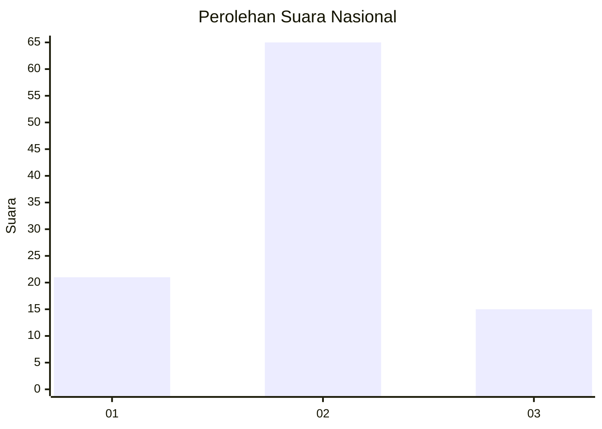
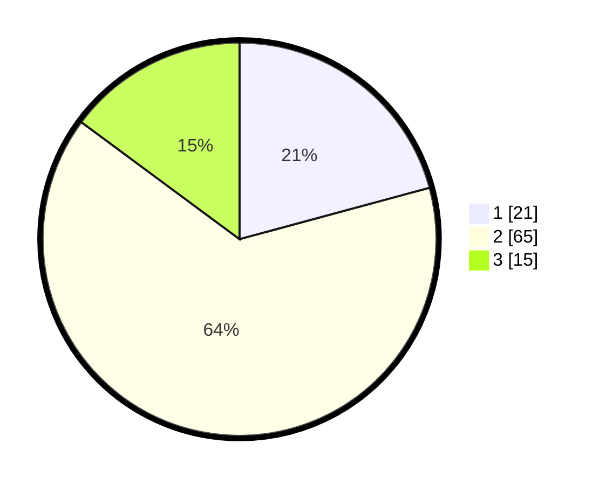

# Hasil

## Grafik

## Tabel

| No. | Nama Paslon    | Suara | Suara (raw) | Persentase |
|:--- |:-------------- | -----:| -----------:| ----------:|
| 1   | ANIES MUHAIMIN | 21    | [21][p-1]   | 20,79      |
| 2   | PRABOWO GIBRAN | 65    | [65][p-2]   | 64,36      |
| 3   | GANJAR MAHFUD  | 15    | [15][p-3]   | 14,85      |

[p-1]: https://github.com/gigit-pemilu/pemilu-2024/blob/main/pilpres/hitung-suara/sub/64-kalimantan-timur/sub/72-kota-samarinda/sub/08-sungai-pinang/sub/1001-temindung-permai/sub/002-tps/sub/paslon-1.txt
[p-2]: https://github.com/gigit-pemilu/pemilu-2024/blob/main/pilpres/hitung-suara/sub/64-kalimantan-timur/sub/72-kota-samarinda/sub/08-sungai-pinang/sub/1001-temindung-permai/sub/002-tps/sub/paslon-2.txt
[p-3]: https://github.com/gigit-pemilu/pemilu-2024/blob/main/pilpres/hitung-suara/sub/64-kalimantan-timur/sub/72-kota-samarinda/sub/08-sungai-pinang/sub/1001-temindung-permai/sub/002-tps/sub/paslon-3.txt

## Foto C Plano

https://sirekap-obj-formc.kpu.go.id/ac57/pemilu/ppwp/64/72/08/10/01/6472081001002-20240215-010516--5be36f0d-54f1-40ab-84d8-67905c013dc3.jpg

https://sirekap-obj-formc.kpu.go.id/ac57/pemilu/ppwp/64/72/08/10/01/6472081001002-20240215-010640--212f10ca-abf4-4187-afc0-f1e9bbdb2910.jpg

https://sirekap-obj-formc.kpu.go.id/ac57/pemilu/ppwp/64/72/08/10/01/6472081001002-20240215-010800--94df41f3-40a3-4289-9094-62b5d4195507.jpg

## Metadata

| Key        | Value               |
| ---------- | ------------------- |
| Time Stamp | 2024-02-25 13:00:00 |

