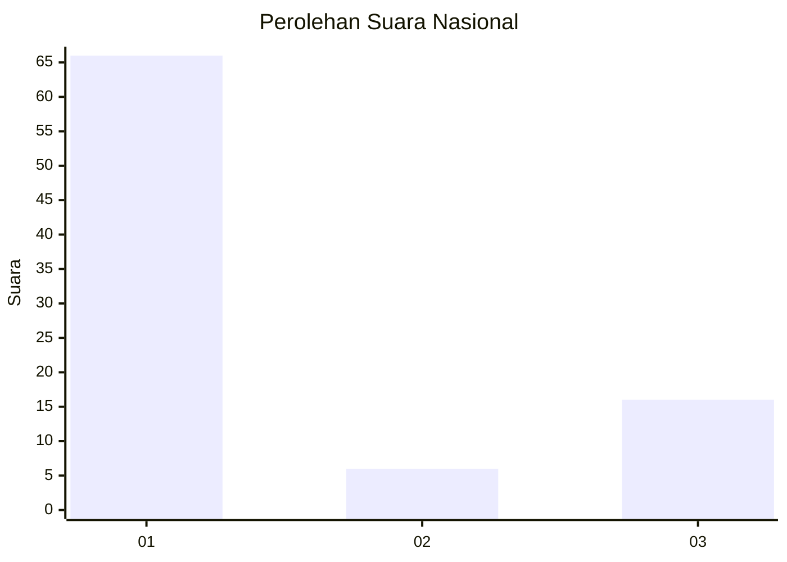
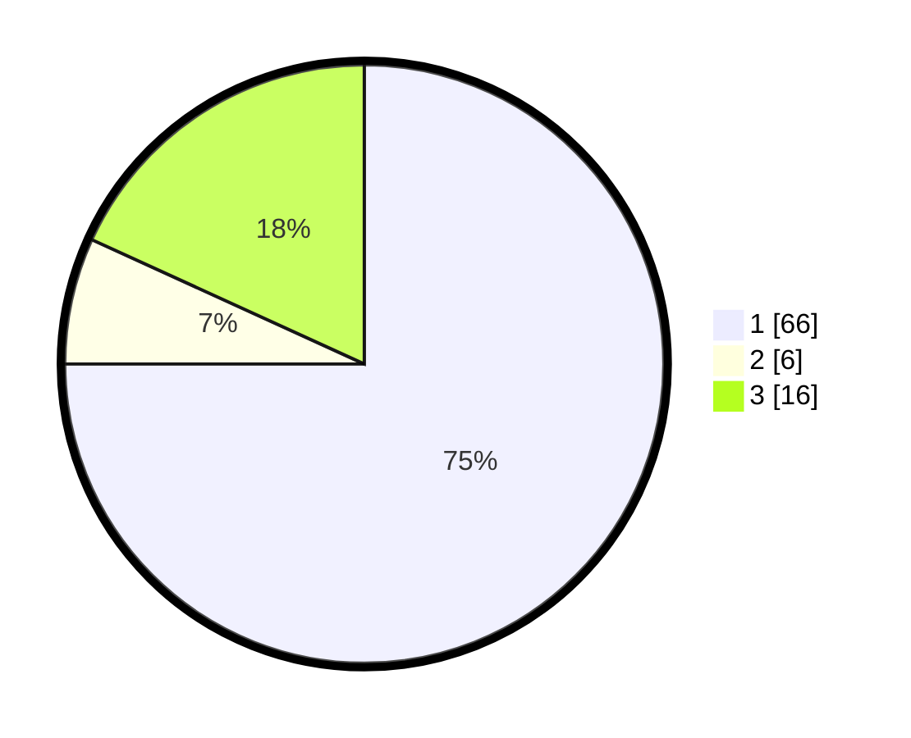

# Hasil

## Grafik

## Tabel

| No. | Nama Paslon    | Suara | Suara (raw) | Persentase |
|:--- |:-------------- | -----:| -----------:| ----------:|
| 1   | ANIES MUHAIMIN | 66    | [66][p-1]   | 75,00      |
| 2   | PRABOWO GIBRAN | 6     | [6][p-2]    | 6,82       |
| 3   | GANJAR MAHFUD  | 16    | [16][p-3]   | 18,18      |

[p-1]: https://github.com/gigit-pemilu/pemilu-2024/blob/main/pilpres/hitung-suara/sub/64-kalimantan-timur/sub/72-kota-samarinda/sub/08-sungai-pinang/sub/1001-temindung-permai/sub/011-tps/sub/paslon-1.txt
[p-2]: https://github.com/gigit-pemilu/pemilu-2024/blob/main/pilpres/hitung-suara/sub/64-kalimantan-timur/sub/72-kota-samarinda/sub/08-sungai-pinang/sub/1001-temindung-permai/sub/011-tps/sub/paslon-2.txt
[p-3]: https://github.com/gigit-pemilu/pemilu-2024/blob/main/pilpres/hitung-suara/sub/64-kalimantan-timur/sub/72-kota-samarinda/sub/08-sungai-pinang/sub/1001-temindung-permai/sub/011-tps/sub/paslon-3.txt

## Foto C Plano

https://sirekap-obj-formc.kpu.go.id/0572/pemilu/ppwp/64/72/08/10/01/6472081001011-20240217-120141--5e70b7e1-2871-4f80-bfc9-418137f8852b.jpg

https://sirekap-obj-formc.kpu.go.id/0572/pemilu/ppwp/64/72/08/10/01/6472081001011-20240217-120216--7f35e9fa-b30f-44c2-8440-237ad01ceeff.jpg

https://sirekap-obj-formc.kpu.go.id/0572/pemilu/ppwp/64/72/08/10/01/6472081001011-20240217-120226--4977f0c4-3aa7-471a-9106-fed765b03e07.jpg

## Metadata

| Key        | Value               |
| ---------- | ------------------- |
| Time Stamp | 2024-02-25 23:00:00 |

