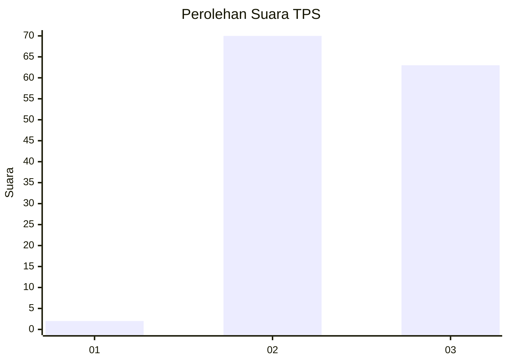
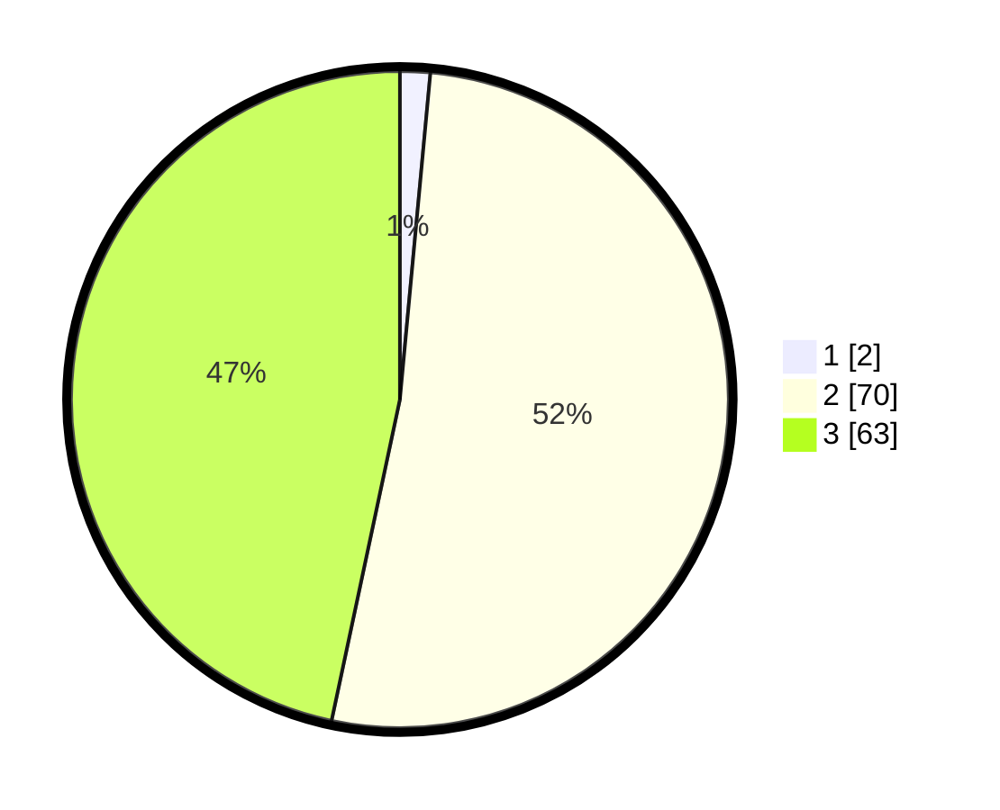

# Hasil

## Grafik

## Tabel

| No. | Nama Paslon    | Suara | Suara (raw) | Persentase |
|:--- |:-------------- | -----:| -----------:| ----------:|
| 1   | ANIES MUHAIMIN | 2     | [2][p-1]    | 1,48       |
| 2   | PRABOWO GIBRAN | 70    | [70][p-2]   | 51,85      |
| 3   | GANJAR MAHFUD  | 63    | [63][p-3]   | 46,67      |

[p-1]: https://github.com/gigit-pemilu/pemilu-2024-64-kalimantan-timur/blob/main/pilpres/hitung-suara/sub/64-kalimantan-timur/sub/72-kota-samarinda/sub/09-samarinda-kota/sub/1001-karang-mumus/sub/001-tps/sub/paslon-1.txt
[p-2]: https://github.com/gigit-pemilu/pemilu-2024-64-kalimantan-timur/blob/main/pilpres/hitung-suara/sub/64-kalimantan-timur/sub/72-kota-samarinda/sub/09-samarinda-kota/sub/1001-karang-mumus/sub/001-tps/sub/paslon-2.txt
[p-3]: https://github.com/gigit-pemilu/pemilu-2024-64-kalimantan-timur/blob/main/pilpres/hitung-suara/sub/64-kalimantan-timur/sub/72-kota-samarinda/sub/09-samarinda-kota/sub/1001-karang-mumus/sub/001-tps/sub/paslon-3.txt

## Foto C Plano

https://sirekap-obj-formc.kpu.go.id/7297/pemilu/ppwp/64/72/09/10/01/6472091001001-20240216-212030--d7c6a411-8dff-4044-aca5-2c1c1a31185b.jpg

https://sirekap-obj-formc.kpu.go.id/7297/pemilu/ppwp/64/72/09/10/01/6472091001001-20240216-212105--b462fba3-5d69-4889-9147-9545c1d174c6.jpg

https://sirekap-obj-formc.kpu.go.id/7297/pemilu/ppwp/64/72/09/10/01/6472091001001-20240216-212134--5e733522-7699-4d39-98a4-8c69bc12bcd9.jpg

## Metadata

| Key        | Value               |
| ---------- | ------------------- |
| Time Stamp | 2024-02-26 12:00:00 |

