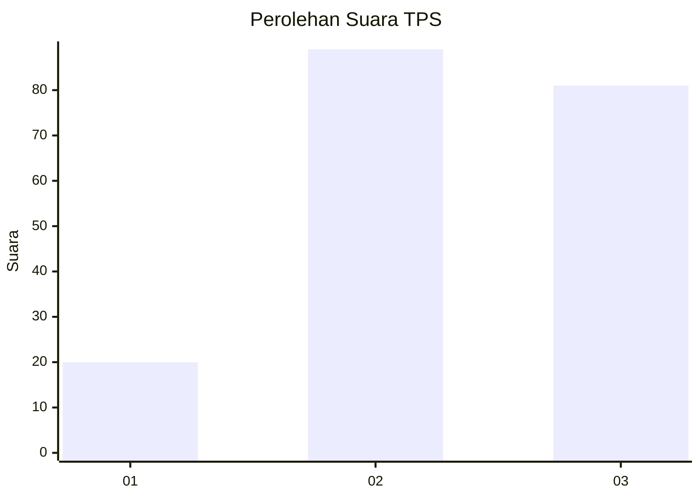
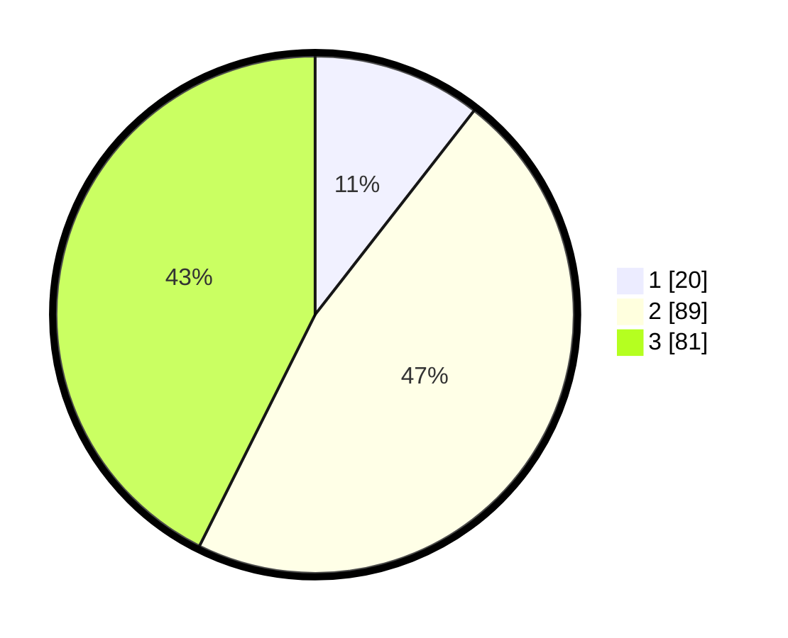

# Hasil

## Grafik

## Tabel

| No. | Nama Paslon    | Suara | Suara (raw) | Persentase |
|:--- |:-------------- | -----:| -----------:| ----------:|
| 1   | ANIES MUHAIMIN | 20    | [20][p-1]   | 10,53      |
| 2   | PRABOWO GIBRAN | 89    | [89][p-2]   | 46,84      |
| 3   | GANJAR MAHFUD  | 81    | [81][p-3]   | 42,63      |

[p-1]: https://github.com/gigit-pemilu/pemilu-2024-64-kalimantan-timur/blob/main/pilpres/hitung-suara/sub/64-kalimantan-timur/sub/72-kota-samarinda/sub/09-samarinda-kota/sub/1001-karang-mumus/sub/002-tps/sub/paslon-1.txt
[p-2]: https://github.com/gigit-pemilu/pemilu-2024-64-kalimantan-timur/blob/main/pilpres/hitung-suara/sub/64-kalimantan-timur/sub/72-kota-samarinda/sub/09-samarinda-kota/sub/1001-karang-mumus/sub/002-tps/sub/paslon-2.txt
[p-3]: https://github.com/gigit-pemilu/pemilu-2024-64-kalimantan-timur/blob/main/pilpres/hitung-suara/sub/64-kalimantan-timur/sub/72-kota-samarinda/sub/09-samarinda-kota/sub/1001-karang-mumus/sub/002-tps/sub/paslon-3.txt

## Foto C Plano

https://sirekap-obj-formc.kpu.go.id/6a63/pemilu/ppwp/64/72/09/10/01/6472091001002-20240216-213728--d6f83e0d-a840-4c57-b54a-4740e9f75177.jpg

https://sirekap-obj-formc.kpu.go.id/6a63/pemilu/ppwp/64/72/09/10/01/6472091001002-20240216-213751--7f1f0c4f-58b6-4103-93c2-8d812db279a2.jpg

https://sirekap-obj-formc.kpu.go.id/6a63/pemilu/ppwp/64/72/09/10/01/6472091001002-20240216-213814--933687c0-d193-47ab-85ff-e4e022de246b.jpg

## Metadata

| Key        | Value               |
| ---------- | ------------------- |
| Time Stamp | 2024-02-24 22:31:28 |

