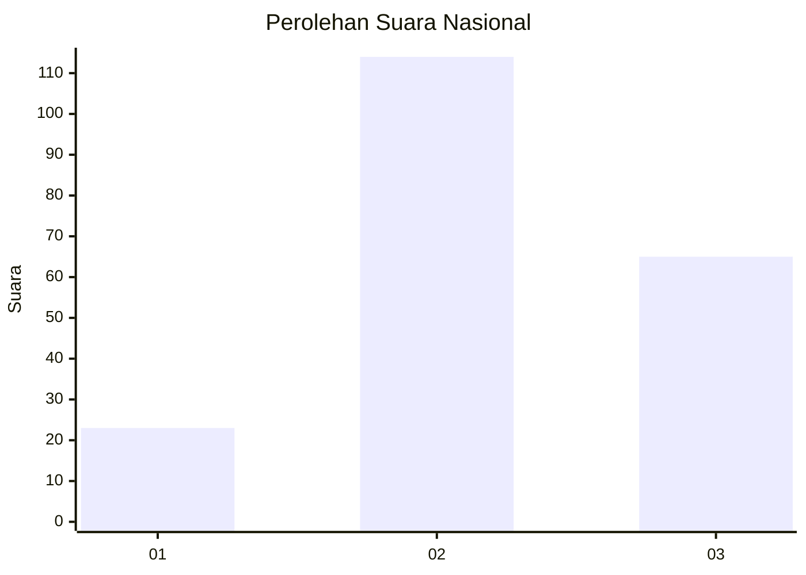
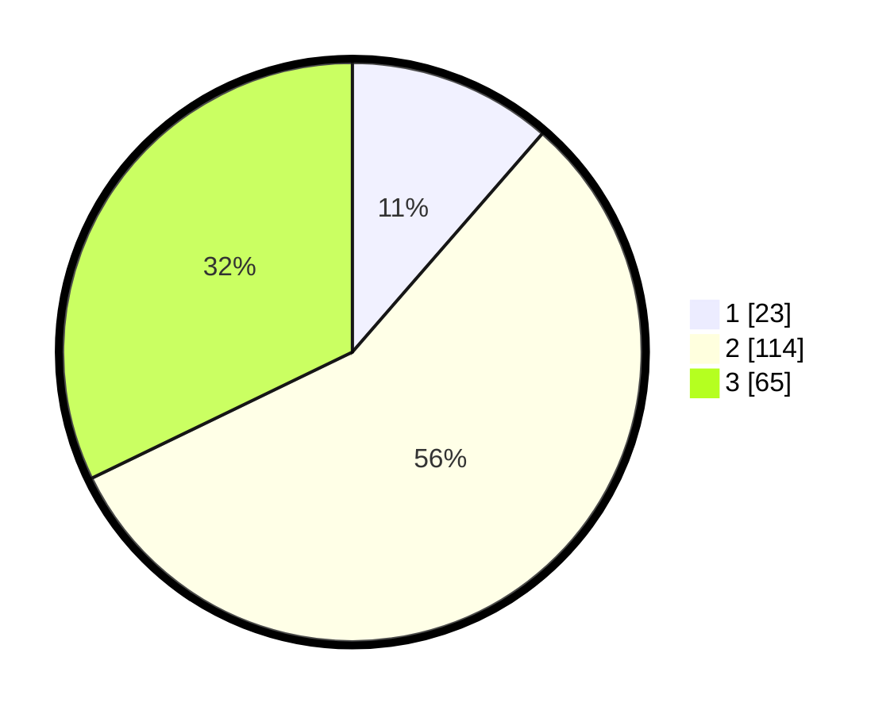

# Hasil

## Grafik

## Tabel

| No. | Nama Paslon    | Suara | Suara (raw) | Persentase |
|:--- |:-------------- | -----:| -----------:| ----------:|
| 1   | ANIES MUHAIMIN | 23    | [23][p-1]   | 11,39      |
| 2   | PRABOWO GIBRAN | 114   | [114][p-2]  | 56,44      |
| 3   | GANJAR MAHFUD  | 65    | [65][p-3]   | 32,18      |

[p-1]: https://github.com/gigit-pemilu/pemilu-2024/blob/main/pilpres/hitung-suara/sub/64-kalimantan-timur/sub/72-kota-samarinda/sub/09-samarinda-kota/sub/1001-karang-mumus/sub/003-tps/sub/paslon-1.txt
[p-2]: https://github.com/gigit-pemilu/pemilu-2024/blob/main/pilpres/hitung-suara/sub/64-kalimantan-timur/sub/72-kota-samarinda/sub/09-samarinda-kota/sub/1001-karang-mumus/sub/003-tps/sub/paslon-2.txt
[p-3]: https://github.com/gigit-pemilu/pemilu-2024/blob/main/pilpres/hitung-suara/sub/64-kalimantan-timur/sub/72-kota-samarinda/sub/09-samarinda-kota/sub/1001-karang-mumus/sub/003-tps/sub/paslon-3.txt

## Foto C Plano

https://sirekap-obj-formc.kpu.go.id/9f50/pemilu/ppwp/64/72/09/10/01/6472091001003-20240216-212417--6e752528-5832-4545-9450-8a005b8a2eb0.jpg

https://sirekap-obj-formc.kpu.go.id/9f50/pemilu/ppwp/64/72/09/10/01/6472091001003-20240216-213025--d354a773-0f38-467a-b08f-d1891153d6cb.jpg

https://sirekap-obj-formc.kpu.go.id/9f50/pemilu/ppwp/64/72/09/10/01/6472091001003-20240216-213051--72058afe-347c-44b4-9d25-7ab67f49e782.jpg

## Metadata

| Key        | Value               |
| ---------- | ------------------- |
| Time Stamp | 2024-02-26 12:00:00 |

