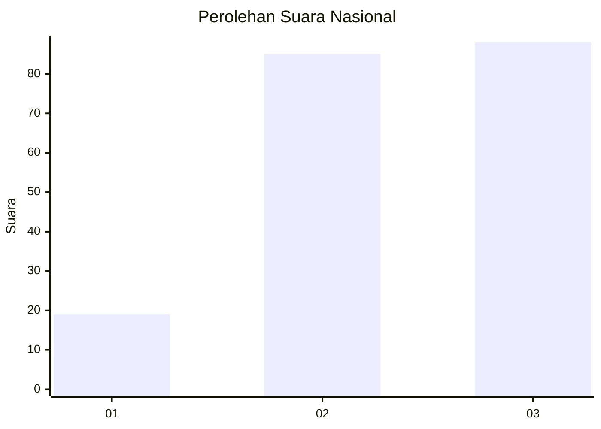
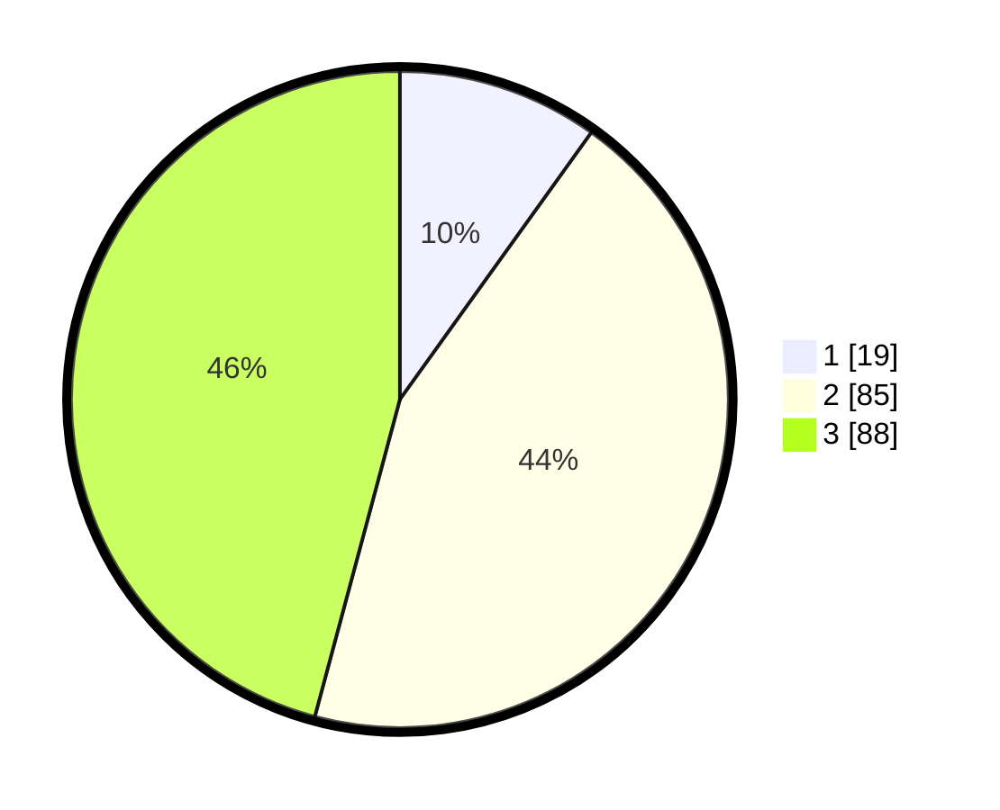

# Hasil

## Grafik

## Tabel

| No. | Nama Paslon    | Suara | Suara (raw) | Persentase |
|:--- |:-------------- | -----:| -----------:| ----------:|
| 1   | ANIES MUHAIMIN | 19    | [19][p-1]   | 9,90       |
| 2   | PRABOWO GIBRAN | 85    | [85][p-2]   | 44,27      |
| 3   | GANJAR MAHFUD  | 88    | [88][p-3]   | 45,83      |

[p-1]: https://github.com/gigit-pemilu/pemilu-2024/blob/main/pilpres/hitung-suara/sub/64-kalimantan-timur/sub/72-kota-samarinda/sub/09-samarinda-kota/sub/1001-karang-mumus/sub/004-tps/sub/paslon-1.txt
[p-2]: https://github.com/gigit-pemilu/pemilu-2024/blob/main/pilpres/hitung-suara/sub/64-kalimantan-timur/sub/72-kota-samarinda/sub/09-samarinda-kota/sub/1001-karang-mumus/sub/004-tps/sub/paslon-2.txt
[p-3]: https://github.com/gigit-pemilu/pemilu-2024/blob/main/pilpres/hitung-suara/sub/64-kalimantan-timur/sub/72-kota-samarinda/sub/09-samarinda-kota/sub/1001-karang-mumus/sub/004-tps/sub/paslon-3.txt

## Foto C Plano

https://sirekap-obj-formc.kpu.go.id/d7db/pemilu/ppwp/64/72/09/10/01/6472091001004-20240216-211444--379ec06b-65e1-48ae-88ed-ec34c42bfc07.jpg

https://sirekap-obj-formc.kpu.go.id/d7db/pemilu/ppwp/64/72/09/10/01/6472091001004-20240216-211545--54d6c2bd-db95-4a1f-9bda-777f784f2415.jpg

https://sirekap-obj-formc.kpu.go.id/d7db/pemilu/ppwp/64/72/09/10/01/6472091001004-20240216-211619--f0e165c2-49a4-4bfd-866a-d23c23099c59.jpg

## Metadata

| Key        | Value               |
| ---------- | ------------------- |
| Time Stamp | 2024-02-25 11:00:00 |

