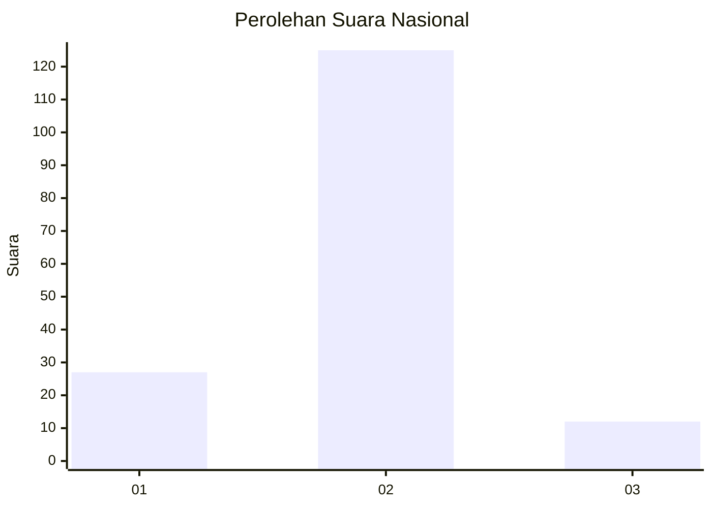
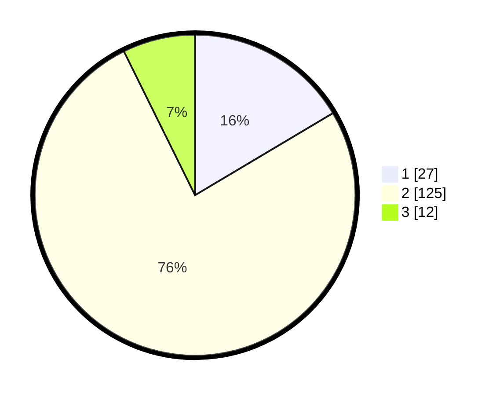

# Hasil

## Grafik

## Tabel

| No. | Nama Paslon    | Suara | Suara (raw) | Persentase |
|:--- |:-------------- | -----:| -----------:| ----------:|
| 1   | ANIES MUHAIMIN | 27    | [27][p-1]   | 16,46      |
| 2   | PRABOWO GIBRAN | 125   | [125][p-2]  | 76,22      |
| 3   | GANJAR MAHFUD  | 12    | [12][p-3]   | 7,32       |

[p-1]: https://github.com/gigit-pemilu/pemilu-2024/blob/main/pilpres/hitung-suara/sub/64-kalimantan-timur/sub/72-kota-samarinda/sub/10-loa-janan-ilir/sub/1001-simpang-tiga/sub/008-tps/sub/paslon-1.txt
[p-2]: https://github.com/gigit-pemilu/pemilu-2024/blob/main/pilpres/hitung-suara/sub/64-kalimantan-timur/sub/72-kota-samarinda/sub/10-loa-janan-ilir/sub/1001-simpang-tiga/sub/008-tps/sub/paslon-2.txt
[p-3]: https://github.com/gigit-pemilu/pemilu-2024/blob/main/pilpres/hitung-suara/sub/64-kalimantan-timur/sub/72-kota-samarinda/sub/10-loa-janan-ilir/sub/1001-simpang-tiga/sub/008-tps/sub/paslon-3.txt

## Foto C Plano

https://sirekap-obj-formc.kpu.go.id/b17d/pemilu/ppwp/64/72/10/10/01/6472101001008-20240215-072025--8f3d7d0d-882c-4238-9d82-361d6de8e56c.jpg

https://sirekap-obj-formc.kpu.go.id/b17d/pemilu/ppwp/64/72/10/10/01/6472101001008-20240215-072108--6981a23f-aa21-4489-9c94-817986648e4e.jpg

https://sirekap-obj-formc.kpu.go.id/b17d/pemilu/ppwp/64/72/10/10/01/6472101001008-20240215-072146--6b899106-abbb-45b8-abcc-557430149bb0.jpg

## Metadata

| Key        | Value               |
| ---------- | ------------------- |
| Time Stamp | 2024-02-25 13:00:00 |

