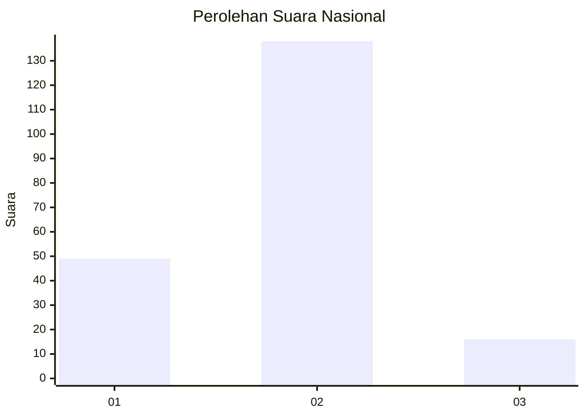
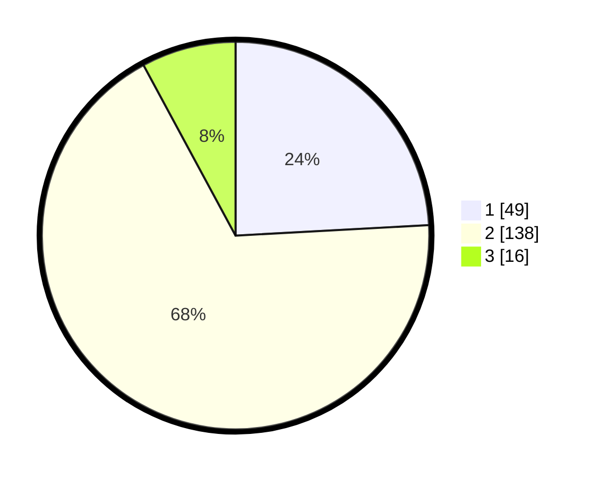

# Hasil

## Grafik

## Tabel

| No. | Nama Paslon    | Suara | Suara (raw) | Persentase |
|:--- |:-------------- | -----:| -----------:| ----------:|
| 1   | ANIES MUHAIMIN | 49    | [49][p-1]   | 24,14      |
| 2   | PRABOWO GIBRAN | 138   | [138][p-2]  | 67,98      |
| 3   | GANJAR MAHFUD  | 16    | [16][p-3]   | 7,88       |

[p-1]: https://github.com/gigit-pemilu/pemilu-2024/blob/main/pilpres/hitung-suara/sub/64-kalimantan-timur/sub/72-kota-samarinda/sub/10-loa-janan-ilir/sub/1001-simpang-tiga/sub/010-tps/sub/paslon-1.txt
[p-2]: https://github.com/gigit-pemilu/pemilu-2024/blob/main/pilpres/hitung-suara/sub/64-kalimantan-timur/sub/72-kota-samarinda/sub/10-loa-janan-ilir/sub/1001-simpang-tiga/sub/010-tps/sub/paslon-2.txt
[p-3]: https://github.com/gigit-pemilu/pemilu-2024/blob/main/pilpres/hitung-suara/sub/64-kalimantan-timur/sub/72-kota-samarinda/sub/10-loa-janan-ilir/sub/1001-simpang-tiga/sub/010-tps/sub/paslon-3.txt

## Foto C Plano

https://sirekap-obj-formc.kpu.go.id/c512/pemilu/ppwp/64/72/10/10/01/6472101001010-20240215-023333--266470b9-063c-49b7-bd42-3fd83560fb69.jpg

https://sirekap-obj-formc.kpu.go.id/c512/pemilu/ppwp/64/72/10/10/01/6472101001010-20240215-023358--863da640-b753-4b3a-966f-486814b6fc2a.jpg

https://sirekap-obj-formc.kpu.go.id/c512/pemilu/ppwp/64/72/10/10/01/6472101001010-20240215-023406--fc6c6ad3-0502-4b74-9c5c-f27368da65d4.jpg

## Metadata

| Key        | Value               |
| ---------- | ------------------- |
| Time Stamp | 2024-02-24 22:31:28 |

