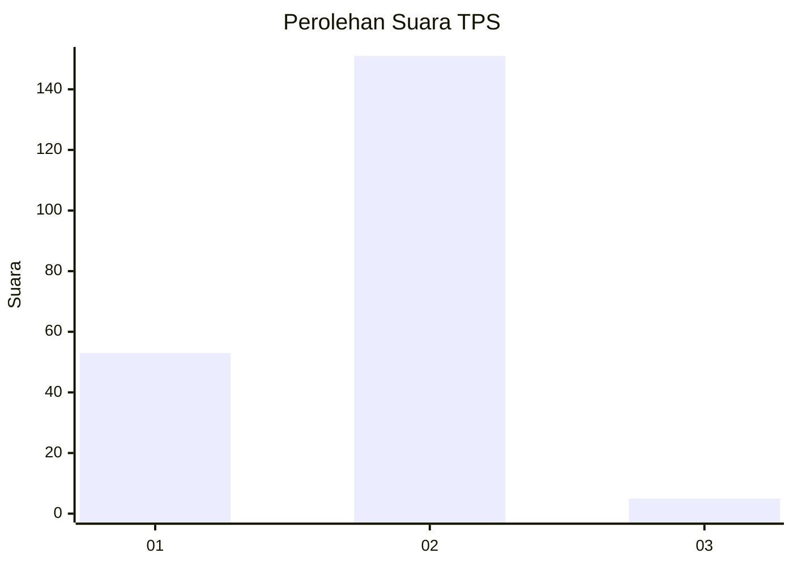
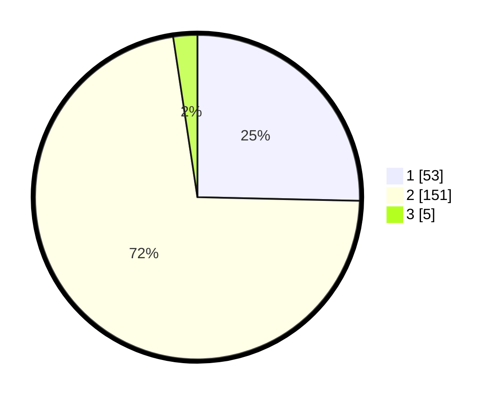

# Hasil

## Grafik

## Tabel

| No. | Nama Paslon    | Suara | Suara (raw) | Persentase |
|:--- |:-------------- | -----:| -----------:| ----------:|
| 1   | ANIES MUHAIMIN | 53    | [53][p-1]   | 25,36      |
| 2   | PRABOWO GIBRAN | 151   | [151][p-2]  | 72,25      |
| 3   | GANJAR MAHFUD  | 5     | [5][p-3]    | 2,39       |

[p-1]: https://github.com/gigit-pemilu/pemilu-2024-64-kalimantan-timur/blob/main/pilpres/hitung-suara/sub/64-kalimantan-timur/sub/74-kota-bontang/sub/01-bontang-utara/sub/1001-bontang-kuala/sub/003-tps/sub/paslon-1.txt
[p-2]: https://github.com/gigit-pemilu/pemilu-2024-64-kalimantan-timur/blob/main/pilpres/hitung-suara/sub/64-kalimantan-timur/sub/74-kota-bontang/sub/01-bontang-utara/sub/1001-bontang-kuala/sub/003-tps/sub/paslon-2.txt
[p-3]: https://github.com/gigit-pemilu/pemilu-2024-64-kalimantan-timur/blob/main/pilpres/hitung-suara/sub/64-kalimantan-timur/sub/74-kota-bontang/sub/01-bontang-utara/sub/1001-bontang-kuala/sub/003-tps/sub/paslon-3.txt

## Foto C Plano

https://sirekap-obj-formc.kpu.go.id/5dec/pemilu/ppwp/64/74/01/10/01/6474011001003-20240218-194407--7a5a3966-3279-495a-9108-abed1f837a3b.jpg

https://sirekap-obj-formc.kpu.go.id/5dec/pemilu/ppwp/64/74/01/10/01/6474011001003-20240218-194442--64752022-5274-40b0-90aa-b2a8e376a1dd.jpg

https://sirekap-obj-formc.kpu.go.id/5dec/pemilu/ppwp/64/74/01/10/01/6474011001003-20240218-194508--6d6cfd27-c238-48e9-aea7-baeb6dd2f800.jpg

## Metadata

| Key        | Value               |
| ---------- | ------------------- |
| Time Stamp | 2024-02-25 18:00:00 |

