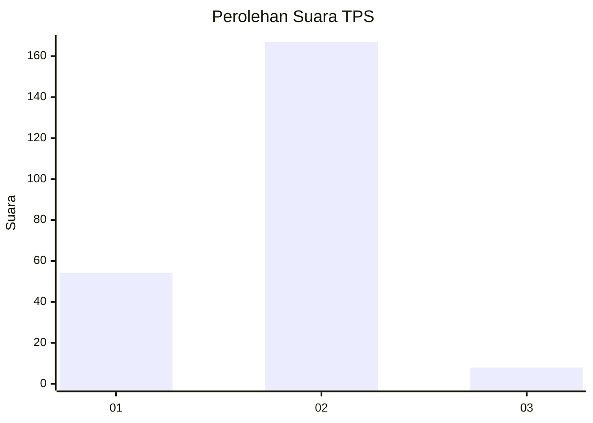

# Hasil

## Grafik

## Tabel

| No. | Nama Paslon    | Suara | Suara (raw) | Persentase |
|:--- |:-------------- | -----:| -----------:| ----------:|
| 1   | ANIES MUHAIMIN | 54    | [54][p-1]   | 23,58      |
| 2   | PRABOWO GIBRAN | 167   | [167][p-2]  | 72,93      |
| 3   | GANJAR MAHFUD  | 8     | [8][p-3]    | 3,49       |

[p-1]: https://github.com/gigit-pemilu/pemilu-2024-64-kalimantan-timur/blob/main/pilpres/hitung-suara/sub/64-kalimantan-timur/sub/74-kota-bontang/sub/01-bontang-utara/sub/1001-bontang-kuala/sub/004-tps/sub/paslon-1.txt
[p-2]: https://github.com/gigit-pemilu/pemilu-2024-64-kalimantan-timur/blob/main/pilpres/hitung-suara/sub/64-kalimantan-timur/sub/74-kota-bontang/sub/01-bontang-utara/sub/1001-bontang-kuala/sub/004-tps/sub/paslon-2.txt
[p-3]: https://github.com/gigit-pemilu/pemilu-2024-64-kalimantan-timur/blob/main/pilpres/hitung-suara/sub/64-kalimantan-timur/sub/74-kota-bontang/sub/01-bontang-utara/sub/1001-bontang-kuala/sub/004-tps/sub/paslon-3.txt

## Foto C Plano

https://sirekap-obj-formc.kpu.go.id/bf03/pemilu/ppwp/64/74/01/10/01/6474011001004-20240218-210339--fe22b828-2ff9-4513-adc1-3bff2768abdb.jpg

https://sirekap-obj-formc.kpu.go.id/bf03/pemilu/ppwp/64/74/01/10/01/6474011001004-20240218-210441--09f3de59-67f0-46e8-abeb-21178a780a8b.jpg

https://sirekap-obj-formc.kpu.go.id/bf03/pemilu/ppwp/64/74/01/10/01/6474011001004-20240218-210505--5980abc2-7a40-4a55-97c7-c8706f6de656.jpg

## Metadata

| Key        | Value               |
| ---------- | ------------------- |
| Time Stamp | 2024-02-25 14:00:00 |

