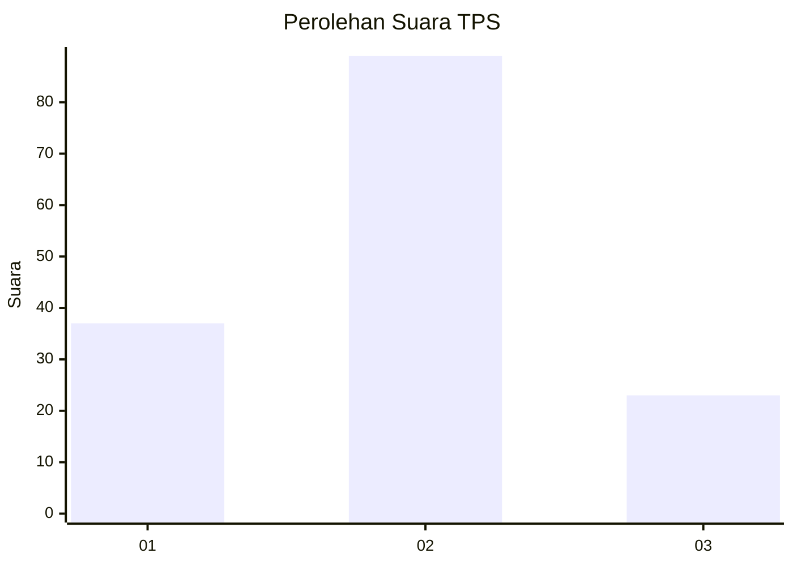
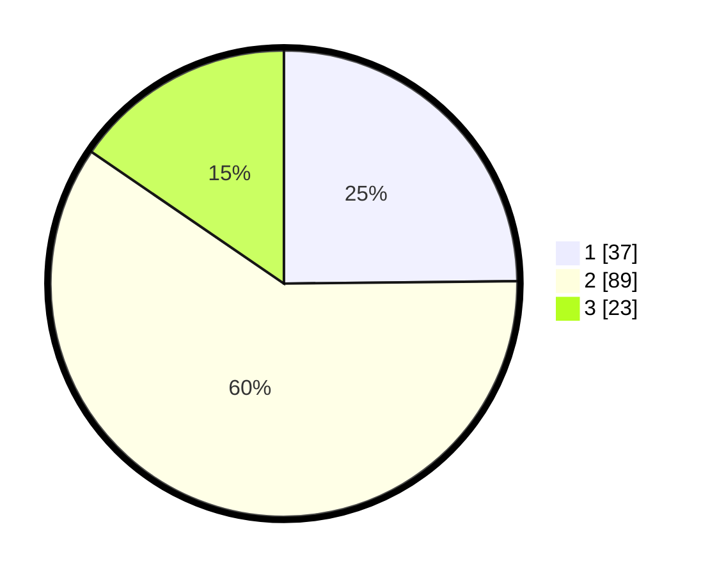

# Hasil

## Grafik

## Tabel

| No. | Nama Paslon    | Suara | Suara (raw) | Persentase |
|:--- |:-------------- | -----:| -----------:| ----------:|
| 1   | ANIES MUHAIMIN | 37    | [37][p-1]   | 24,83      |
| 2   | PRABOWO GIBRAN | 89    | [89][p-2]   | 59,73      |
| 3   | GANJAR MAHFUD  | 23    | [23][p-3]   | 15,44      |

[p-1]: https://github.com/gigit-pemilu/pemilu-2024-64-kalimantan-timur/blob/main/pilpres/hitung-suara/sub/64-kalimantan-timur/sub/74-kota-bontang/sub/02-bontang-selatan/sub/1001-tanjung-laut/sub/001-tps/sub/paslon-1.txt
[p-2]: https://github.com/gigit-pemilu/pemilu-2024-64-kalimantan-timur/blob/main/pilpres/hitung-suara/sub/64-kalimantan-timur/sub/74-kota-bontang/sub/02-bontang-selatan/sub/1001-tanjung-laut/sub/001-tps/sub/paslon-2.txt
[p-3]: https://github.com/gigit-pemilu/pemilu-2024-64-kalimantan-timur/blob/main/pilpres/hitung-suara/sub/64-kalimantan-timur/sub/74-kota-bontang/sub/02-bontang-selatan/sub/1001-tanjung-laut/sub/001-tps/sub/paslon-3.txt

## Foto C Plano

https://sirekap-obj-formc.kpu.go.id/9e95/pemilu/ppwp/64/74/02/10/01/6474021001001-20240215-000118--032b6b50-b9ff-45d3-8deb-4308f564c663.jpg

https://sirekap-obj-formc.kpu.go.id/9e95/pemilu/ppwp/64/74/02/10/01/6474021001001-20240215-000335--960834c0-f469-42a8-b503-d1a119749849.jpg

https://sirekap-obj-formc.kpu.go.id/9e95/pemilu/ppwp/64/74/02/10/01/6474021001001-20240215-000607--042ebad8-e13d-46a4-a05f-a5f2af598e62.jpg

## Metadata

| Key        | Value               |
| ---------- | ------------------- |
| Time Stamp | 2024-02-16 00:00:26 |

