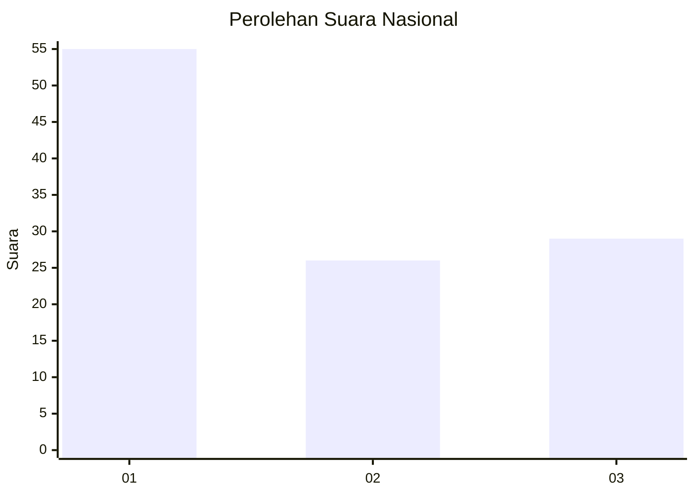
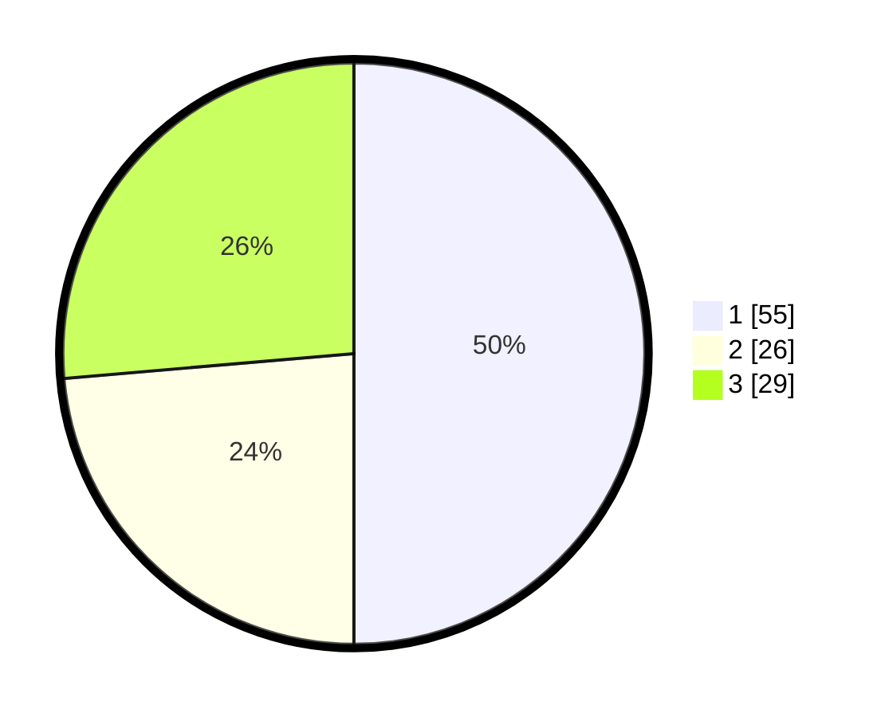

# Hasil

## Grafik

## Tabel

| No. | Nama Paslon    | Suara | Suara (raw) | Persentase |
|:--- |:-------------- | -----:| -----------:| ----------:|
| 1   | ANIES MUHAIMIN | 55    | [55][p-1]   | 50,00      |
| 2   | PRABOWO GIBRAN | 26    | [26][p-2]   | 23,64      |
| 3   | GANJAR MAHFUD  | 29    | [29][p-3]   | 26,36      |

[p-1]: https://github.com/gigit-pemilu/pemilu-2024/blob/main/pilpres/hitung-suara/sub/64-kalimantan-timur/sub/74-kota-bontang/sub/02-bontang-selatan/sub/1001-tanjung-laut/sub/004-tps/sub/paslon-1.txt
[p-2]: https://github.com/gigit-pemilu/pemilu-2024/blob/main/pilpres/hitung-suara/sub/64-kalimantan-timur/sub/74-kota-bontang/sub/02-bontang-selatan/sub/1001-tanjung-laut/sub/004-tps/sub/paslon-2.txt
[p-3]: https://github.com/gigit-pemilu/pemilu-2024/blob/main/pilpres/hitung-suara/sub/64-kalimantan-timur/sub/74-kota-bontang/sub/02-bontang-selatan/sub/1001-tanjung-laut/sub/004-tps/sub/paslon-3.txt

## Foto C Plano

https://sirekap-obj-formc.kpu.go.id/a122/pemilu/ppwp/64/74/02/10/01/6474021001004-20240219-145250--38425add-5bbb-402d-9267-46591d6191f0.jpg

https://sirekap-obj-formc.kpu.go.id/a122/pemilu/ppwp/64/74/02/10/01/6474021001004-20240219-145306--df559b8d-717d-4496-bd14-8ee583122959.jpg

https://sirekap-obj-formc.kpu.go.id/a122/pemilu/ppwp/64/74/02/10/01/6474021001004-20240219-145319--9243b224-d188-4517-b024-c637da40f57f.jpg

## Metadata

| Key        | Value               |
| ---------- | ------------------- |
| Time Stamp | 2024-02-19 15:00:00 |

## DATA PEMILIH TETAP

Jumlah pemilih dalam DPT: **277**.
 * L: **145**.
 * P: **32**.

## DATA PENGGUNA HAK PILIH

Jumlah pengguna hak pilih dalam DPT: **182**.
 * L: **896**.
 * P: **893**.

Jumlah pengguna hak pilih dalam DPTb: **484**.
 * L: **881**.
 * P: **83**.

Jumlah pengguna hak pilih dalam DPK: **345**.
 * L: **811**.
 * P: **884**.

Jumlah pengguna hak pilih: **227**.
 * L: **207**.
 * P: **200**.

## JUMLAH SUARA SAH DAN TIDAK SAH

JUMLAH SELURUH SUARA SAH: **520**.

JUMLAH SUARA TIDAK SAH: **887**.

JUMLAH SELURUH SUARA SAH DAN SUARA TIDAK SAH: **207**.

