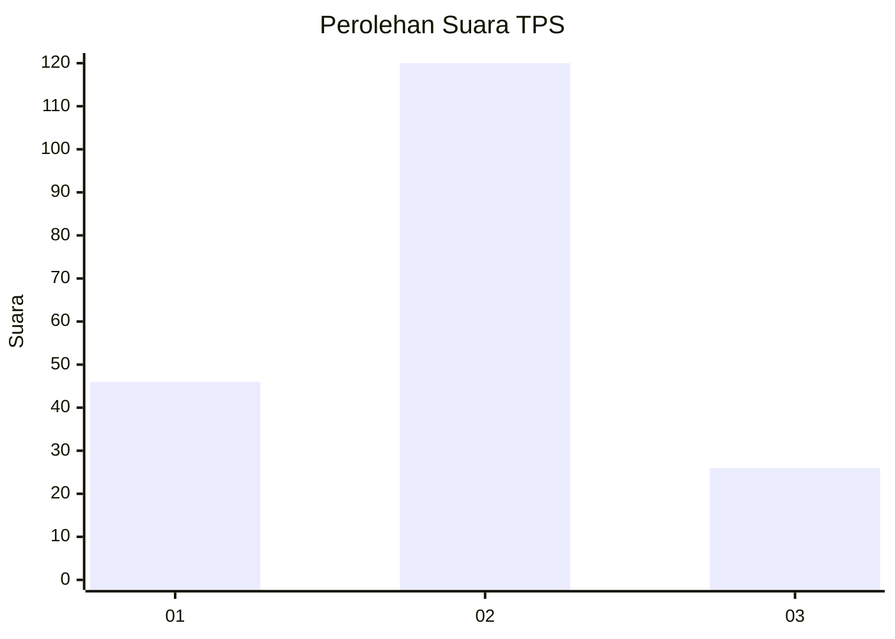
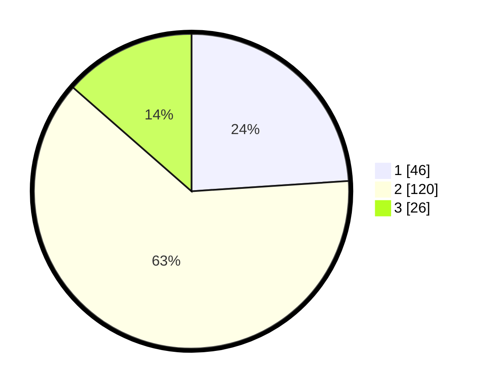

# Hasil

## Grafik

## Tabel

| No. | Nama Paslon    | Suara | Suara (raw) | Persentase |
|:--- |:-------------- | -----:| -----------:| ----------:|
| 1   | ANIES MUHAIMIN | 46    | [46][p-1]   | 23,96      |
| 2   | PRABOWO GIBRAN | 120   | [120][p-2]  | 62,50      |
| 3   | GANJAR MAHFUD  | 26    | [26][p-3]   | 13,54      |

[p-1]: https://github.com/gigit-pemilu/pemilu-2024-64-kalimantan-timur/blob/main/pilpres/hitung-suara/sub/64-kalimantan-timur/sub/74-kota-bontang/sub/02-bontang-selatan/sub/1001-tanjung-laut/sub/007-tps/sub/paslon-1.txt
[p-2]: https://github.com/gigit-pemilu/pemilu-2024-64-kalimantan-timur/blob/main/pilpres/hitung-suara/sub/64-kalimantan-timur/sub/74-kota-bontang/sub/02-bontang-selatan/sub/1001-tanjung-laut/sub/007-tps/sub/paslon-2.txt
[p-3]: https://github.com/gigit-pemilu/pemilu-2024-64-kalimantan-timur/blob/main/pilpres/hitung-suara/sub/64-kalimantan-timur/sub/74-kota-bontang/sub/02-bontang-selatan/sub/1001-tanjung-laut/sub/007-tps/sub/paslon-3.txt

## Foto C Plano

https://sirekap-obj-formc.kpu.go.id/8405/pemilu/ppwp/64/74/02/10/01/6474021001007-20240220-074931--8ffdbc0b-a571-4aa9-ab1f-5b7a52500b07.jpg

https://sirekap-obj-formc.kpu.go.id/8405/pemilu/ppwp/64/74/02/10/01/6474021001007-20240220-075101--e316676b-810c-46c2-9925-ef510720d83f.jpg

https://sirekap-obj-formc.kpu.go.id/8405/pemilu/ppwp/64/74/02/10/01/6474021001007-20240220-075132--afc35eda-69b5-4d3b-b2ed-226bb94913cf.jpg

## Metadata

| Key        | Value               |
| ---------- | ------------------- |
| Time Stamp | 2024-02-26 12:00:00 |

## DATA PEMILIH TETAP

Jumlah pemilih dalam DPT: **220**.
 * L: **16**.
 * P: **804**.

## DATA PENGGUNA HAK PILIH

Jumlah pengguna hak pilih dalam DPT: **877**.
 * L: **827**.
 * P: **830**.

Jumlah pengguna hak pilih dalam DPTb: **402**.
 * L: **81**.
 * P: **80**.

Jumlah pengguna hak pilih dalam DPK: **866**.
 * L: **88**.
 * P: **8**.

Jumlah pengguna hak pilih: **995**.
 * L: **96**.
 * P: **23**.

## JUMLAH SUARA SAH DAN TIDAK SAH

JUMLAH SELURUH SUARA SAH: **192**.

JUMLAH SUARA TIDAK SAH: **3**.

JUMLAH SELURUH SUARA SAH DAN SUARA TIDAK SAH: **195**.

