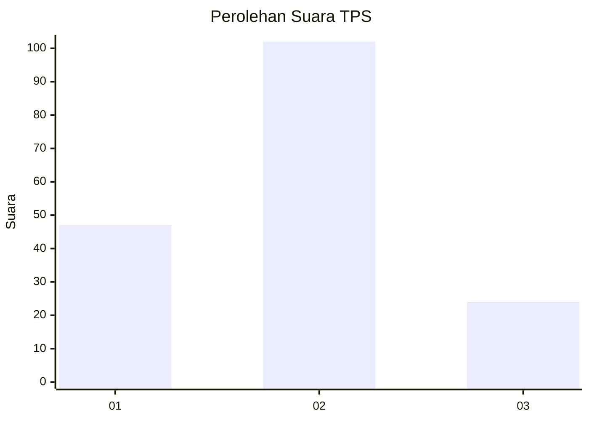
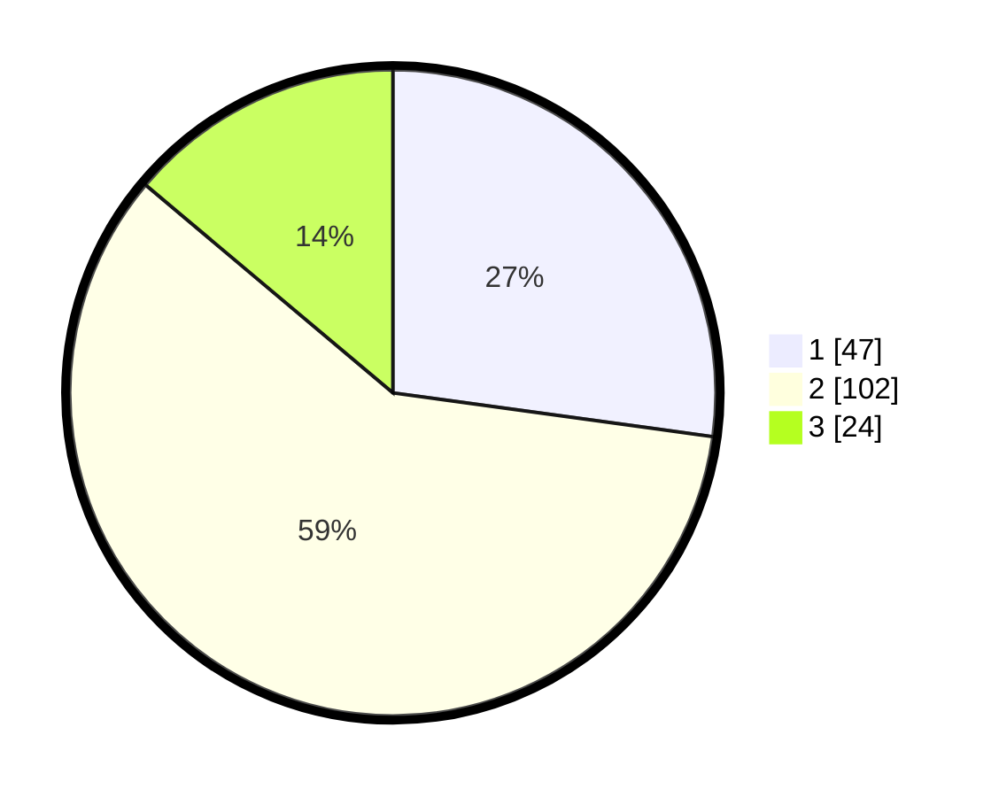

# Hasil

## Grafik

## Tabel

| No. | Nama Paslon    | Suara | Suara (raw) | Persentase |
|:--- |:-------------- | -----:| -----------:| ----------:|
| 1   | ANIES MUHAIMIN | 47    | [47][p-1]   | 27,17      |
| 2   | PRABOWO GIBRAN | 102   | [102][p-2]  | 58,96      |
| 3   | GANJAR MAHFUD  | 24    | [24][p-3]   | 13,87      |

[p-1]: https://github.com/gigit-pemilu/pemilu-2024-64-kalimantan-timur/blob/main/pilpres/hitung-suara/sub/64-kalimantan-timur/sub/74-kota-bontang/sub/02-bontang-selatan/sub/1001-tanjung-laut/sub/009-tps/sub/paslon-1.txt
[p-2]: https://github.com/gigit-pemilu/pemilu-2024-64-kalimantan-timur/blob/main/pilpres/hitung-suara/sub/64-kalimantan-timur/sub/74-kota-bontang/sub/02-bontang-selatan/sub/1001-tanjung-laut/sub/009-tps/sub/paslon-2.txt
[p-3]: https://github.com/gigit-pemilu/pemilu-2024-64-kalimantan-timur/blob/main/pilpres/hitung-suara/sub/64-kalimantan-timur/sub/74-kota-bontang/sub/02-bontang-selatan/sub/1001-tanjung-laut/sub/009-tps/sub/paslon-3.txt

## Foto C Plano

https://sirekap-obj-formc.kpu.go.id/0950/pemilu/ppwp/64/74/02/10/01/6474021001009-20240220-104317--0a9efdc0-5456-412c-908b-64d43746cb68.jpg

https://sirekap-obj-formc.kpu.go.id/0950/pemilu/ppwp/64/74/02/10/01/6474021001009-20240220-104342--470b824c-7745-4007-9c2c-75e7f2156d99.jpg

https://sirekap-obj-formc.kpu.go.id/0950/pemilu/ppwp/64/74/02/10/01/6474021001009-20240220-104405--30cc3fa3-5696-4908-95d4-ae6fd19cffc1.jpg

## Metadata

| Key        | Value               |
| ---------- | ------------------- |
| Time Stamp | 2024-02-21 14:00:00 |

## DATA PEMILIH TETAP

Jumlah pemilih dalam DPT: **224**.
 * L: **320**.
 * P: **604**.

## DATA PENGGUNA HAK PILIH

Jumlah pengguna hak pilih dalam DPT: **471**.
 * L: **82**.
 * P: **859**.

Jumlah pengguna hak pilih dalam DPTb: **803**.
 * L: **802**.
 * P: **824**.

Jumlah pengguna hak pilih dalam DPK: **202**.
 * L: **880**.
 * P: **802**.

Jumlah pengguna hak pilih: **176**.
 * L: **894**.
 * P: **882**.

## JUMLAH SUARA SAH DAN TIDAK SAH

JUMLAH SELURUH SUARA SAH: **173**.

JUMLAH SUARA TIDAK SAH: **3**.

JUMLAH SELURUH SUARA SAH DAN SUARA TIDAK SAH: **176**.

